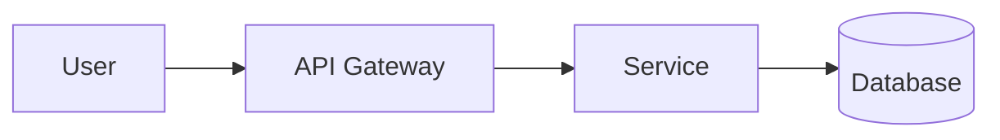

# Mermaid Design

Professional Mermaid diagram generation for AI coding agents, packaged as both a Claude Code plugin and an Agent Plugins v1 package.

The project is inspired by the editorial discipline of [`cathrynlavery/diagram-design`](https://github.com/cathrynlavery/diagram-design), while keeping Mermaid source as the canonical artifact so diagrams remain editable, reviewable, diffable, and directly visualized in GitHub Markdown.

## What it provides

- **GitHub-first Mermaid output** — every GitHub-facing diagram keeps a fenced `mermaid` source block as the source of truth.
- **Four Agent Skills** — core design, software architecture, process/behavior, and data/analysis.
- **Progressive disclosure** — detailed guidance lives in skill `references/` and `assets/` rather than bloating every skill invocation.
- **150 professional diagram patterns** — architecture, distributed systems, cloud, security, data, agents, CI/CD, lifecycle, modeling, planning, and analytics recipes.
- **Mermaid CLI validation through MCP** — the bundled MCP configuration uses `@volare-consulting/mermaid-mcp`, which renders with the official `@mermaid-js/mermaid-cli`.
- **Dual packaging** — Agent Plugins 1.0.0 plus native Claude Code plugin metadata and MCP configuration.

## Repository layout

```text
plugins/mermaid-design/
├── plugin.json                         # Agent Plugins v1 manifest
├── mcp.json                            # Agent Plugins MCP configuration
├── .claude-plugin/plugin.json          # Claude Code manifest
├── .mcp.json                           # Claude Code MCP configuration
├── README.md
└── skills/
    ├── mermaid-design/
    │   ├── SKILL.md
    │   ├── references/
    │   │   ├── diagram-selection.md
    │   │   ├── github-compatibility.md
    │   │   └── style-guide.md
    │   └── assets/
    │       └── pattern-catalog.md       # 150 reusable patterns
    ├── software-architecture/
    ├── process-and-behavior/
    └── data-and-analysis/
```

## GitHub rendering contract

GitHub embeds Mermaid in Markdown but may run a different Mermaid version from the newest upstream release. Therefore the skills distinguish conservative diagram families from version-sensitive families.

For GitHub deliverables:

1. prefer stable Mermaid syntax;
2. validate syntax/layout with the MCP renderer when available;
3. do not assume a successful latest-CLI render proves GitHub support;
4. fall back to stable `flowchart`, `sequenceDiagram`, `stateDiagram-v2`, `classDiagram`, or `erDiagram` syntax when compatibility is uncertain;
5. never replace Mermaid source with only a PNG/SVG render.

Example:

````markdown

````

## Supported diagram families

The skills understand Mermaid's broad diagram vocabulary, including flowcharts, swimlanes, sequences, classes, states, ER models, journeys, Gantt, pie, quadrant, Git graph, mind map, timeline, ZenUML, Sankey, XY, block, packet, Kanban, architecture, radar, event modeling, treemap, Venn, Ishikawa, Wardley, Cynefin, tree views, and related examples.

Some newer families are intentionally treated as **version-sensitive for GitHub** and are translated to stable equivalents when the target GitHub Mermaid version is unknown.

## MCP renderer

Portable Agent Plugins configuration:

```json
{
  "$schema": "https://agent-plugins.org/schemas/1.0.0/mcp.schema.json",
  "mcpServers": {
    "mermaid-renderer": {
      "type": "stdio",
      "command": "npx",
      "args": ["-y", "@volare-consulting/mermaid-mcp@0.2.0"],
      "cwd": "${PLUGIN_ROOT}"
    }
  }
}
```

The renderer requires Node.js/npm and a Chrome/Chromium runtime through Mermaid CLI/Puppeteer. For enterprise or locked-down environments, preinstall and pin dependencies through the organization's approved software supply chain instead of allowing ad-hoc downloads.

## Design philosophy

Mermaid syntax is the implementation detail; communication quality is the product. The skills first decide what question a diagram must answer, then select a proven composition pattern, minimize visual noise, validate semantics, and only then optimize layout.

For architecture documents, prefer a small set of focused views—typically context/topology, runtime sequence, and state/data structure—over a single giant diagram.

## License

Apache License 2.0. See `LICENSE`.
