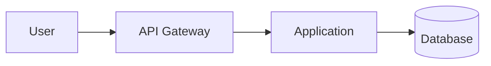

# Mermaid Design

A Claude Code plugin and Agent Plugins v1 package for producing professional Mermaid diagrams whose canonical source remains directly renderable in GitHub Markdown.

## Why this plugin

Mermaid makes diagrams maintainable as code, but generated diagrams often fail in one of three ways: the wrong diagram type is chosen, the picture is visually noisy, or syntax works in a newer Mermaid renderer but not in GitHub. Mermaid Design treats diagram selection, editorial composition, and GitHub compatibility as first-class concerns.

## Components

### Agent Skills

- `mermaid-design` — core diagram selection, editorial design, GitHub compatibility, validation, and a 150-pattern composition catalog.
- `software-architecture` — software/cloud/platform/security/data/agent architecture views for RFCs and design docs.
- `process-and-behavior` — sequence, state, workflow, lifecycle, incident, journey, Gantt, timeline, and Git history views.
- `data-and-analysis` — ER/data models, lineage, governance, quantitative flows, and analytical diagrams.

Skills use `references/` and `assets/` for progressive disclosure instead of loading the entire pattern library into every request.

### Mermaid MCP renderer

The plugin configures `@volare-consulting/mermaid-mcp@0.2.0`, which uses the official `@mermaid-js/mermaid-cli` under the hood. It provides a render tool for syntax/layout validation and preview generation.

The renderer is intentionally **not** the canonical output. GitHub-facing deliverables must retain fenced Mermaid source.

## Compatibility

This directory supports both packaging models:

- **Agent Plugins 1.0.0**: `plugin.json`, `skills/`, and `mcp.json`.
- **Claude Code plugin**: `.claude-plugin/plugin.json`, `skills/`, and `.mcp.json`.

The same skills are shared by both formats.

## GitHub rendering policy

GitHub renders Mermaid in fenced Markdown blocks, but GitHub's deployed Mermaid version may lag current upstream Mermaid. Therefore:

1. stable Mermaid families are preferred for GitHub-facing documents;
2. newer/beta families are used only when target compatibility is known;
3. unsupported/version-sensitive concepts fall back to stable flowchart, sequence, state, class, or ER syntax;
4. PNG/SVG renders may accompany a diagram but never replace the editable Mermaid source.

## Example

````markdown

````

## MCP prerequisites

The configured renderer runs through `npx` and requires Node.js/npm. Mermaid CLI rendering also requires a Chrome/Chromium runtime through Puppeteer. In locked-down environments, install the renderer and browser dependencies through your approved dependency-management process instead of allowing ad-hoc network installation.

## Design principles

- communication goal before syntax;
- one dominant message per diagram;
- semantic grouping over decoration;
- conservative Mermaid for portable GitHub rendering;
- source-as-code first;
- render/validate before delivery when tooling is available;
- use multiple focused views instead of one giant architecture diagram.

## Pattern library

`skills/mermaid-design/assets/pattern-catalog.md` contains 150 reusable recipes spanning architecture, distributed systems, cloud, data platforms, security, agents, CI/CD, lifecycle, ER modeling, planning, and analytical views.
