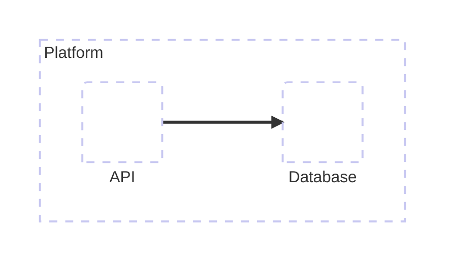

# Architecture

## Use when

Services grouped by deployment or subsystem.

## Avoid when

Message order and unsupported renderers.

## Preferred semantic intents

System.

## GitHub compatibility

Capability-gated; use the fallback for unknown or GitHub targets. Validate the installed exact version.

## Design rules

Use text labels; built-in shapes are optional and never carry core meaning.

## Complexity budget

Recommend at most 12 services; split near 18.

## Minimal syntax

## Common failure modes

Use text labels; built-in shapes are optional and never carry core meaning. Do not assume that passing the local parser proves target support.

## Fallbacks

Flowchart with subgraphs.

## Examples

The minimal example is an illustrative fixture, not inferred user data. Change its
facts to match the request. See [the upstream reference](https://mermaid.js.org/syntax/architecture.html) for version-specific syntax.
