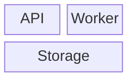

# Block

## Use when

Small structural arrangements where adjacency matters.

## Avoid when

Large dependency graphs or pixel-precise layout.

## Preferred semantic intents

Structure.

## GitHub compatibility

Capability-gated; use the fallback for unknown or GitHub targets. Validate the installed exact version.

## Design rules

Use a few blocks and do not imply ownership through arbitrary positioning.

## Complexity budget

Recommend at most 12 blocks; split near 18.

## Minimal syntax

## Common failure modes

Use a few blocks and do not imply ownership through arbitrary positioning. Do not assume that passing the local parser proves target support.

## Fallbacks

Flowchart or Mindmap.

## Examples

The minimal example is an illustrative fixture, not inferred user data. Change its
facts to match the request. See [the upstream reference](https://mermaid.js.org/syntax/block.html) for version-specific syntax.
