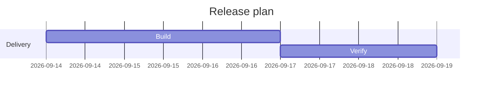

# Gantt

## Use when

Tasks with supplied dates and durations.

## Avoid when

Unknown schedules or unordered priorities.

## Preferred semantic intents

Planning.

## GitHub compatibility

Core conservative candidate; use this basic syntax and verify the actual GitHub preview when possible. No version guarantee.

## Design rules

Keep task identifiers stable and distinguish dependencies from overlap.

## Complexity budget

Recommend at most 15 tasks; split near 25.

## Minimal syntax

## Common failure modes

Keep task identifiers stable and distinguish dependencies from overlap. Do not assume that passing the local parser proves target support.

## Fallbacks

Use a table or prose if the renderer cannot support the required semantics; do not silently change relationship meaning..

## Examples

The minimal example is an illustrative fixture, not inferred user data. Change its
facts to match the request. See [the upstream reference](https://mermaid.js.org/syntax/gantt.html) for version-specific syntax.
