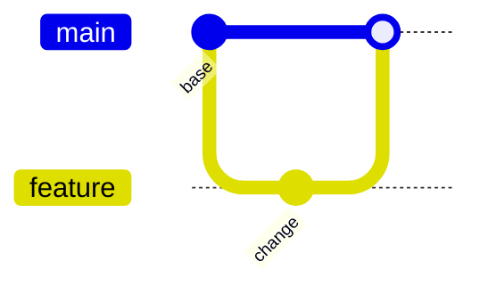

# Gitgraph

## Use when

Commit branching and merge history.

## Avoid when

Generic project dependencies.

## Preferred semantic intents

Version history.

## GitHub compatibility

Core conservative candidate; use this basic syntax and verify the actual GitHub preview when possible. No version guarantee.

## Design rules

Distinguish an illustrative workflow from actual repository history.

## Complexity budget

Recommend at most 12 commits; split near 18.

## Minimal syntax

## Common failure modes

Distinguish an illustrative workflow from actual repository history. Do not assume that passing the local parser proves target support.

## Fallbacks

Use a table or prose if the renderer cannot support the required semantics; do not silently change relationship meaning..

## Examples

The minimal example is an illustrative fixture, not inferred user data. Change its
facts to match the request. See [the upstream reference](https://mermaid.js.org/syntax/gitgraph.html) for version-specific syntax.
