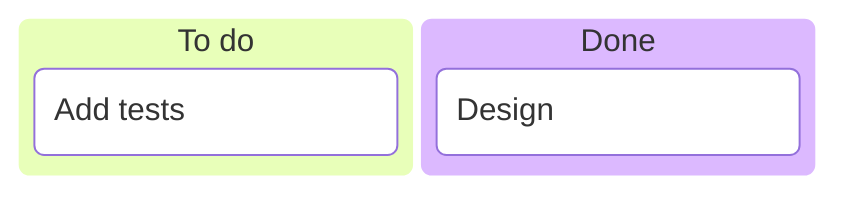

# Kanban

## Use when

Cards grouped by current status.

## Avoid when

Dependencies or elapsed time.

## Preferred semantic intents

Planning.

## GitHub compatibility

Capability-gated; use the fallback for unknown or GitHub targets. Validate the installed exact version.

## Design rules

Use stable card identifiers and avoid external tracker links as dependencies.

## Complexity budget

Recommend at most 12 cards; split near 18.

## Minimal syntax

## Common failure modes

Use stable card identifiers and avoid external tracker links as dependencies. Do not assume that passing the local parser proves target support.

## Fallbacks

Markdown table.

## Examples

The minimal example is an illustrative fixture, not inferred user data. Change its
facts to match the request. See [the upstream reference](https://mermaid.js.org/syntax/kanban.html) for version-specific syntax.
