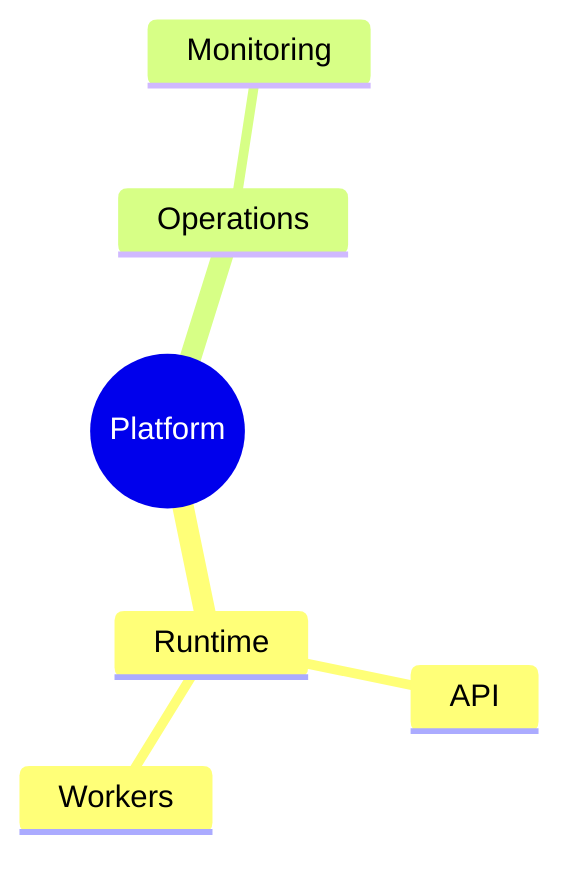

# Mindmap

## Use when

Rooted hierarchy and containment.

## Avoid when

Cross-cutting dependencies or chronological order.

## Preferred semantic intents

Structure.

## GitHub compatibility

Core conservative candidate; use this basic syntax and verify the actual GitHub preview when possible. No version guarantee.

## Design rules

Indent consistently and keep sibling concepts at equal abstraction.

## Complexity budget

Recommend at most 4 levels; split near 5.

## Minimal syntax

## Common failure modes

Indent consistently and keep sibling concepts at equal abstraction. Do not assume that passing the local parser proves target support.

## Fallbacks

Use a table or prose if the renderer cannot support the required semantics; do not silently change relationship meaning..

## Examples

The minimal example is an illustrative fixture, not inferred user data. Change its
facts to match the request. See [the upstream reference](https://mermaid.js.org/syntax/mindmap.html) for version-specific syntax.
