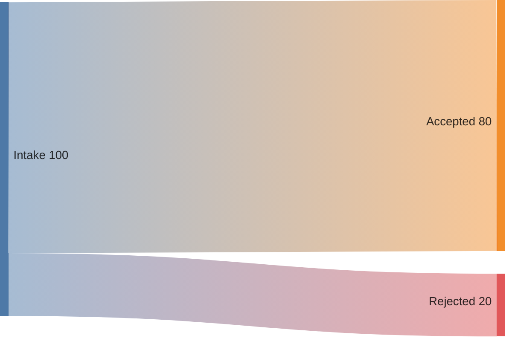

# Sankey

## Use when

Measured quantities splitting or merging.

## Avoid when

Unknown values or unbalanced accounting presented as conserved flow.

## Preferred semantic intents

Quantitative.

## GitHub compatibility

Capability-gated; use the fallback for unknown or GitHub targets. Validate the installed exact version.

## Design rules

Keep units and periods consistent; explain any losses or residuals.

## Complexity budget

Recommend at most 10 nodes; split near 15.

## Minimal syntax

## Common failure modes

Keep units and periods consistent; explain any losses or residuals. Do not assume that passing the local parser proves target support.

## Fallbacks

Table of source, target, value and unit.

## Examples

The minimal example is an illustrative fixture, not inferred user data. Change its
facts to match the request. See [the upstream reference](https://mermaid.js.org/syntax/sankey.html) for version-specific syntax.
