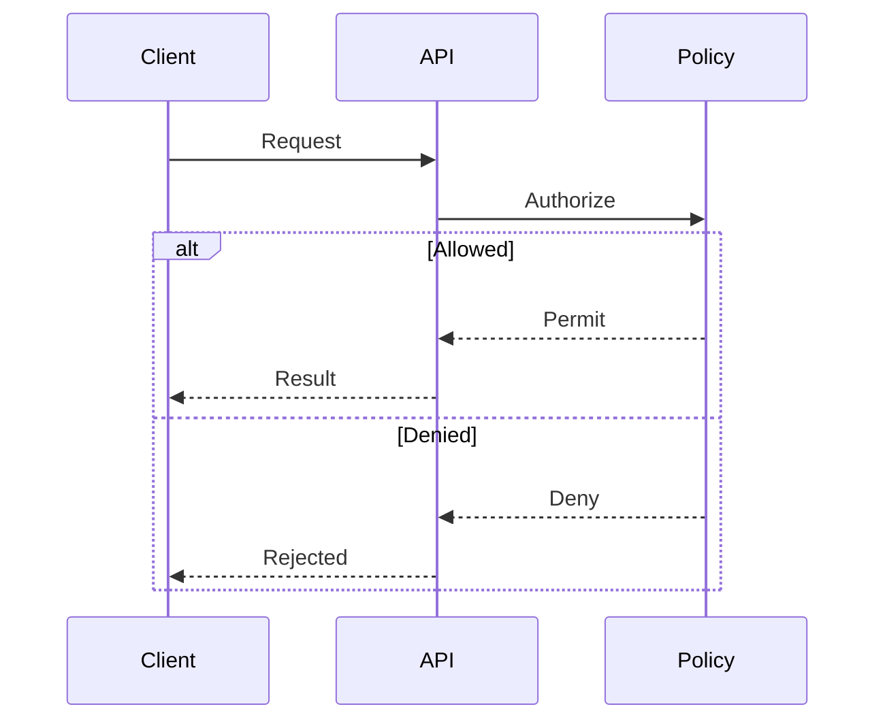

# Sequence

## Use when

Messages between named actors.

## Avoid when

Task durations or static containment.

## Preferred semantic intents

Interaction.

## GitHub compatibility

Core conservative candidate; use this basic syntax and verify the actual GitHub preview when possible. No version guarantee.

## Design rules

Declare actors in reading order; use alt for mutually exclusive outcomes.

## Complexity budget

Recommend at most 5 actors; split near 7.

## Minimal syntax

## Common failure modes

Declare actors in reading order; use alt for mutually exclusive outcomes. Do not assume that passing the local parser proves target support.

## Fallbacks

Use a table or prose if the renderer cannot support the required semantics; do not silently change relationship meaning..

## Examples

The minimal example is an illustrative fixture, not inferred user data. Change its
facts to match the request. See [the upstream reference](https://mermaid.js.org/syntax/sequenceDiagram.html) for version-specific syntax.
