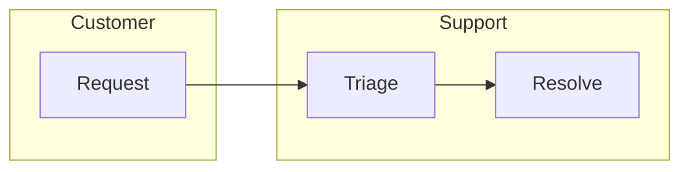

# Swimlane

## Use when

Responsibility and handoffs across owners are the primary question.

## Avoid when

Only chronology matters; choose Sequence for actor messages.

## Preferred semantic intents

Responsibility, with a process pattern.

## GitHub compatibility

Capability-gated. Native syntax is not included in the pinned v0.1 parser corpus.
Use the fallback until the exact target supports native swimlanes and its syntax
has been checked against that version's official documentation. Do not assume
all Mermaid 11 releases implement the current documentation.

## Design rules

One lane per real owner. A handoff crosses a boundary; a stage is not an owner.

## Complexity budget

Recommend at most 5 lanes; split near 7.

## Minimal syntax

Conservative ownership fallback (not native swimlane syntax):

## Common failure modes

Do not invent a native grammar keyword or promise geometrically aligned lanes.
Flowchart subgraph positioning is renderer-controlled.

## Fallbacks

Flowchart with owner subgraphs, preserving every handoff. Use a table of step and
owner if geometry is essential and target rendering is unavailable.

## Examples

The fallback above preserves Customer-to-Support ownership transfer.
