# Architecture Pattern Examples

Use these as composition references. Adapt semantics and labels; do not mechanically copy every node. Prefer boundaries that communicate ownership, trust, runtime, or deployment meaning.

## 1. Layered platform with explicit boundaries

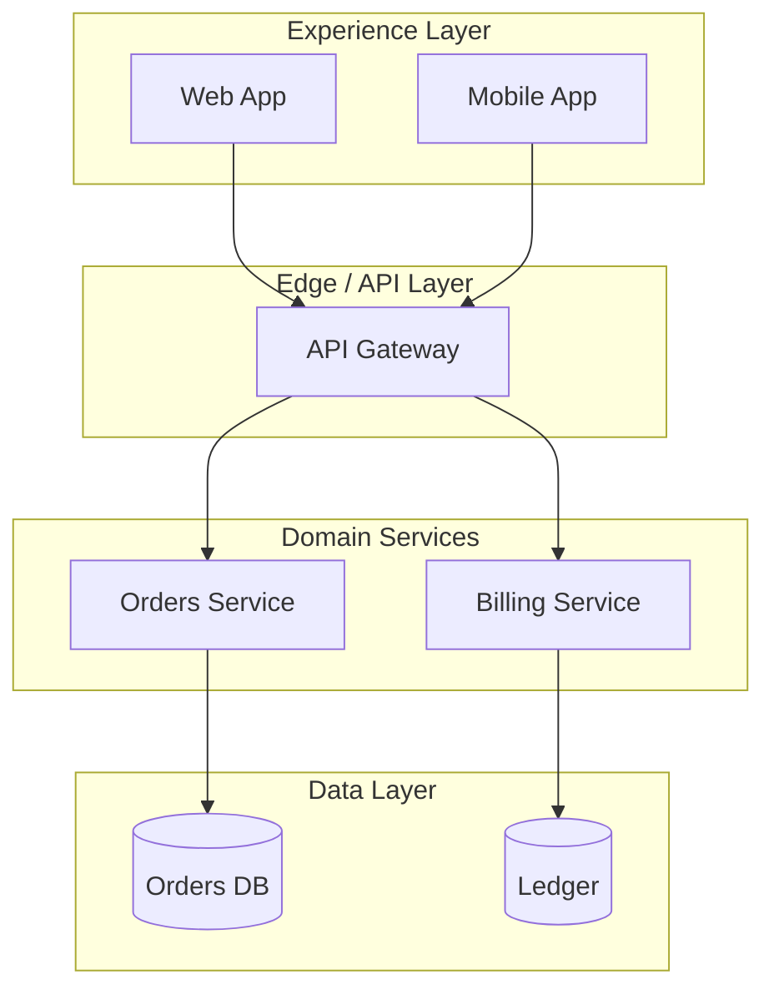

Use `subgraph` when layers represent real ownership or deployment boundaries, not merely visual decoration.

## 2. Control plane / data plane

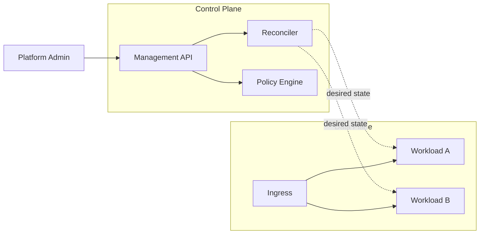

Keep management/control edges visually distinct from runtime traffic where the syntax remains readable.

## 3. Trust-zone boundaries

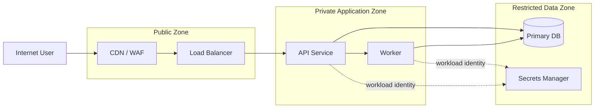

Every edge crossing a trust boundary should represent an intentional interface.

## 4. Multi-region active/active

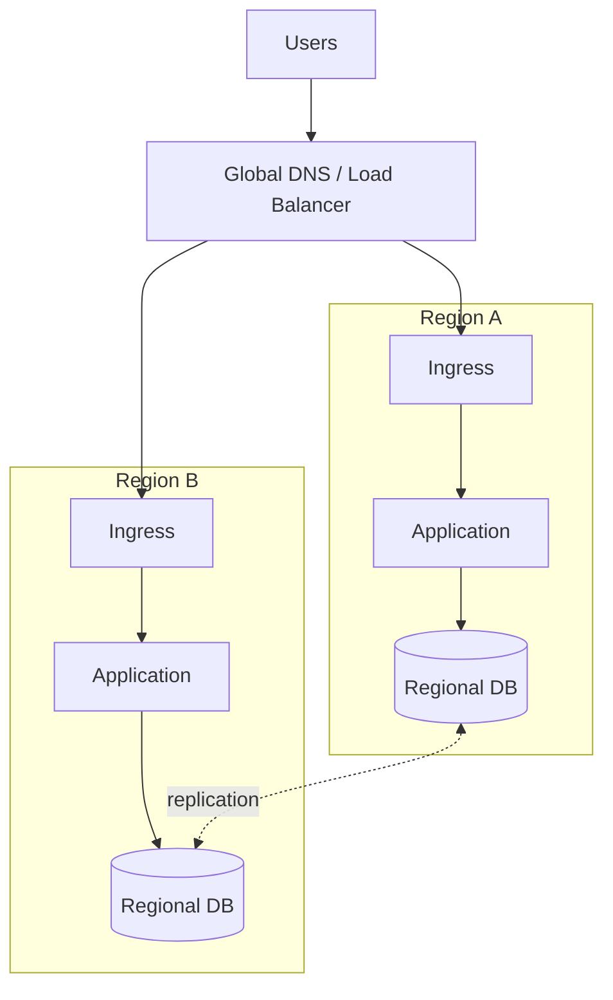

Make regional stacks structurally symmetric unless asymmetry is itself the message.

## 5. Shared-services backbone

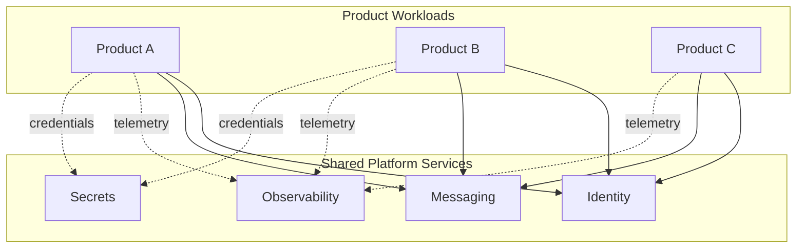

Avoid repeating shared infrastructure inside each product boundary when the point is centralization.

## 6. Strangler migration

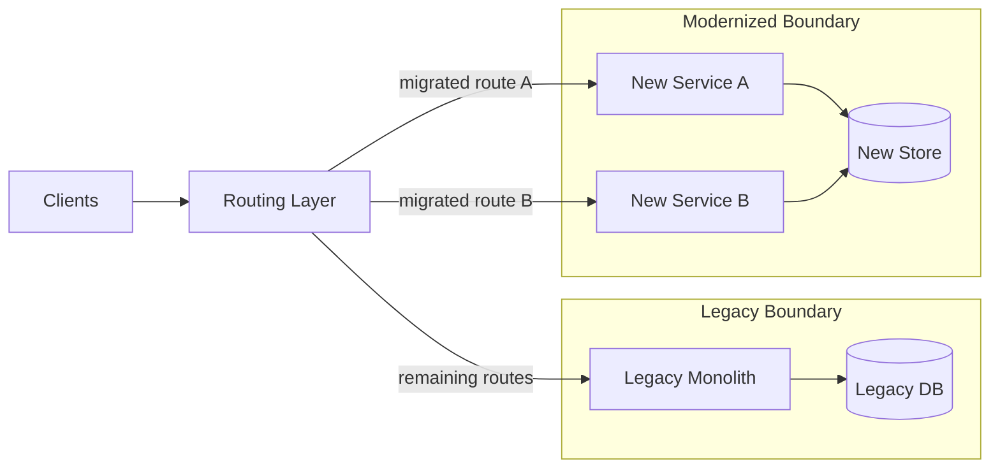

Show migration direction with routing semantics rather than a generic arrow between old and new systems.

## 7. Event-driven backbone

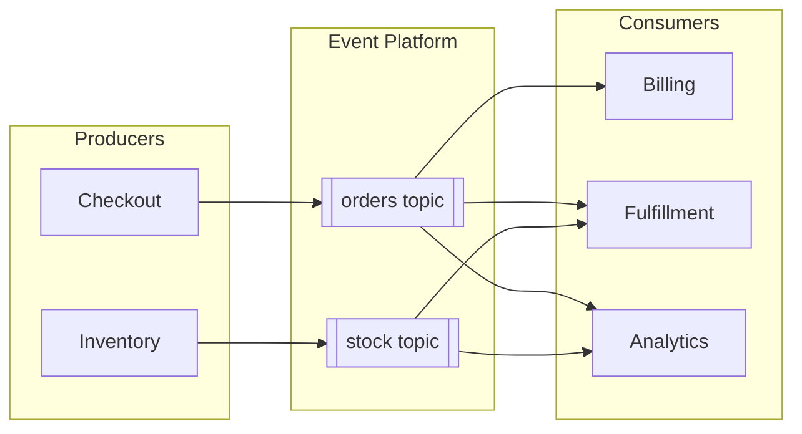

Name topics or event streams when they are part of the contract; do not hide them behind a single anonymous bus.

## 8. Kubernetes request path with cluster boundary

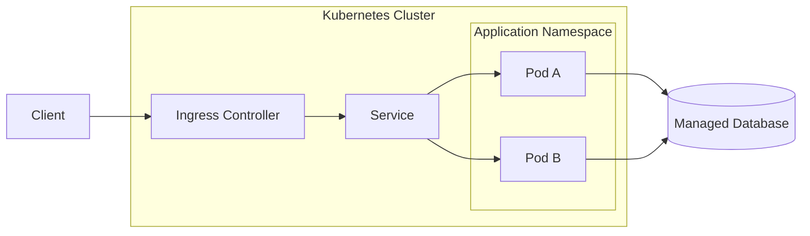

Nest boundaries when runtime containment matters: cluster -> namespace -> workload.

## 9. Bounded-context map

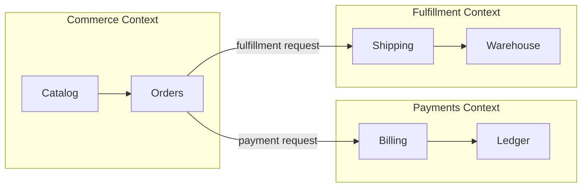

Use one subgraph per bounded context; keep cross-context relationships explicit and sparse.

## 10. RAG system with offline and online planes

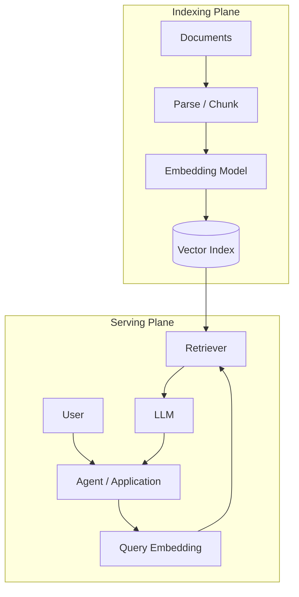

Separate offline preparation from online request handling; this usually communicates RAG architecture more clearly than one linear pipeline.

## 11. Agent supervisor with tool boundary

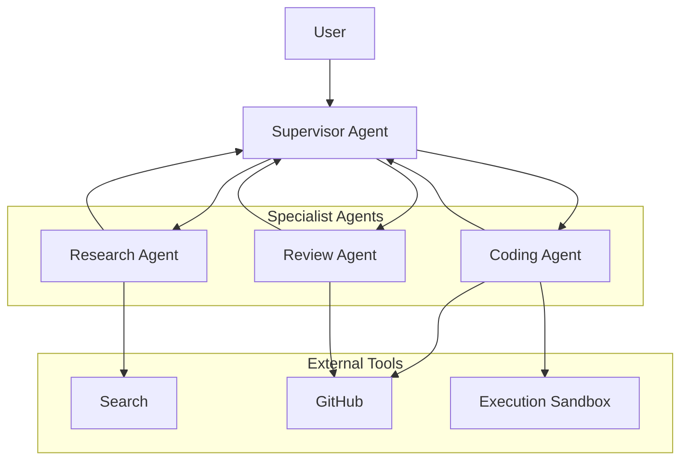

Keep autonomous actors separate from non-agent tools so responsibility is visually obvious.

## 12. Cloud landing zone hierarchy

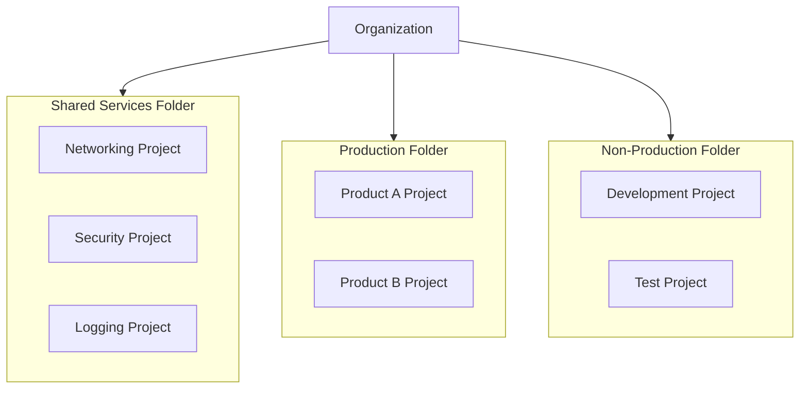

Use subgraphs for administrative boundaries and nodes for resources within them; do not turn every hierarchy level into an extra arrow-only chain.
