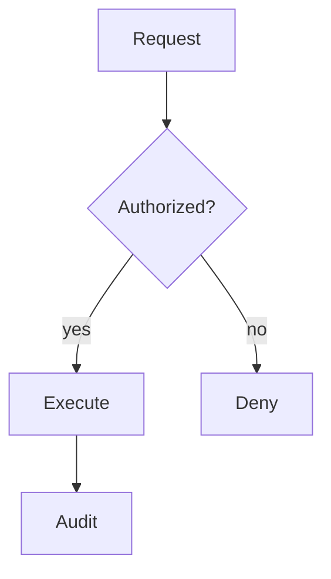
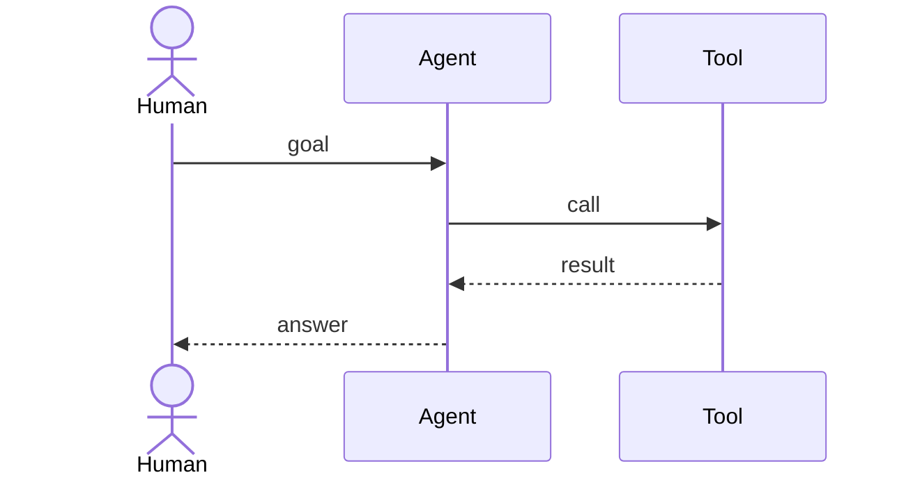
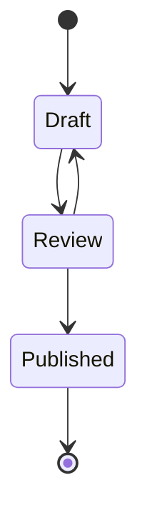
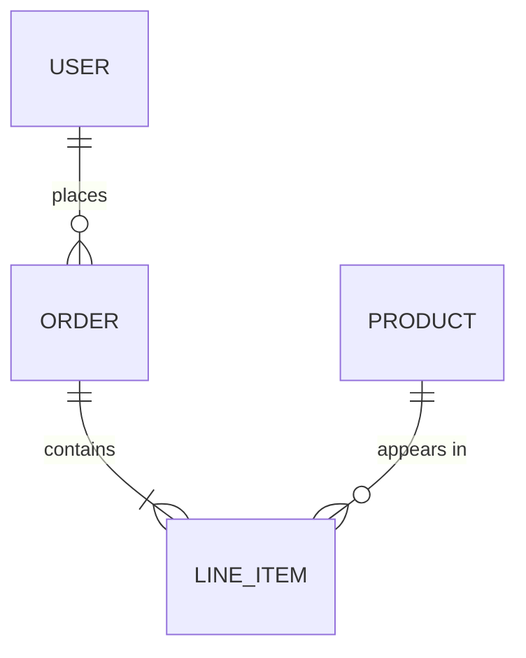

# Example fixtures

Small GitHub-safe Mermaid fixtures for docs and smoke checks. These are not a pattern library—prefer `references/patterns/` and `references/syntax/` at runtime.

## Flowchart — request authorize execute

## Sequence — human agent tool

## State — simple lifecycle

## ER — minimal entities

