# Agent System Patterns

## Tool-calling loop
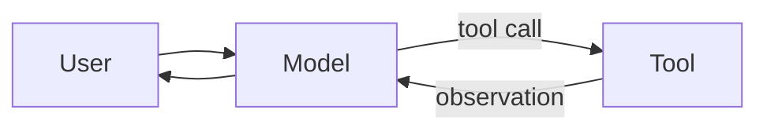

## Agent supervisor
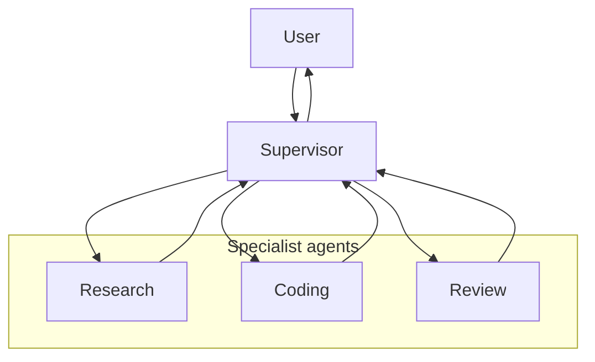

## Multi-agent delegation
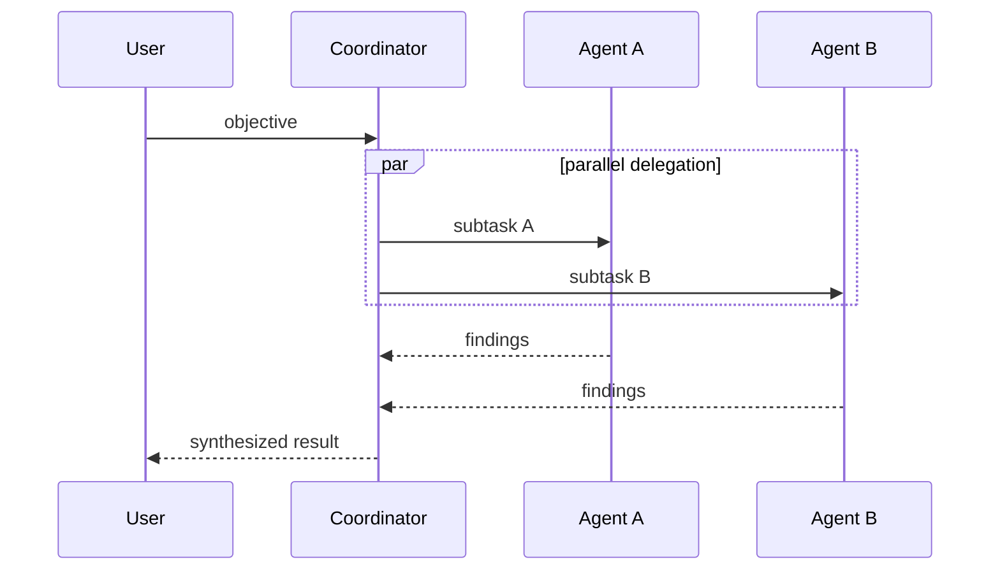

## Human approval gate
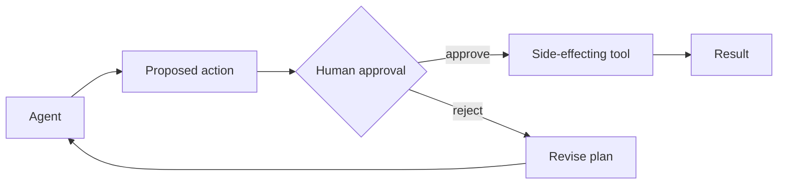

## Reasoning / deterministic boundary
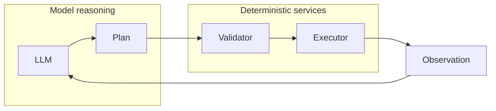

## Memory layers
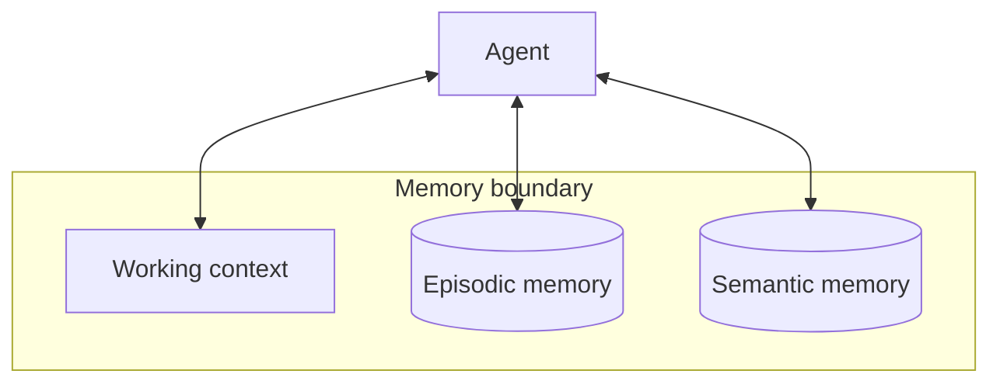

## Retrieval-grounded agent
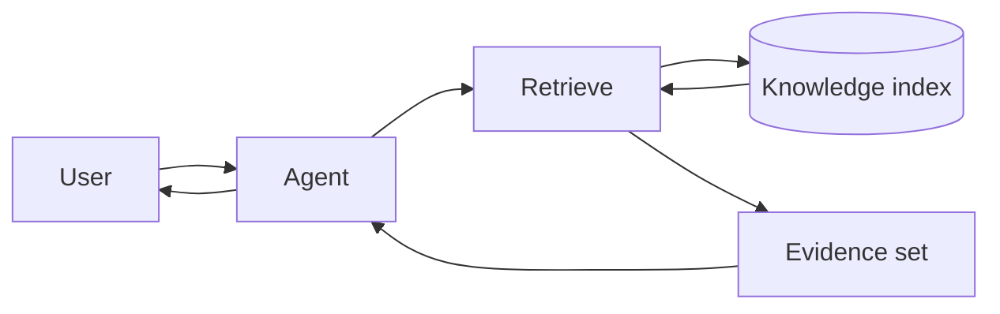

## Policy-guarded tool use
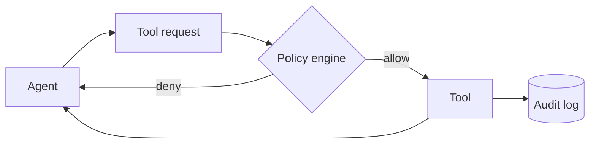

## Planner / executor
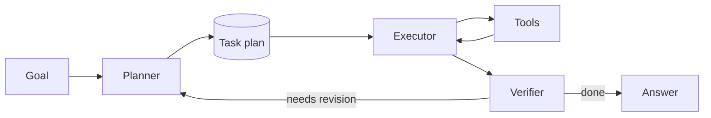

## Agent observability
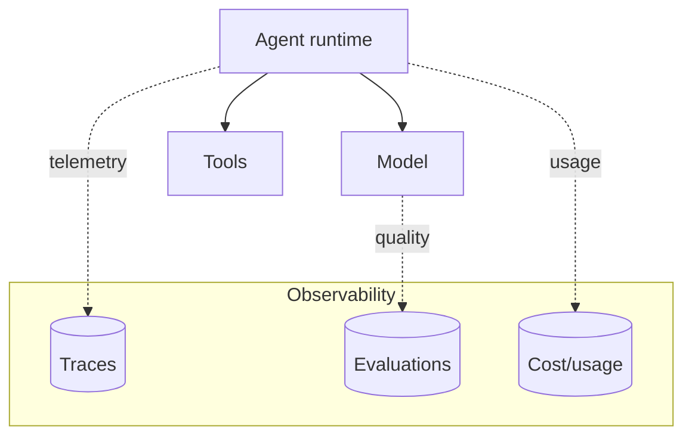

## Agent sandbox boundary
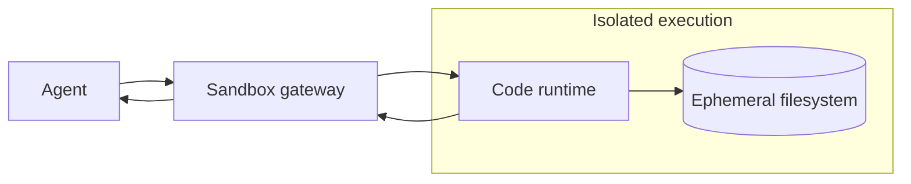

## Agent identity propagation
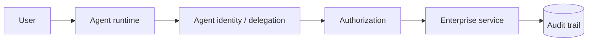

## Critic loop
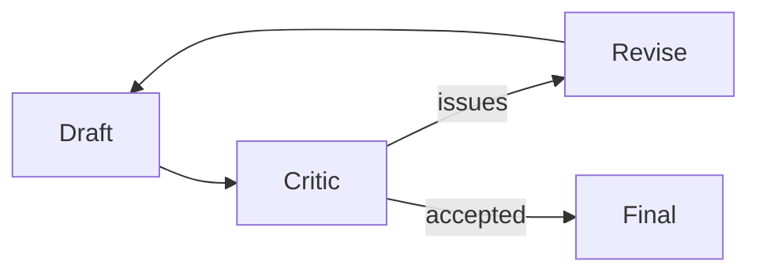

## Router / specialists
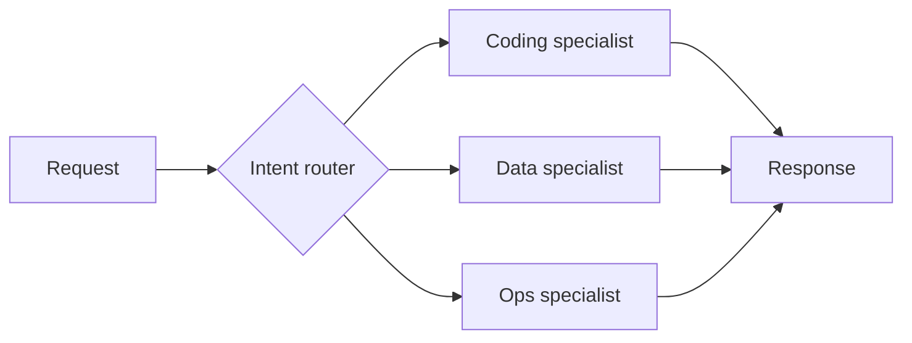

## Agent workflow with durable state
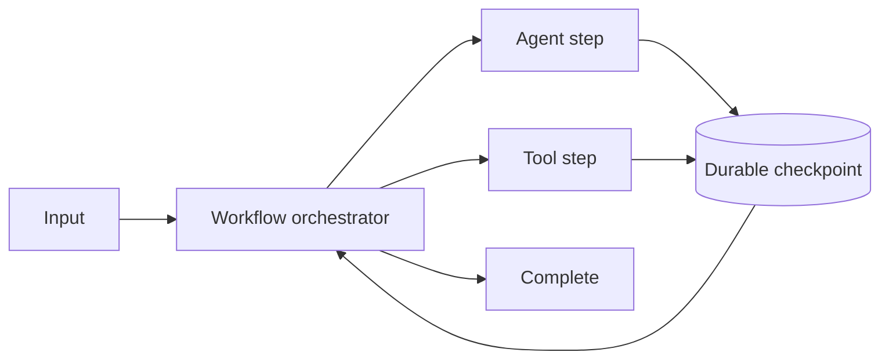
