# Architecture & Boundary Patterns

Copy and adapt. Keep boundary labels semantic.

## System context
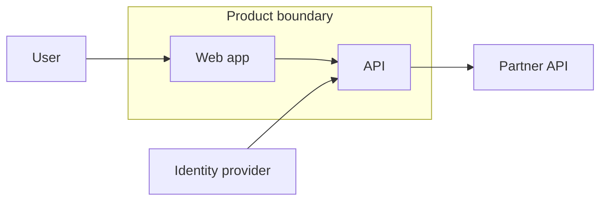

## Three-tier application
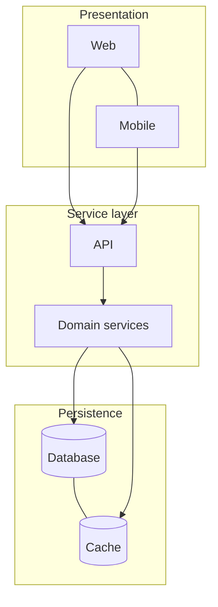

## Layered platform
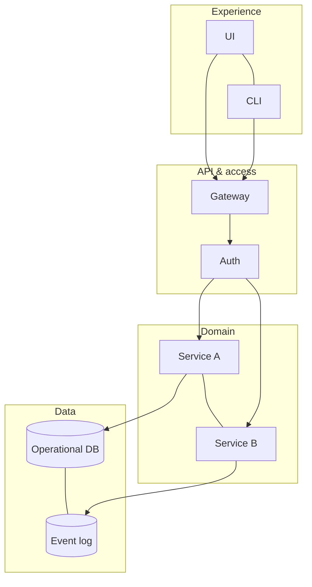

## Hub and spoke
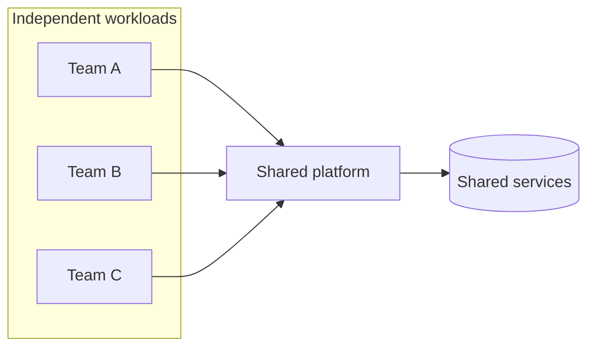

## Control plane / data plane
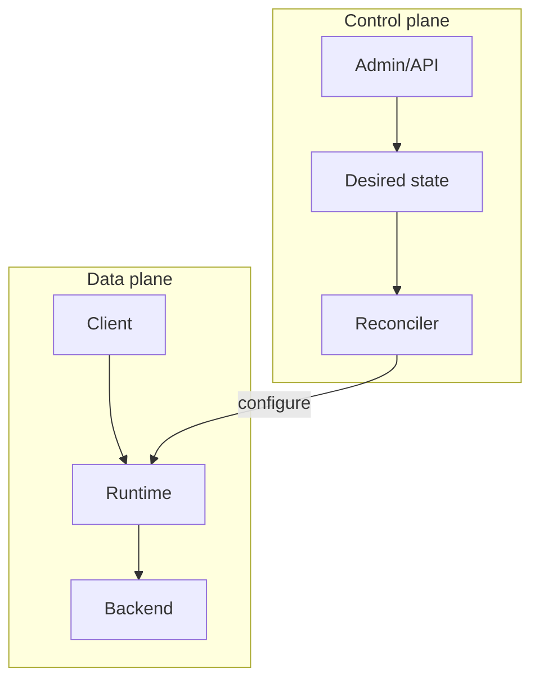

## Trust zones
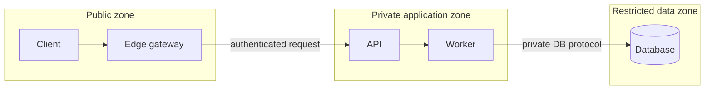

## Active / passive region pair
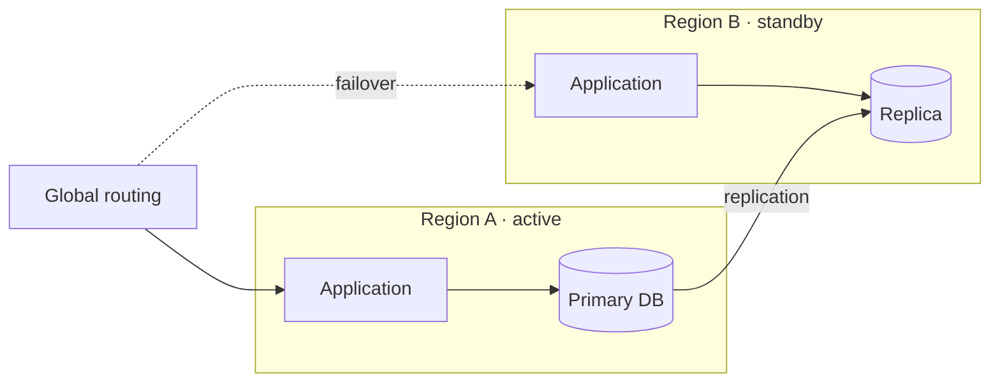

## Multi-region active/active
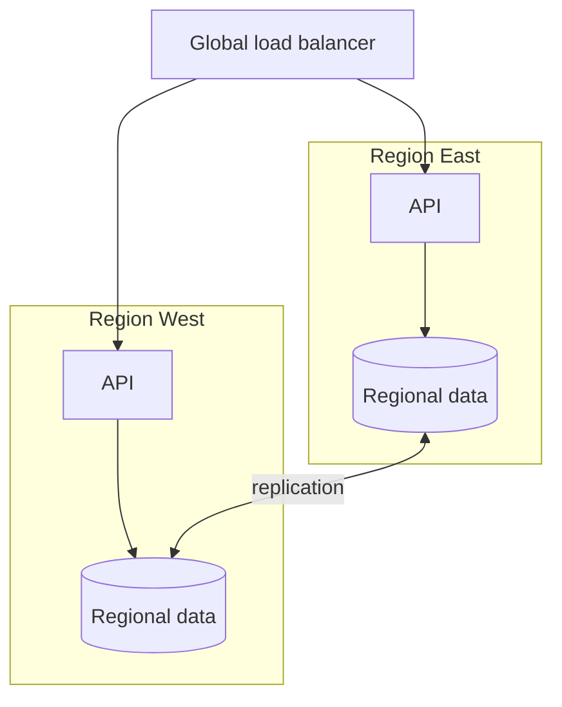

## Shared services backbone
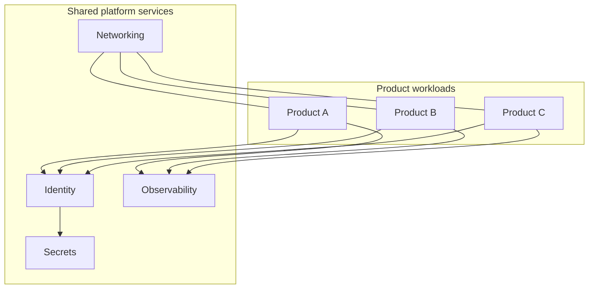

## Adapter boundary
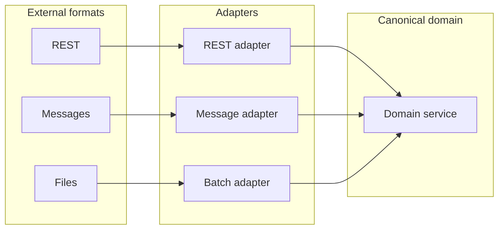

## Anti-corruption layer
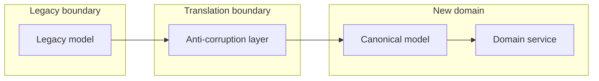

## Strangler migration
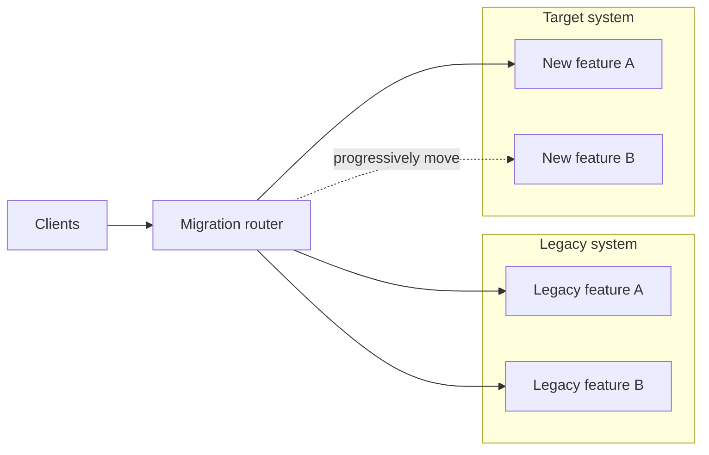

## Capability map
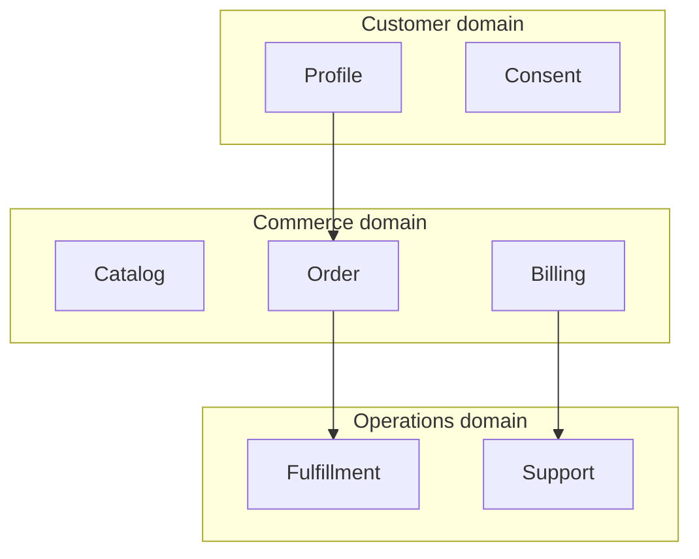

## Bounded context map
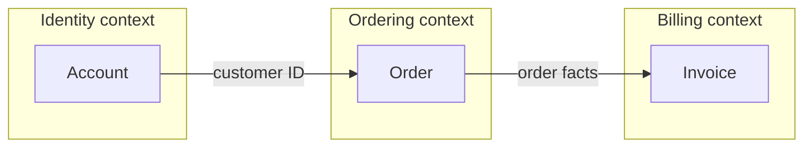

## Architecture zone map
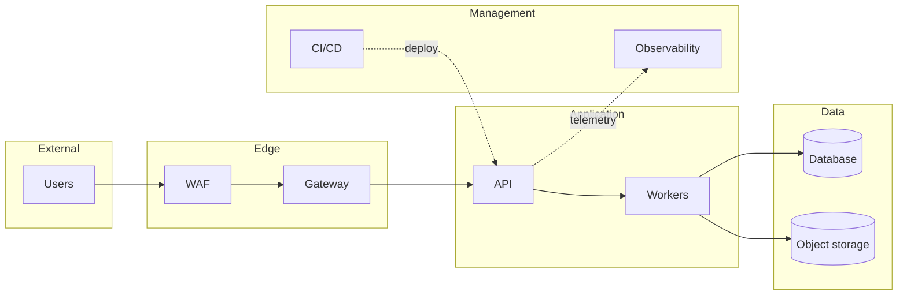
