# Data & AI Platform Patterns

## Medallion platform
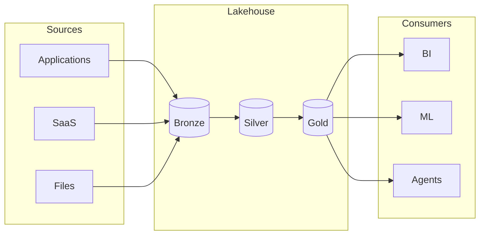

## Lakehouse planes
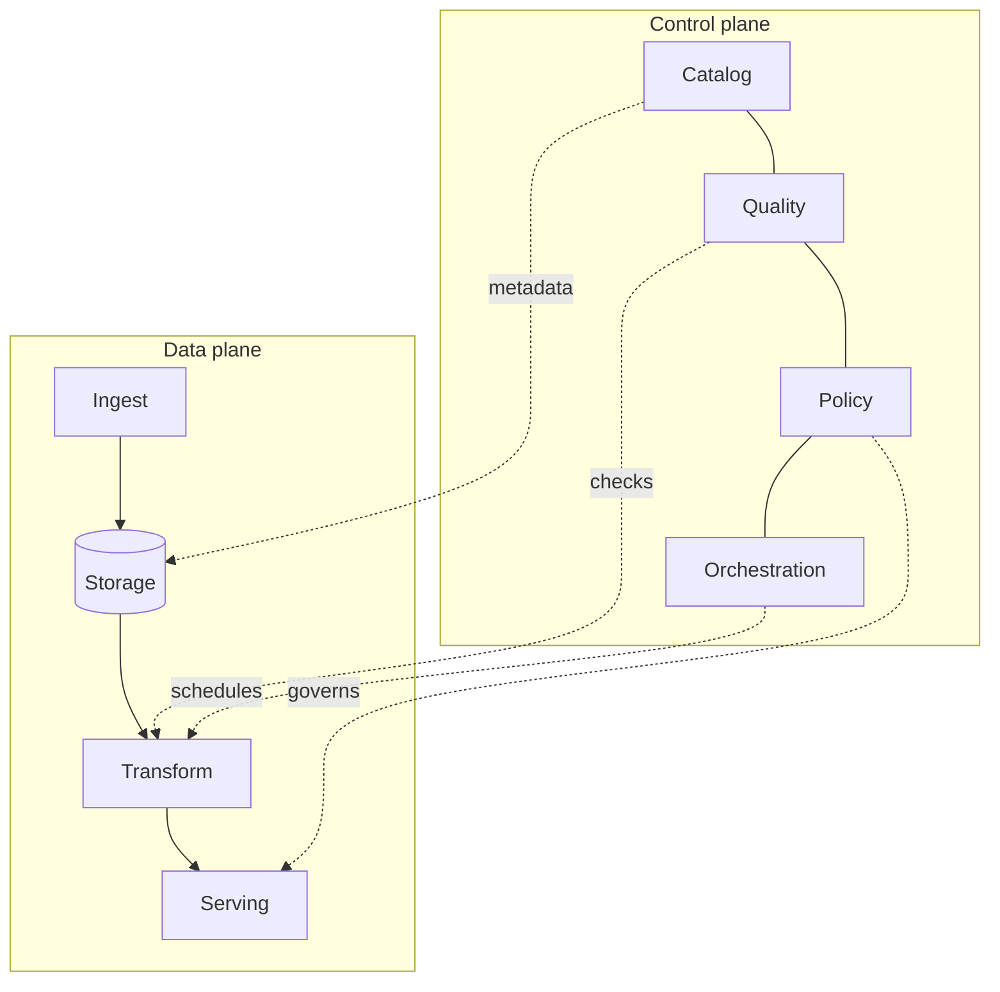

## Data lineage spine
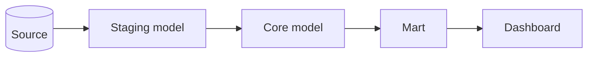

## Governance overlay
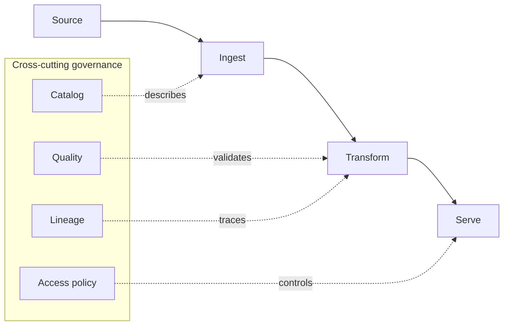

## CDC propagation
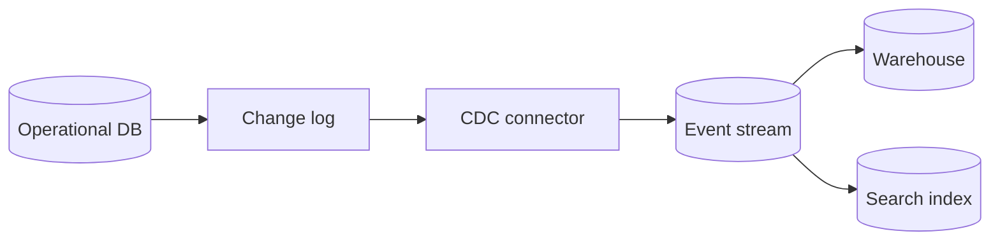

## RAG indexing pipeline
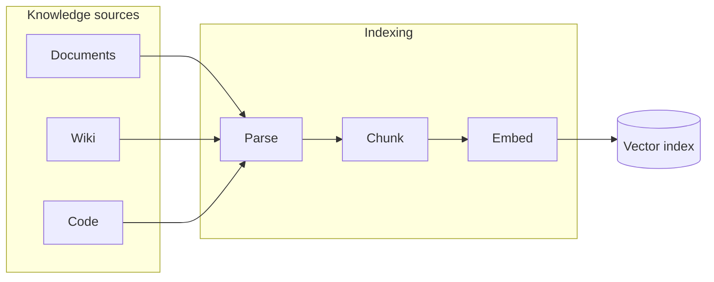

## RAG query path
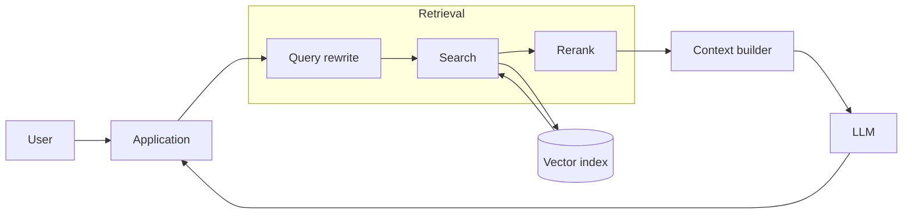

## Feature pipeline
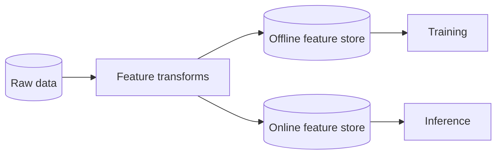

## ML training pipeline
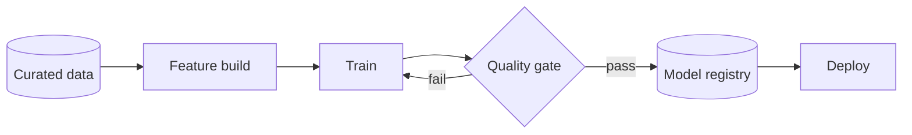

## Model serving path
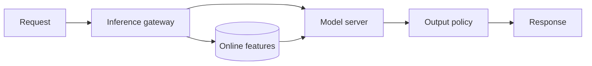

## LLMOps evaluation loop
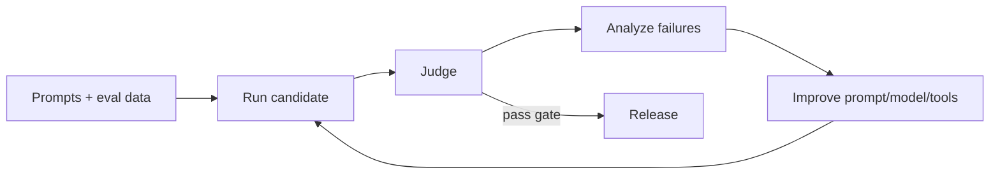

## Semantic layer
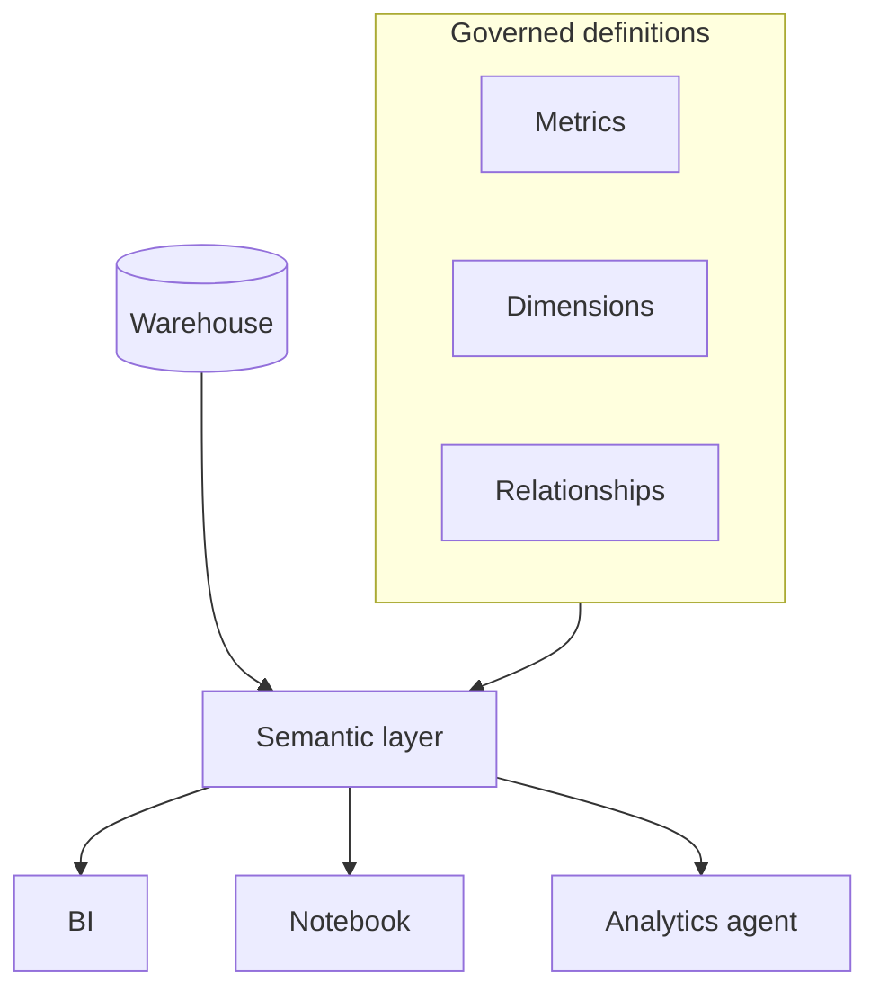

## Data quality quarantine
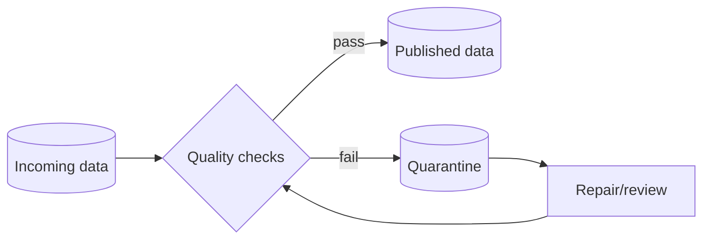

## Catalog / knowledge convergence
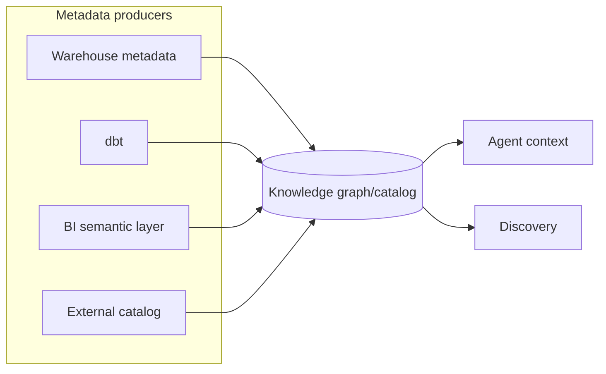

## Privacy-preserving analytics boundary
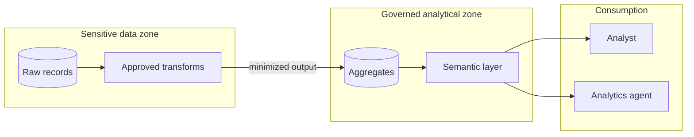
