# Delivery & Operations Patterns

## CI/CD pipeline
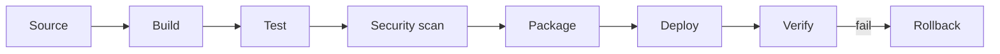

## Pipeline quality gates
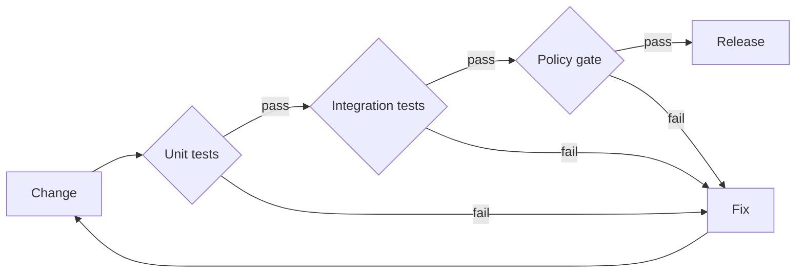

## GitOps reconciliation
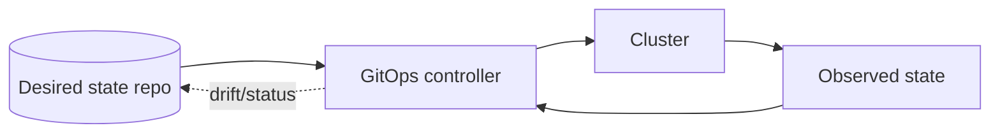

## Kubernetes request path
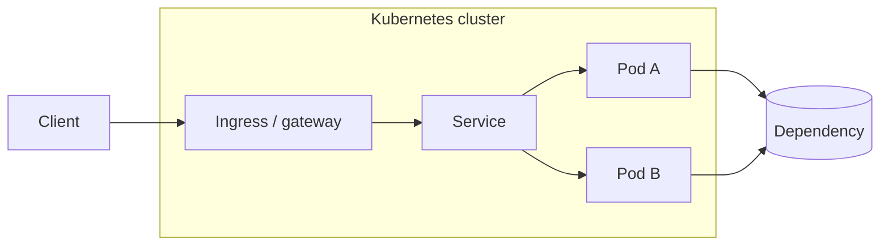

## Kubernetes control loop
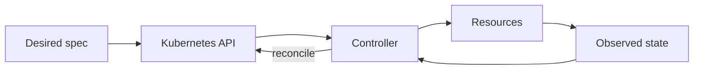

## Blue / green deployment
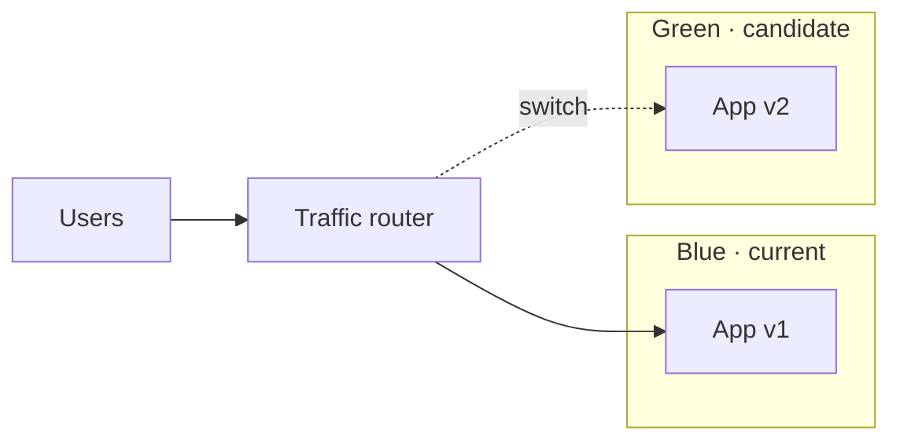

## Canary rollout
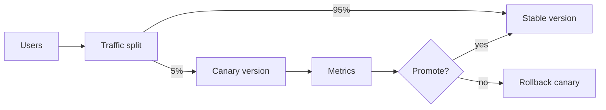

## Feature flag path
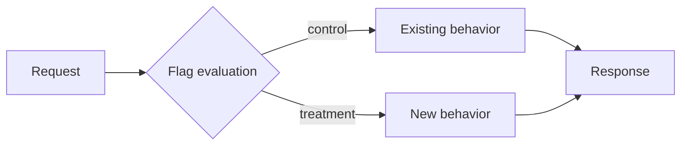

## Backup / restore
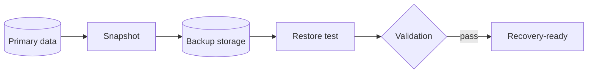

## Disaster recovery failover
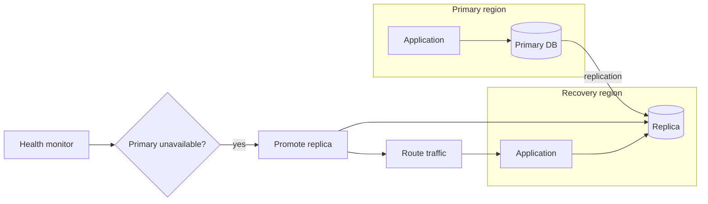

## SLO error budget loop
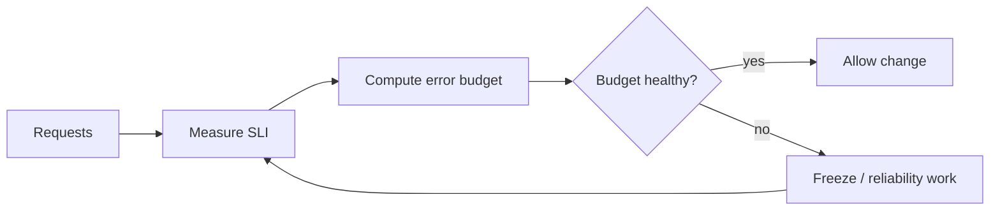

## Incident response
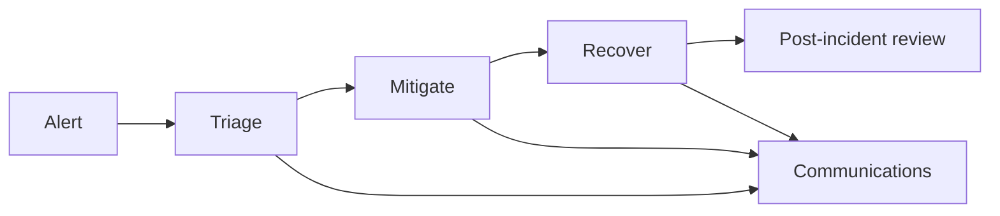

## Cloud landing zone
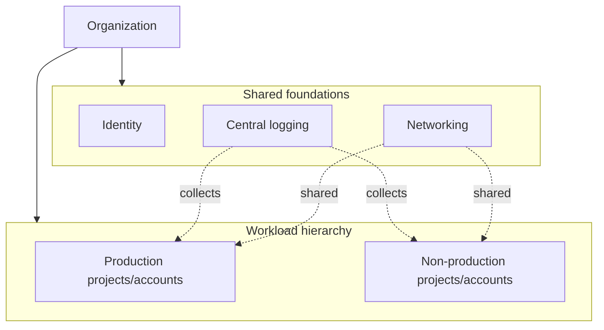

## Observability pipeline
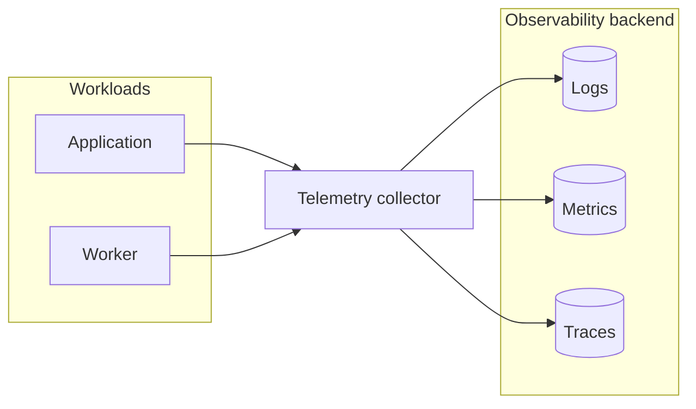

## Release train
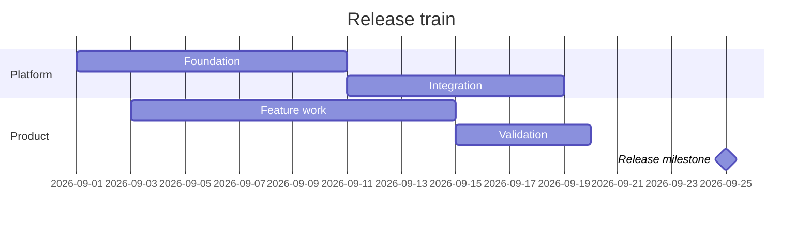
