# Distributed Systems Patterns

## Event-driven backbone
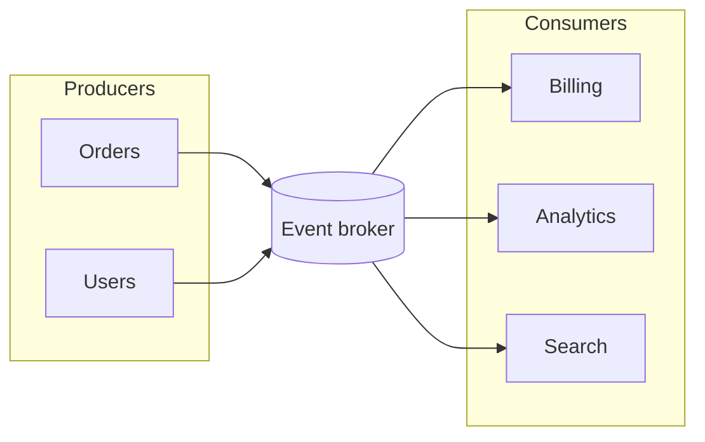

## CQRS split
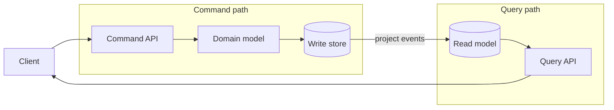

## Cache aside
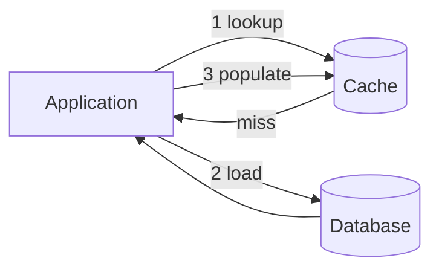

## Write-through cache
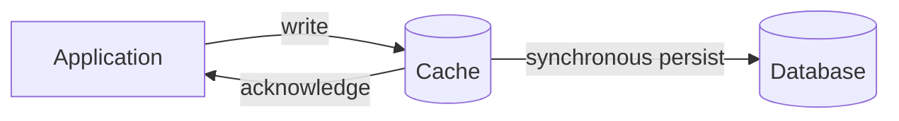

## Write-behind cache
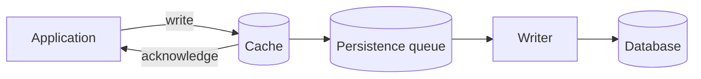

## Transactional outbox
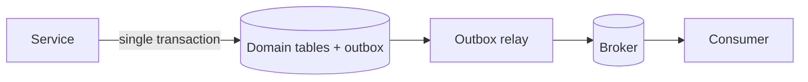

## Saga choreography
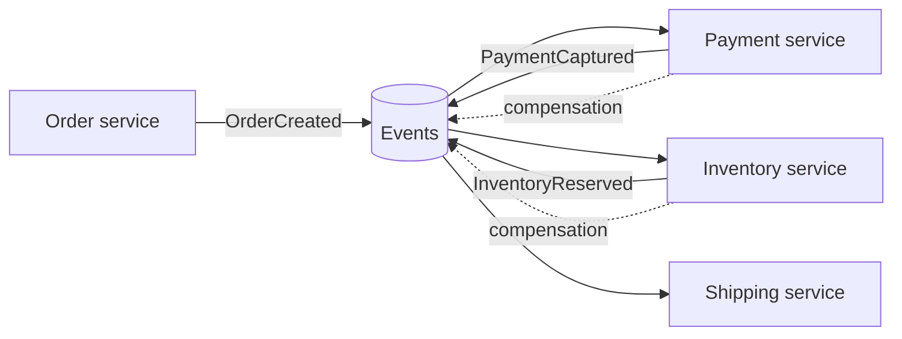

## Saga orchestration
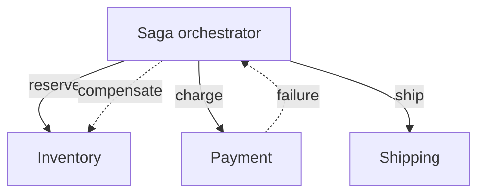

## Circuit breaker
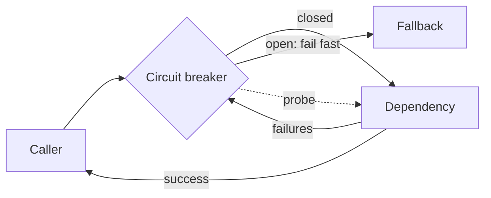

## Bulkhead isolation
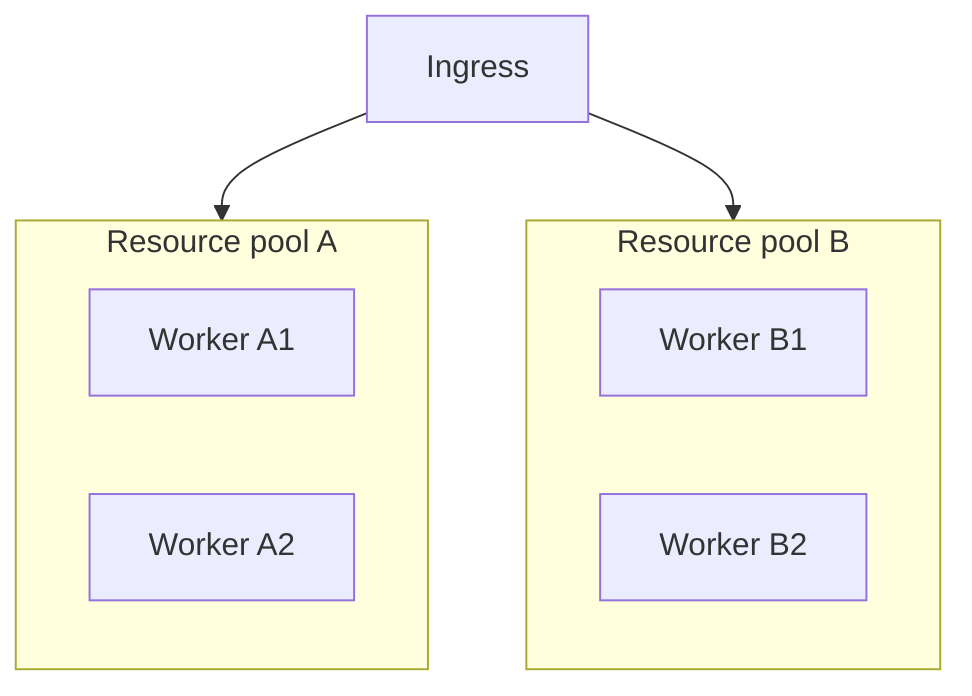

## Retry with dead letter
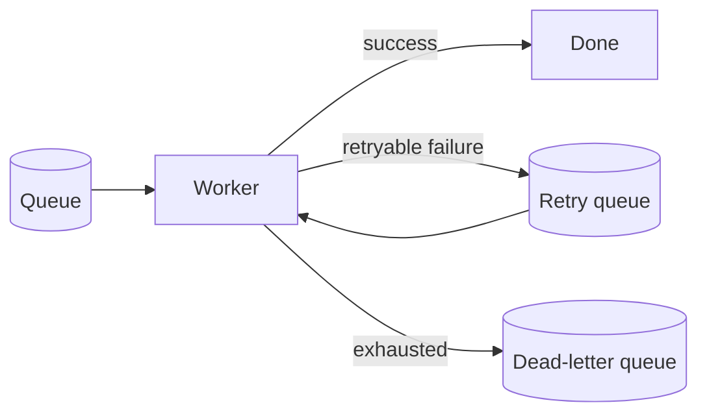

## Fan-out / fan-in
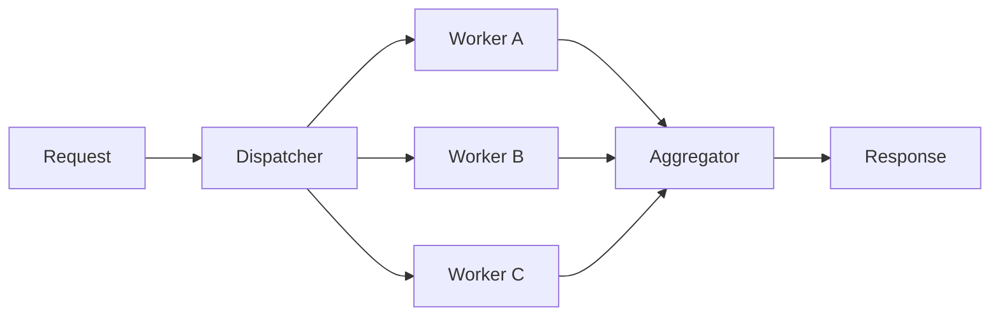

## Lambda data path
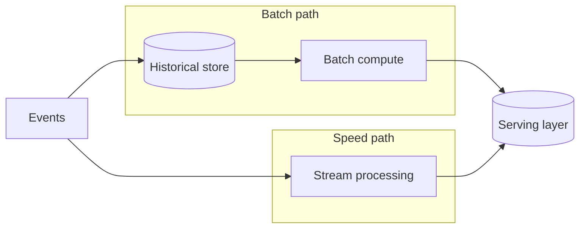

## Kappa data path
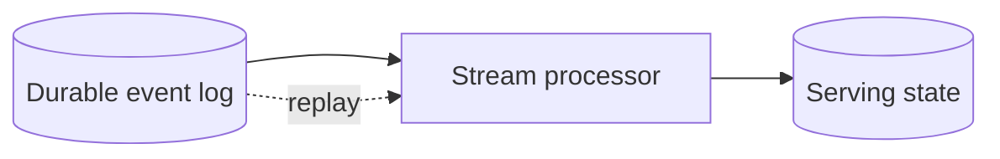

## Eventual consistency projection
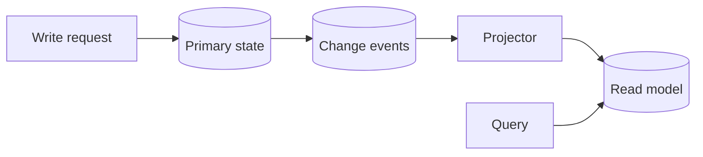
