# Domain & Data Model Patterns

## Aggregate root
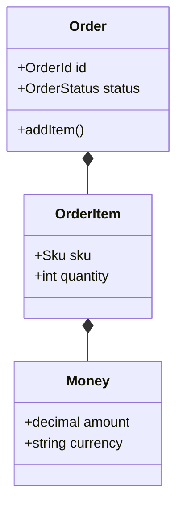

## Strategy family
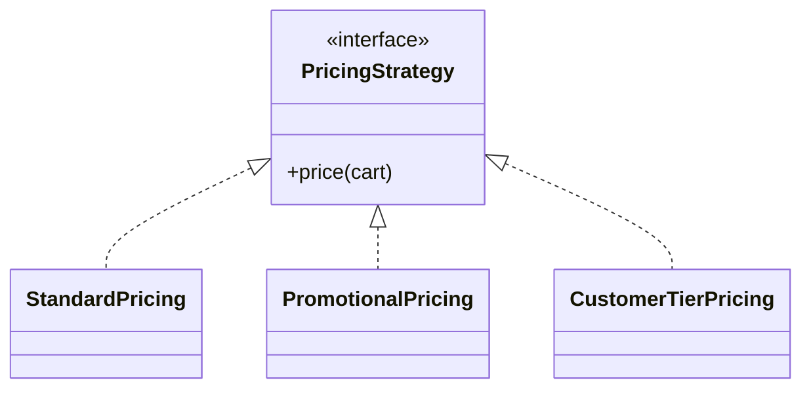

## Adapter family
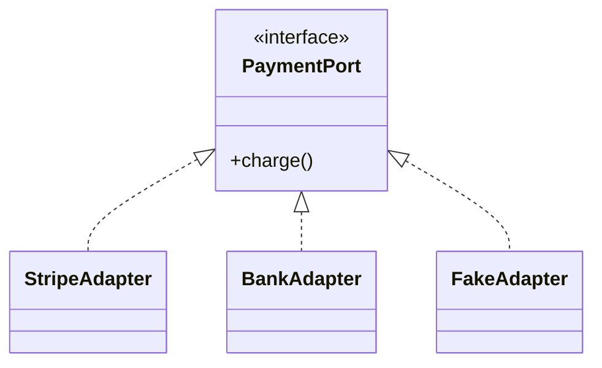

## Repository pattern
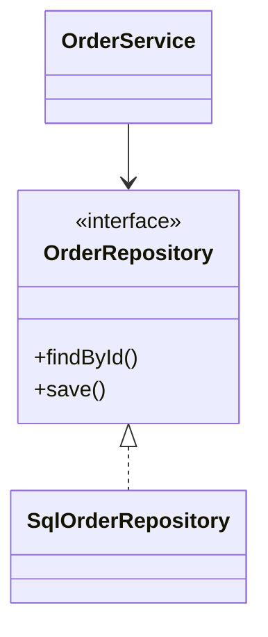

## Decorator chain
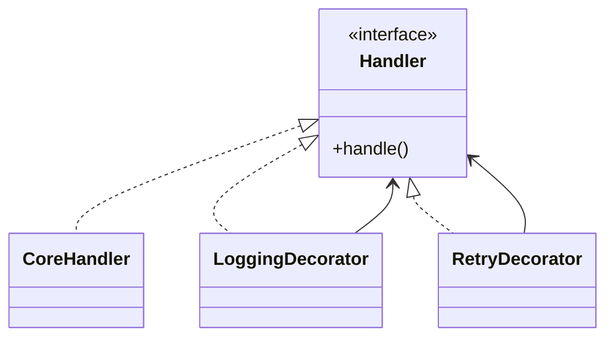

## Command handler model
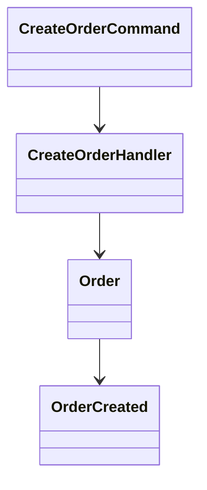

## Plugin interface model
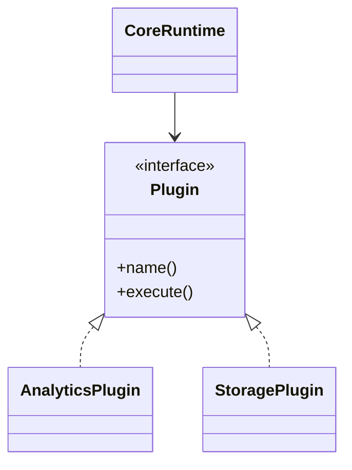

## API DTO boundary
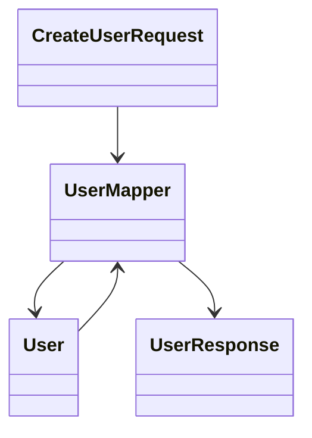

## Star schema
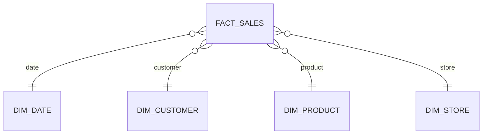

## Snowflake schema
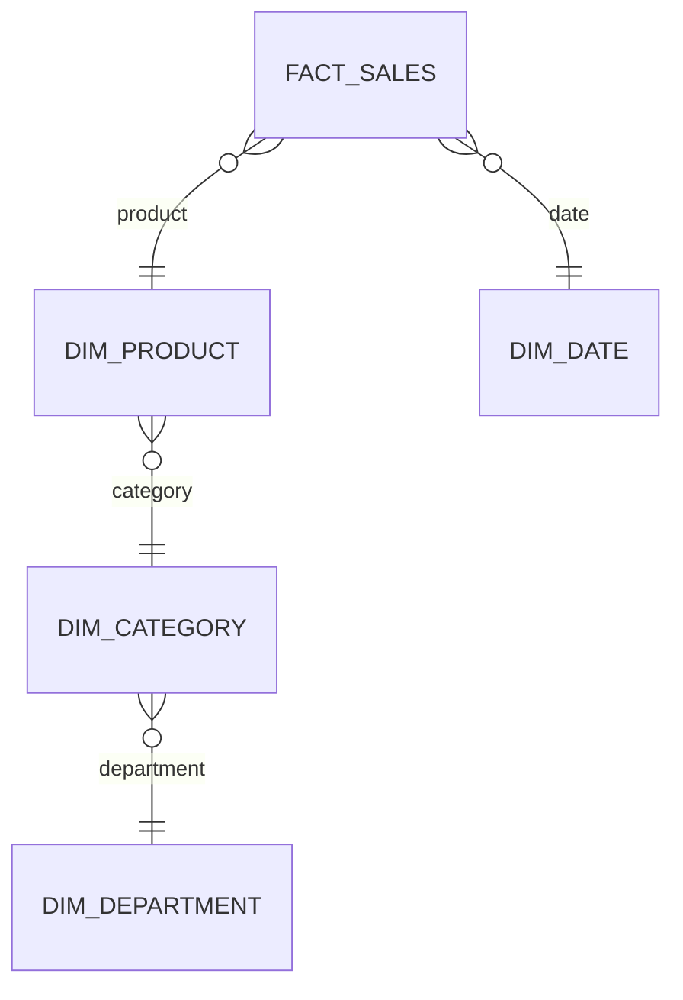

## Event store
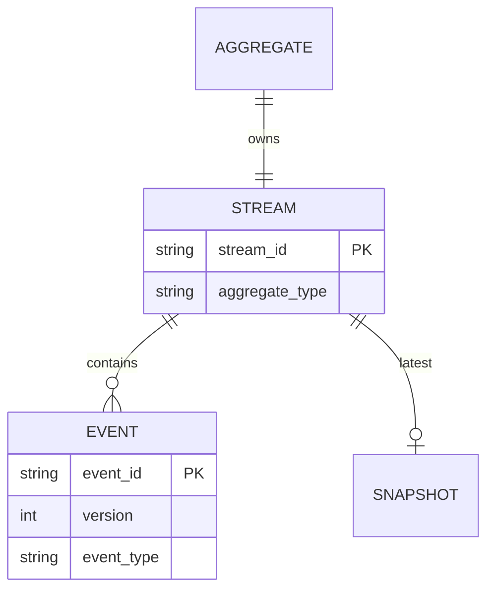

## Multi-tenant SaaS
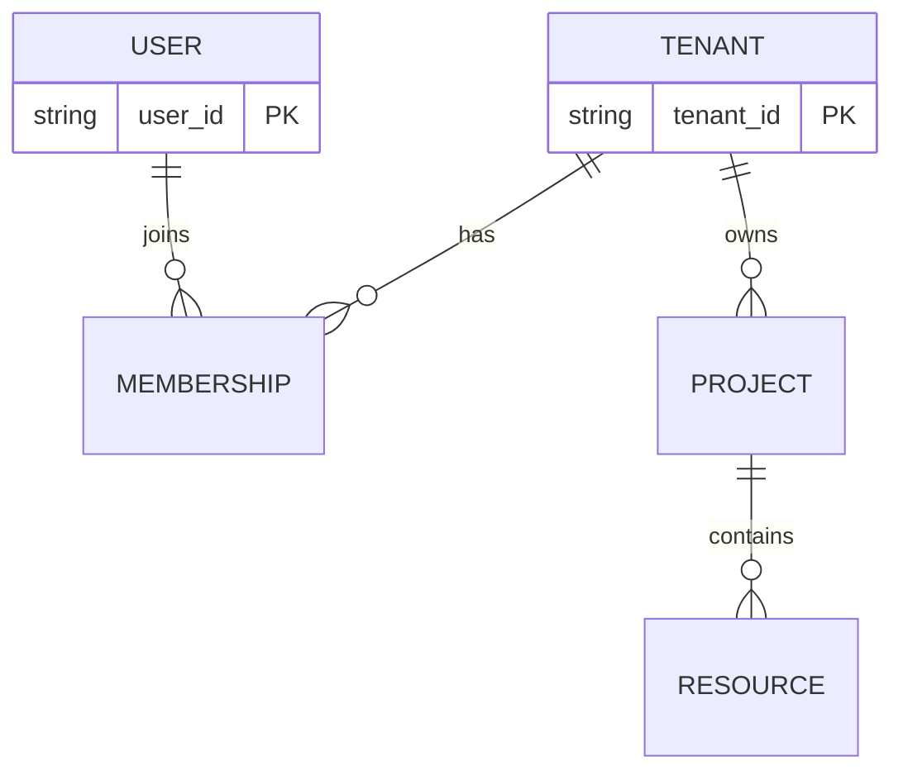

## RBAC model
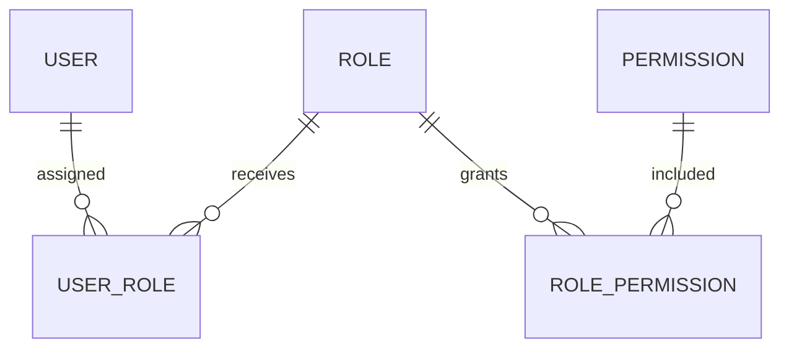

## Catalog / lineage model
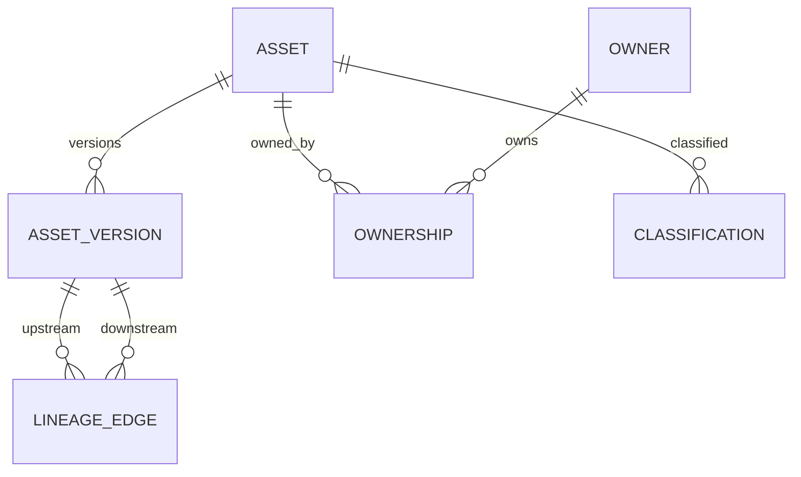

## Observability model
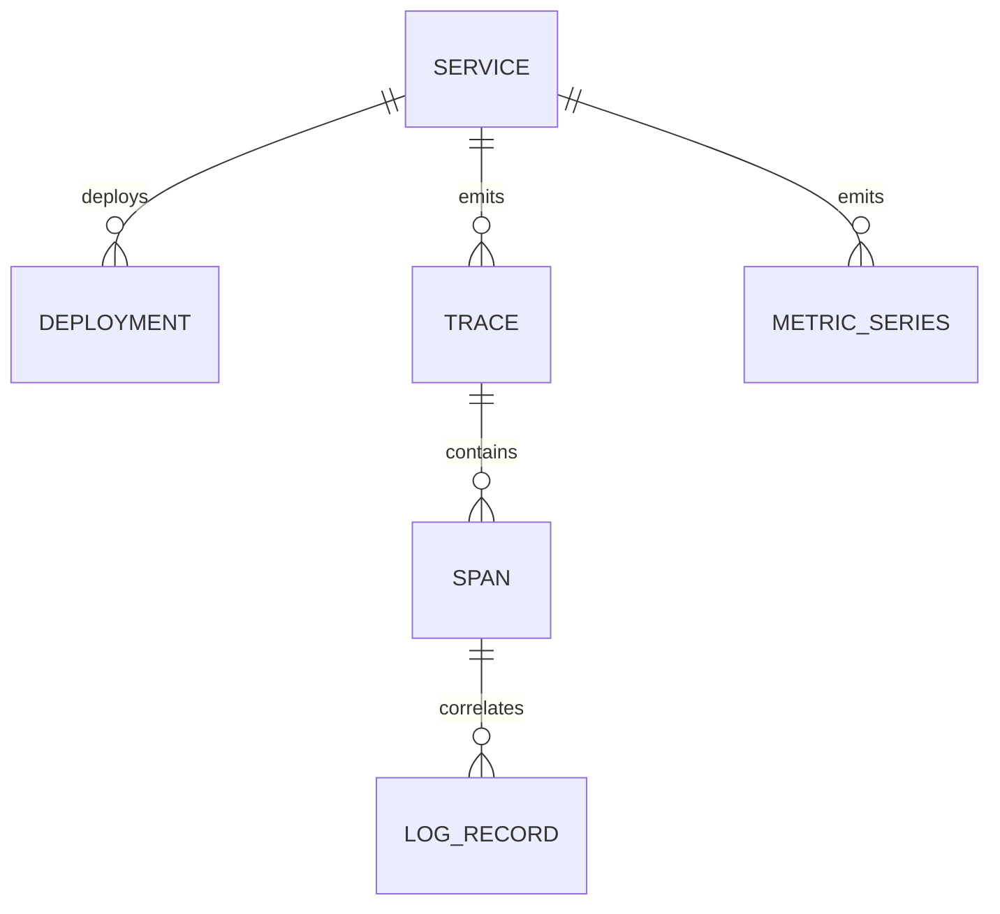
