# Planning & Analysis Patterns

## Release train Gantt
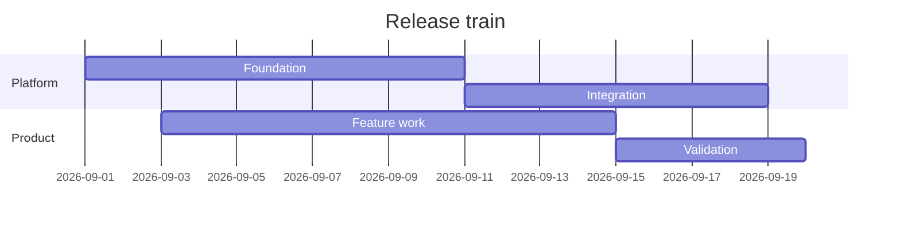

## Migration waves Gantt
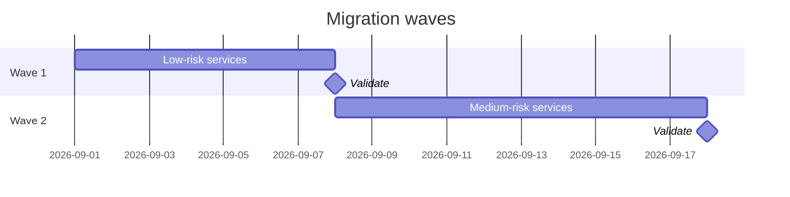

## Incident timeline
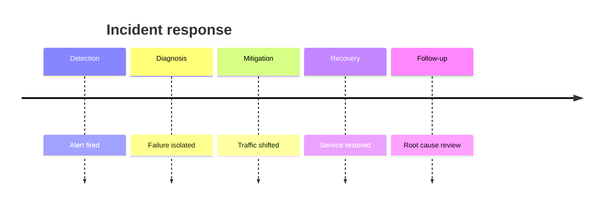

## Product evolution timeline
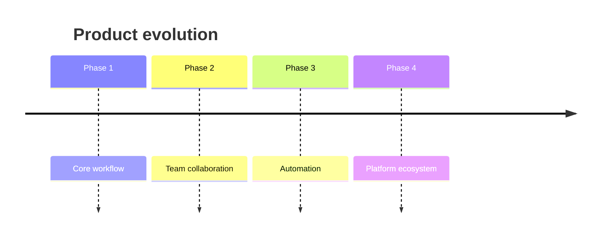

## Risk quadrant
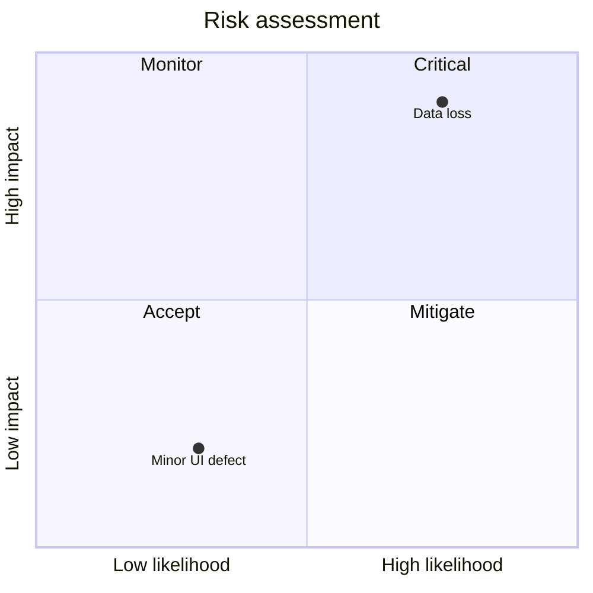

## Build / buy quadrant
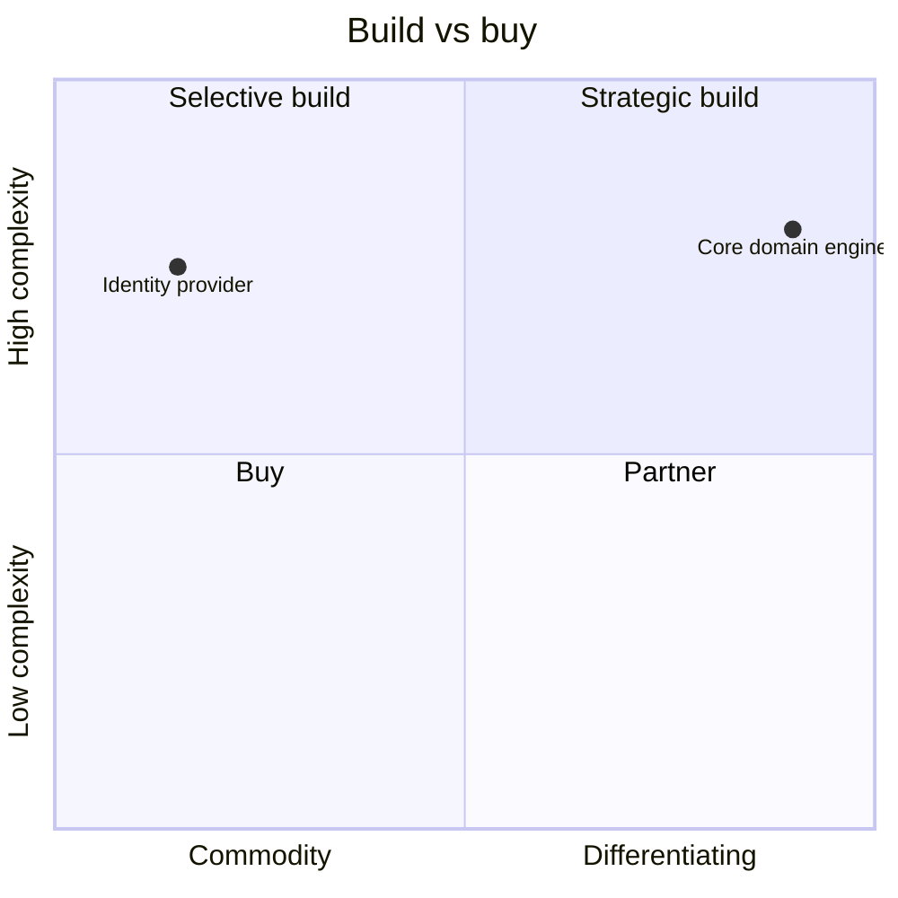

## User journey
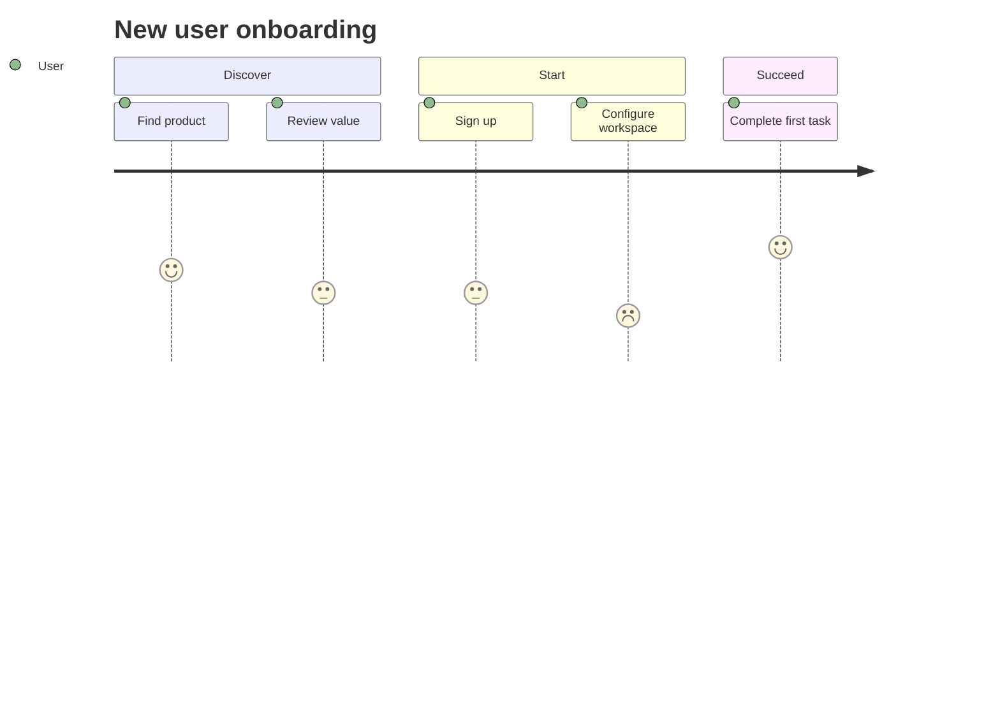

## Git history
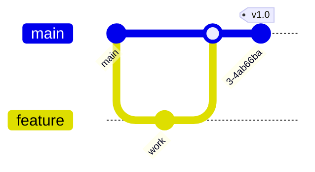

## Conversion Sankey
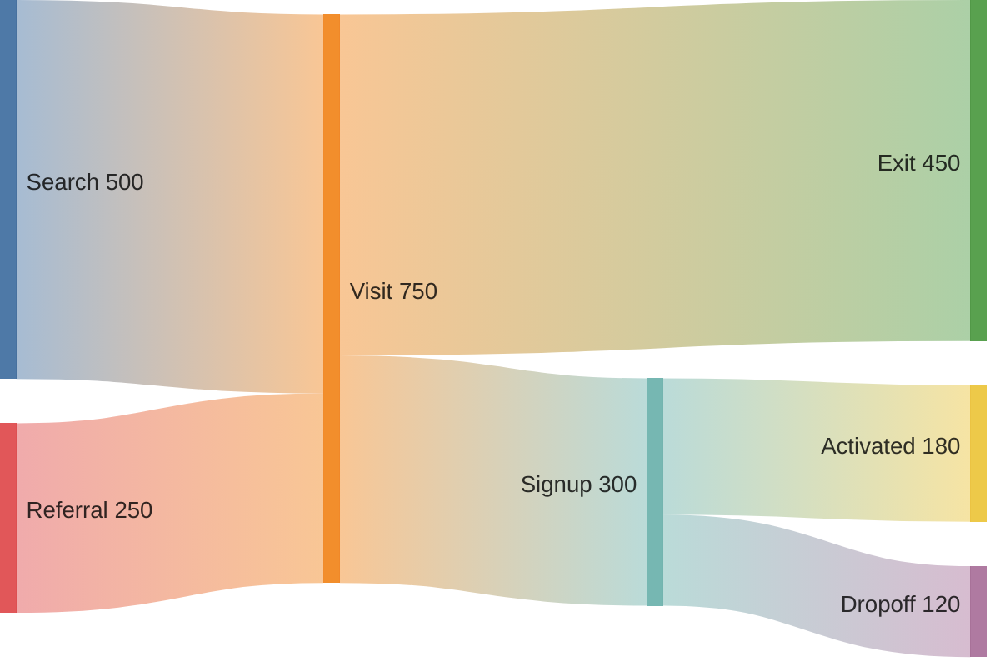

## Cost allocation Sankey
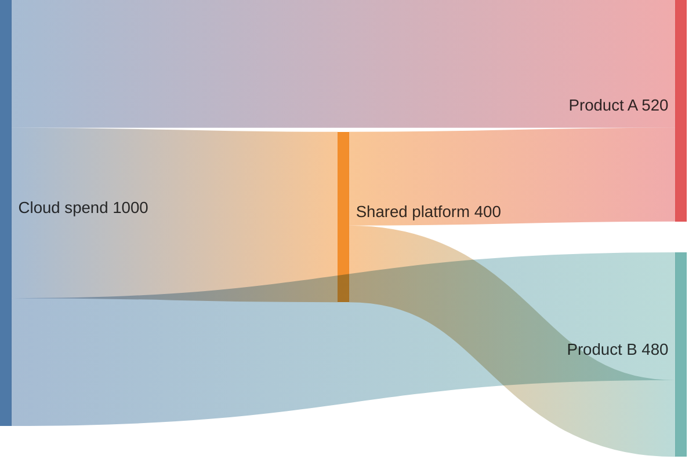

## Time-series threshold
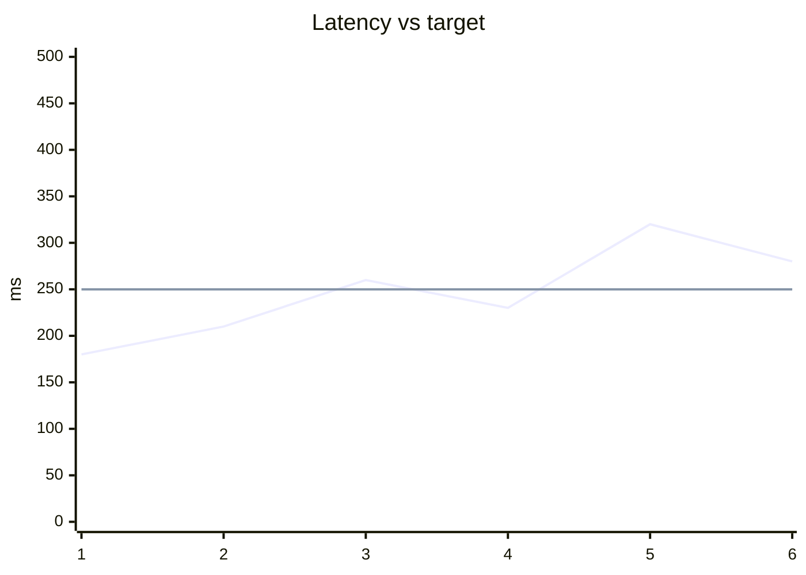

## Kanban delivery board
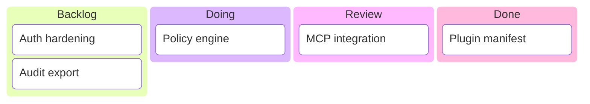

## Requirement trace
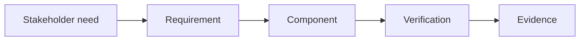

## Decision tree
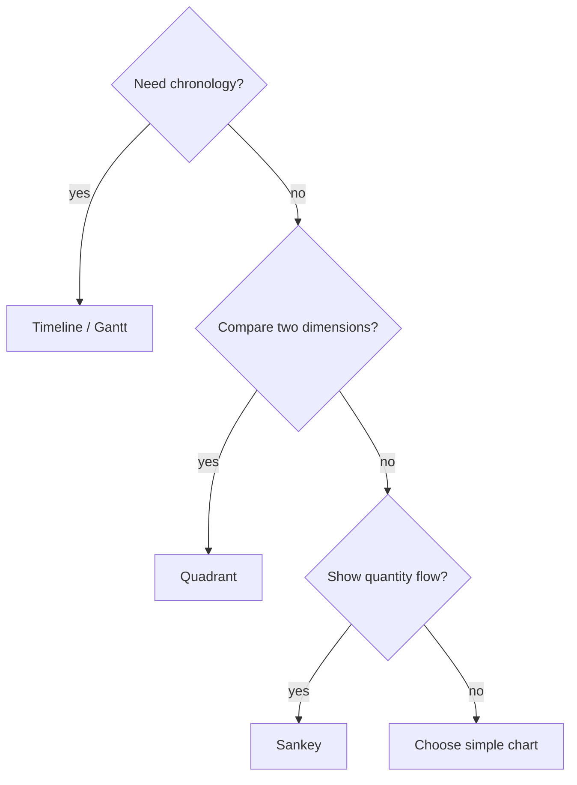

## Dependency tree
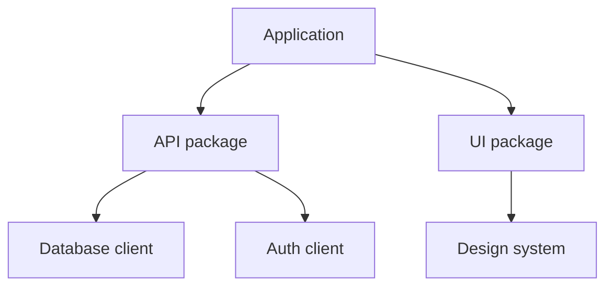

## Ishikawa fallback
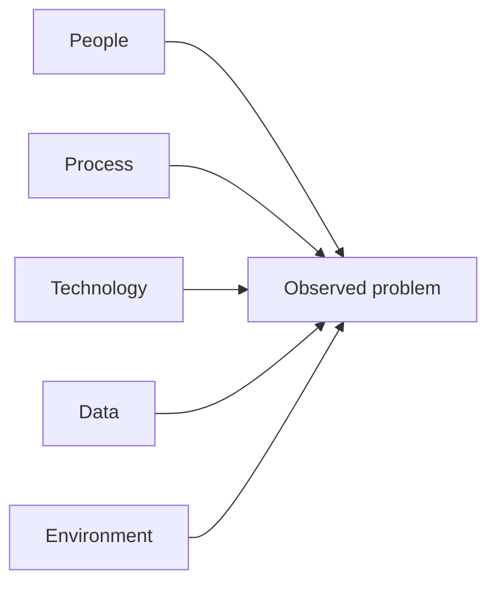
