# Security & Governance Patterns

## Identity boundary
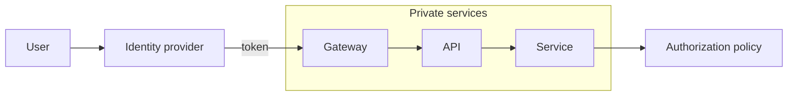

## Zero-trust access path
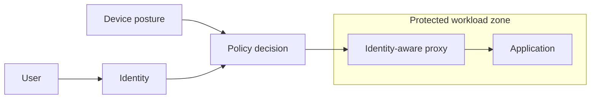

## RBAC
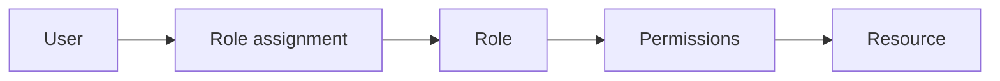

## ABAC
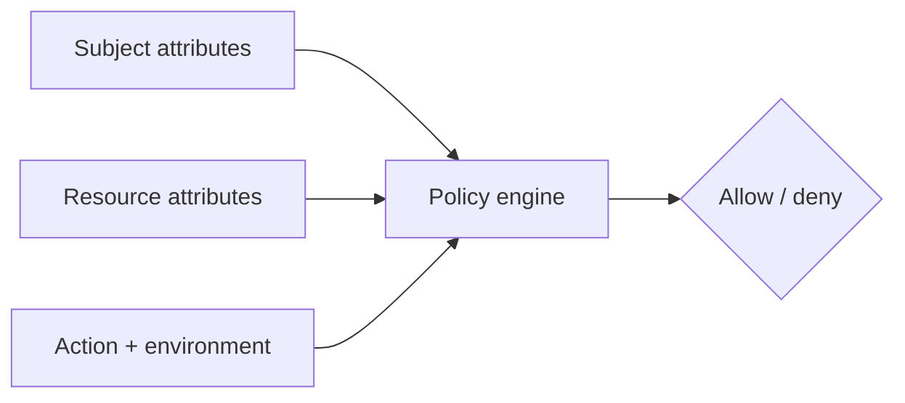

## ReBAC
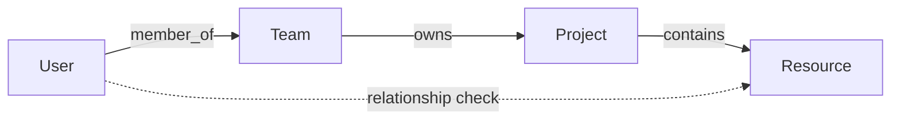

## Secrets delivery
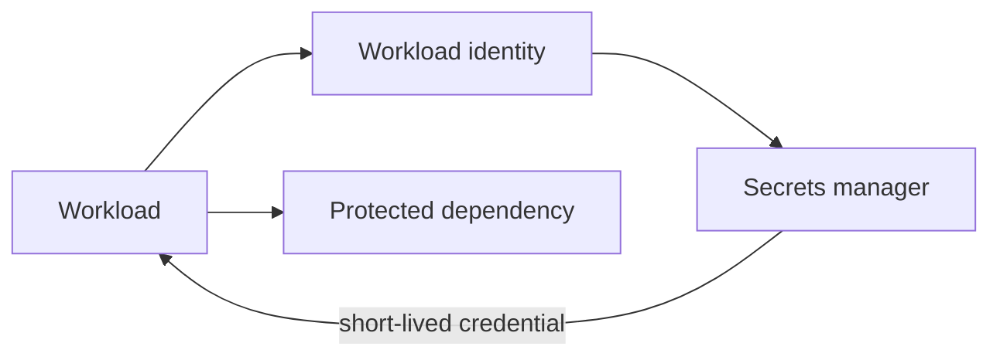

## Key rotation
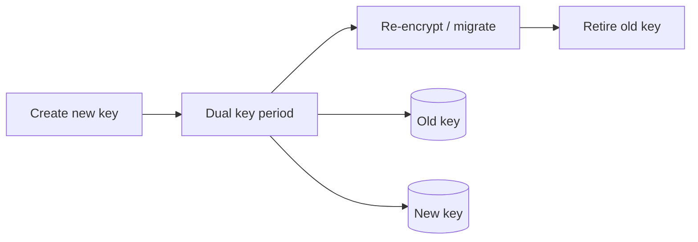

## Threat model flow
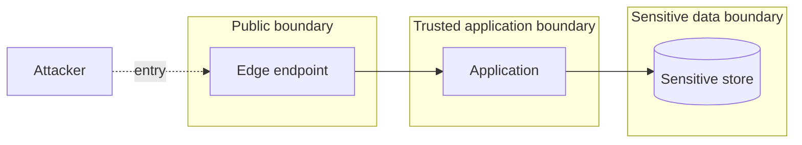

## Privacy data flow
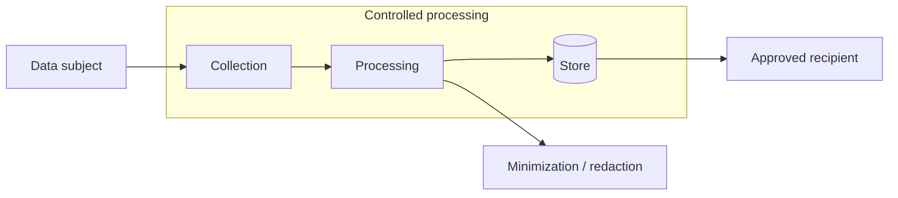

## Policy enforcement point
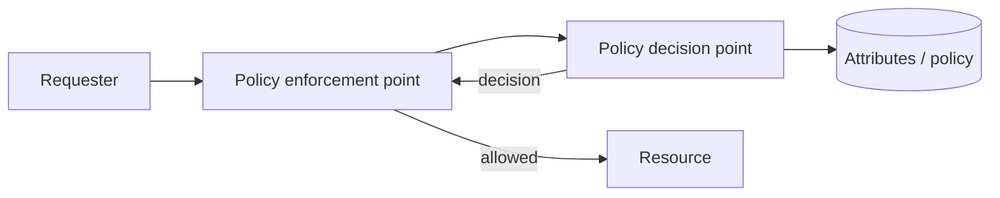

## Audit trail
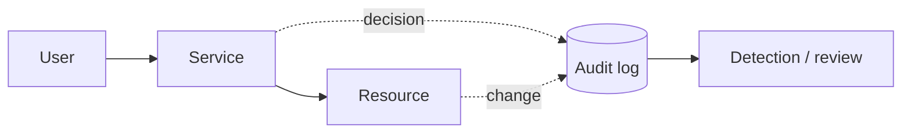

## Governance control plane
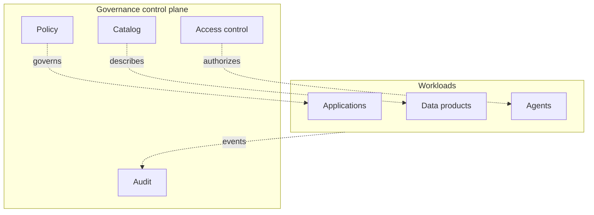

## Data classification boundary
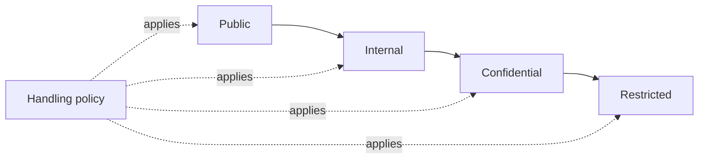

## Break-glass access
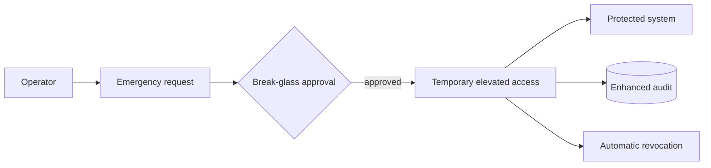

## Supply-chain trust boundary
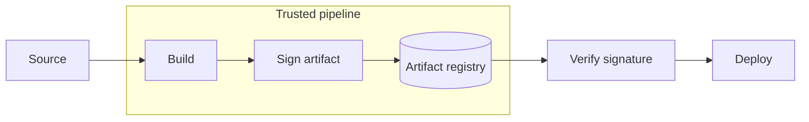
