# Sequence Patterns

## Synchronous request / response
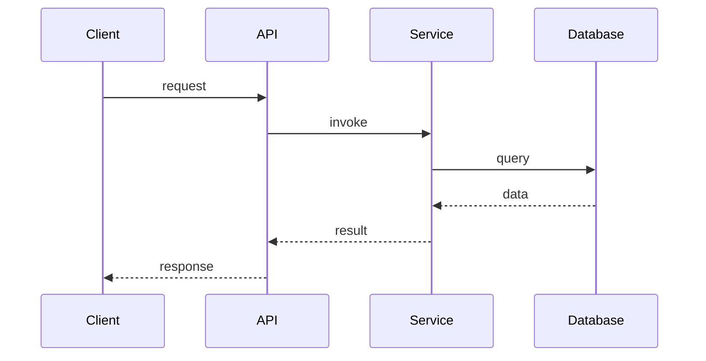

## OAuth authorization code
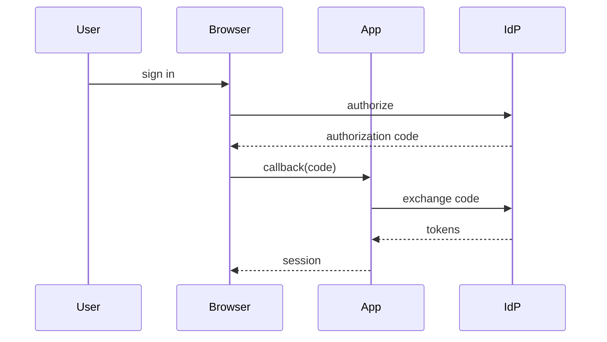

## Token refresh
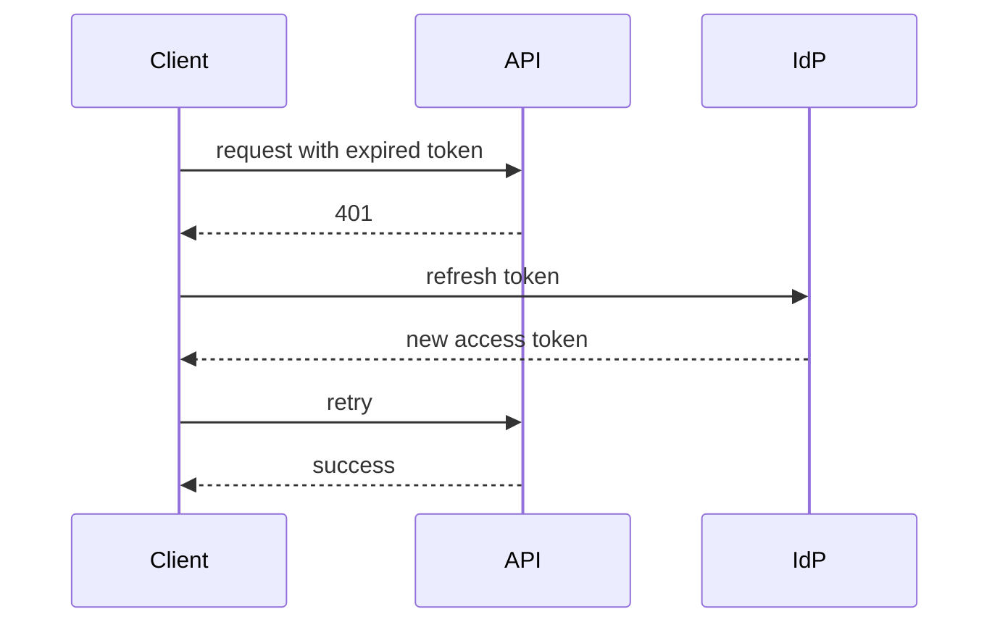

## Webhook delivery
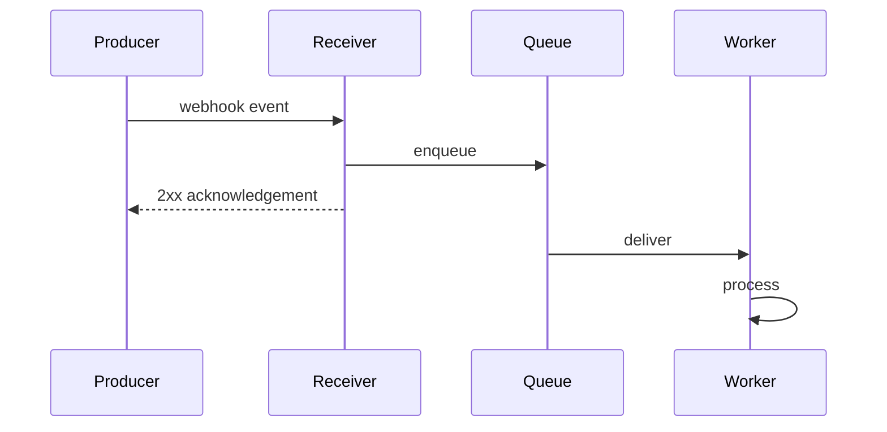

## Idempotent consumer
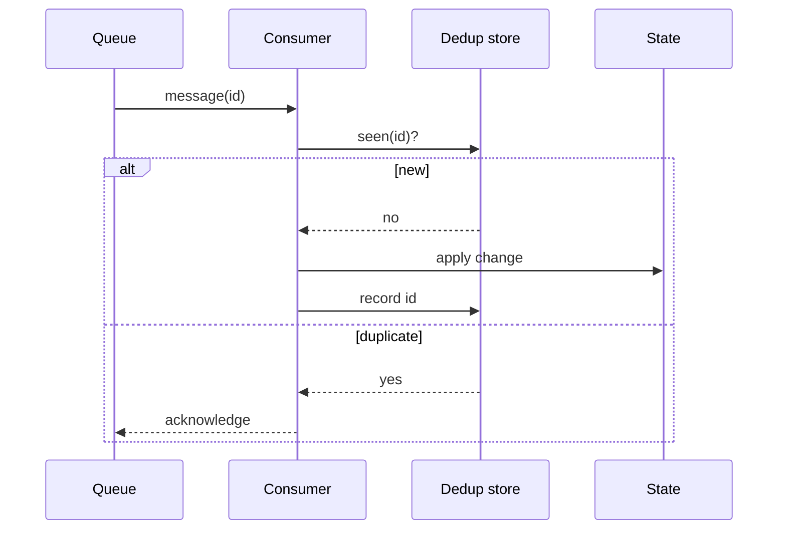

## Transactional outbox
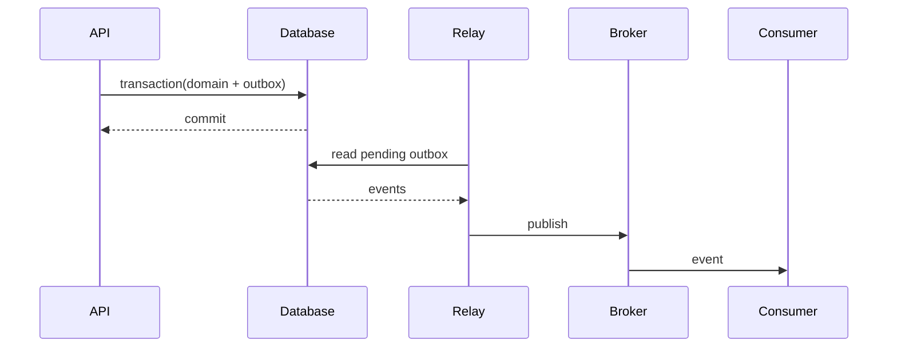

## Saga orchestration
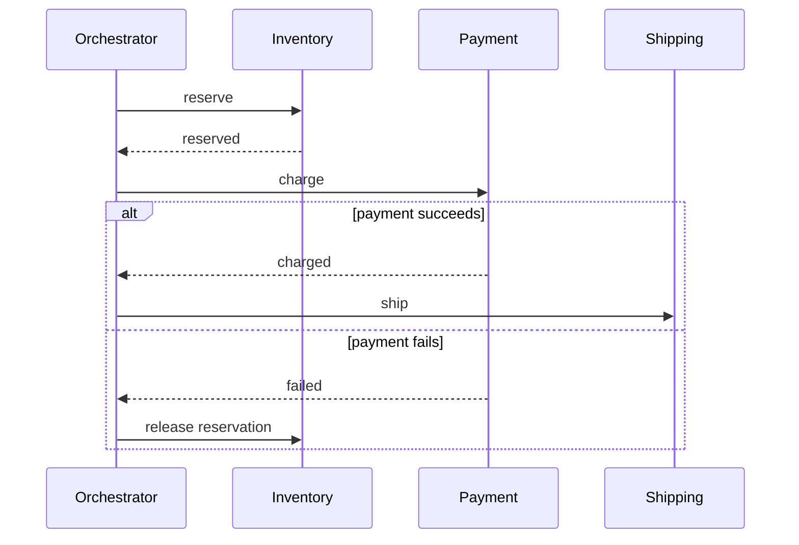

## Retry / backoff
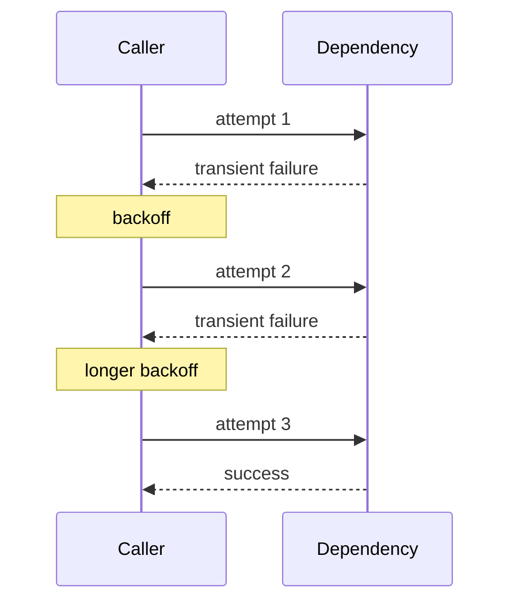

## Circuit breaker
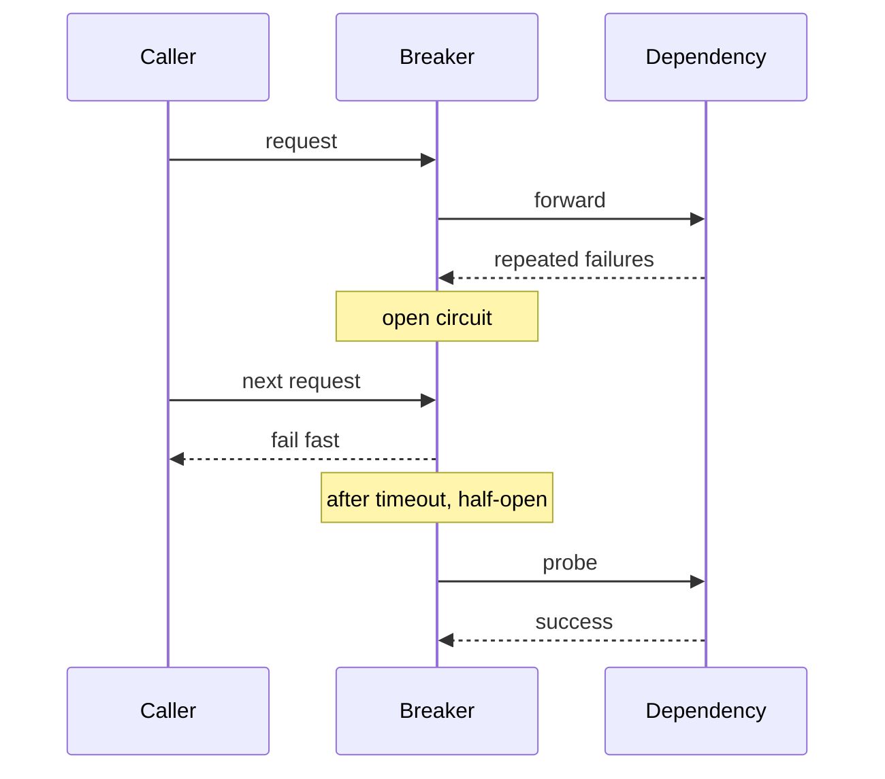

## Cache hit / miss
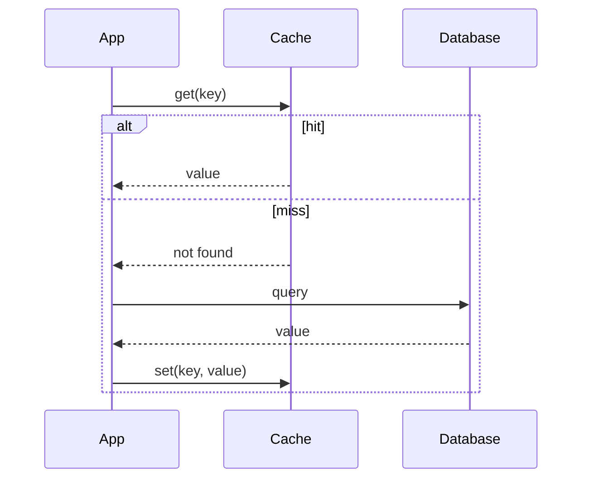

## Async job submission
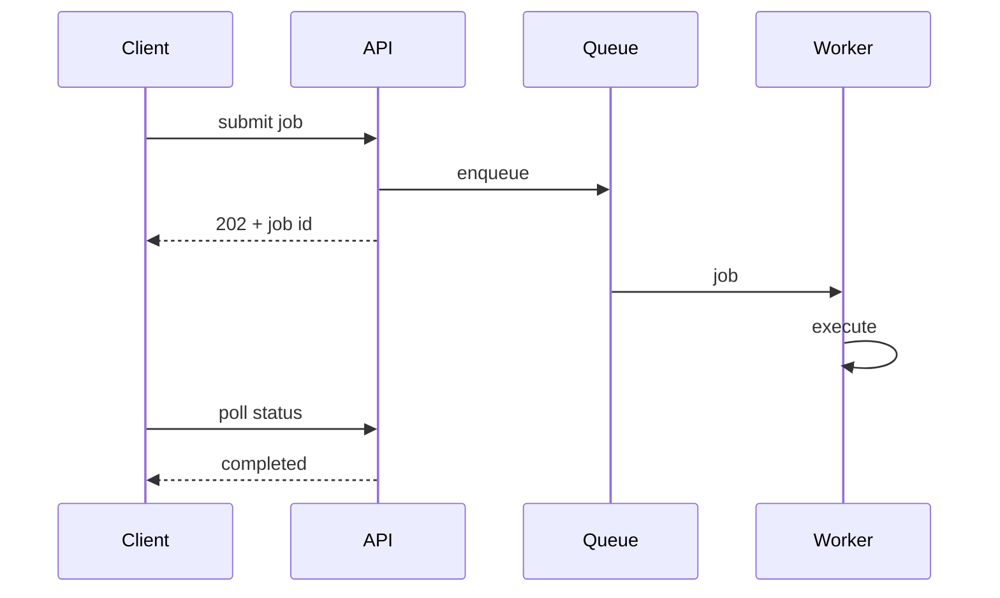

## Long-running operation
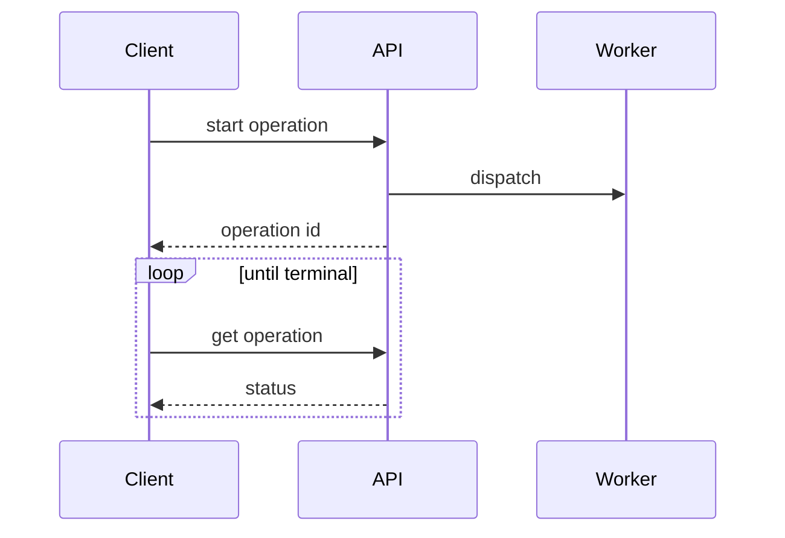

## RAG query
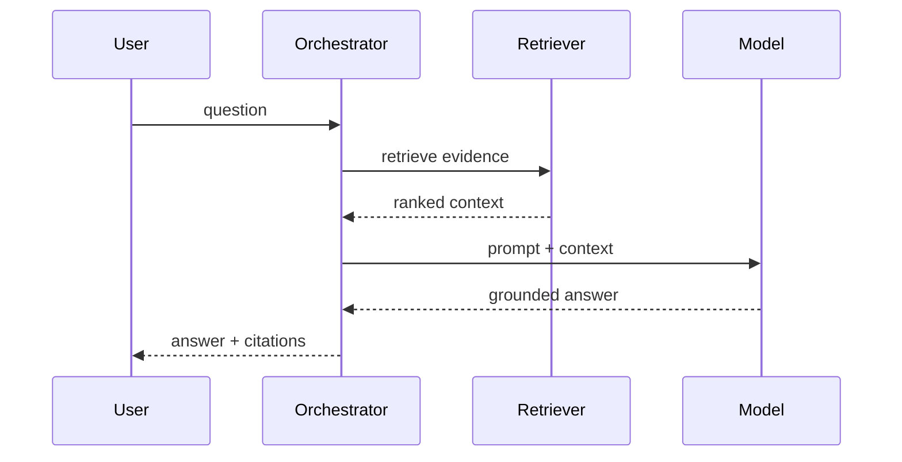

## Human approval
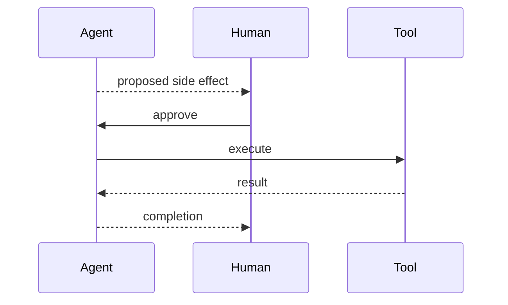

## Eventual consistency
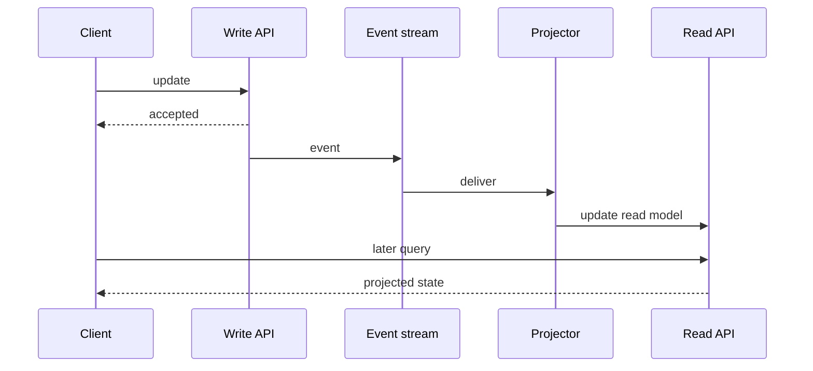
