# State & Process Patterns

## Entity lifecycle
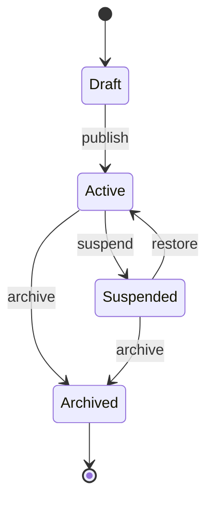

## Order lifecycle
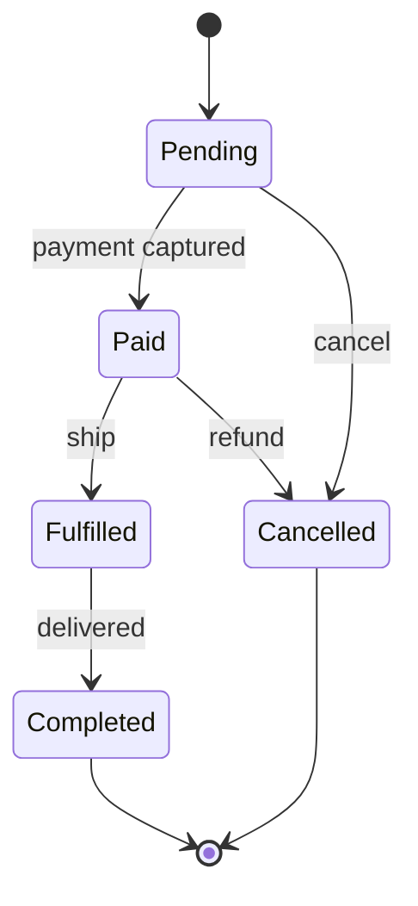

## Job lifecycle
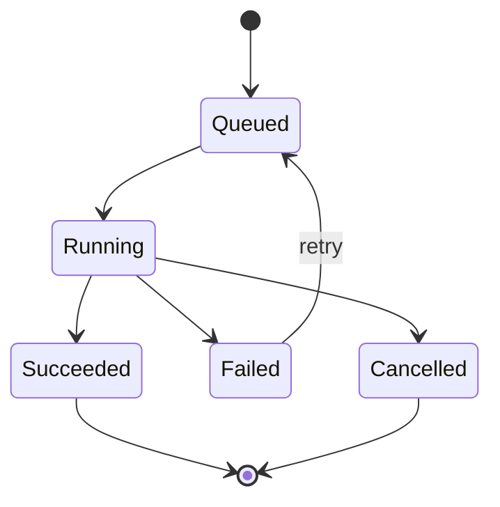

## Deployment lifecycle
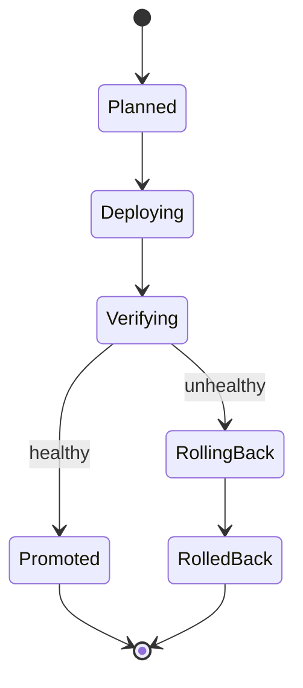

## Incident lifecycle
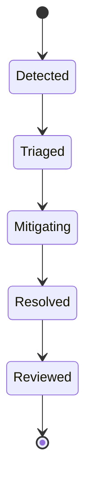

## Approval workflow
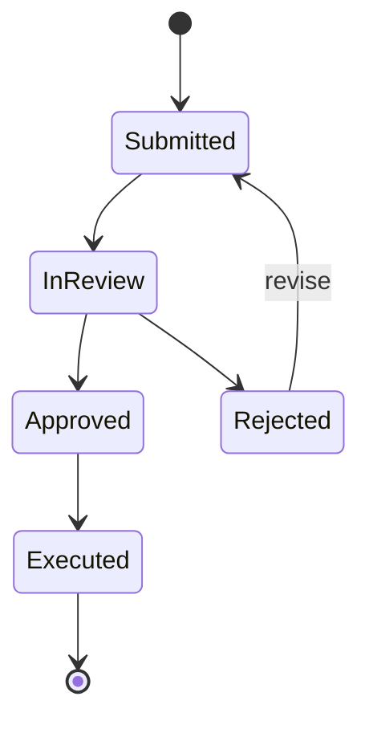

## Circuit breaker states
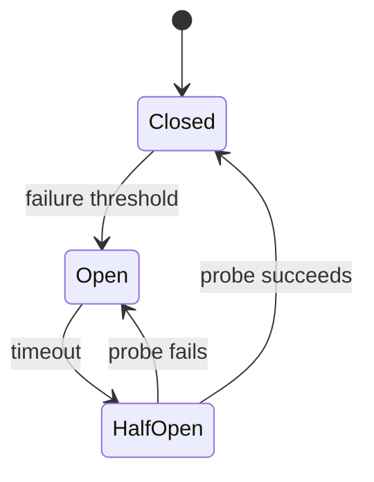

## Connection states
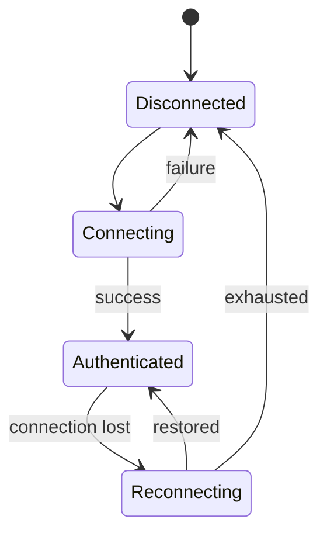

## Subscription lifecycle
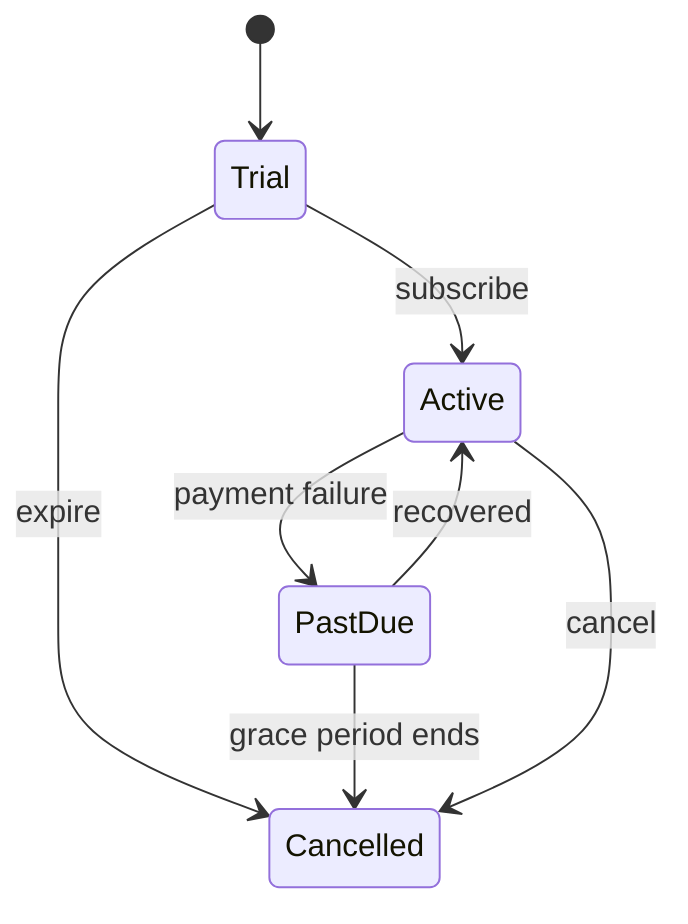

## Data quality state
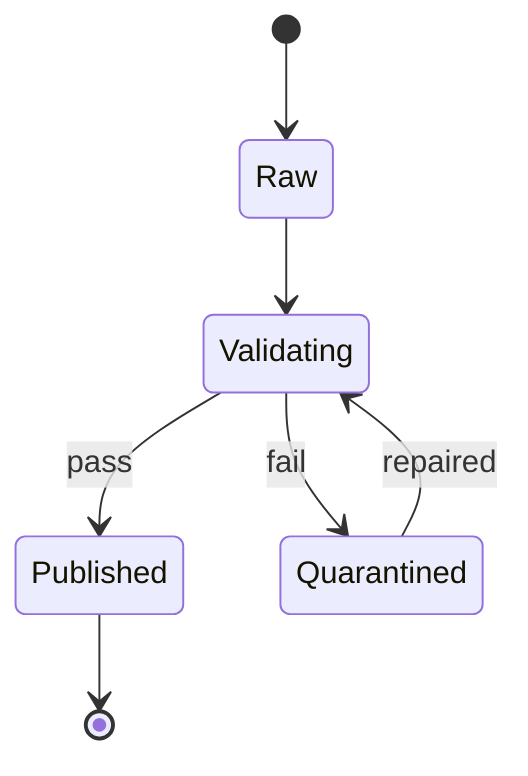

## Migration waves
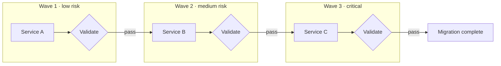

## Swimlane-like ownership
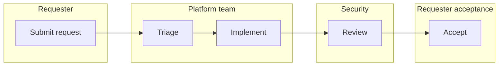

## Human-in-the-loop process
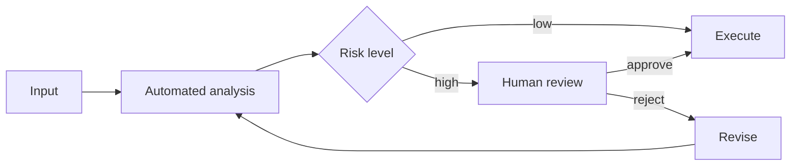

## Data retention lifecycle
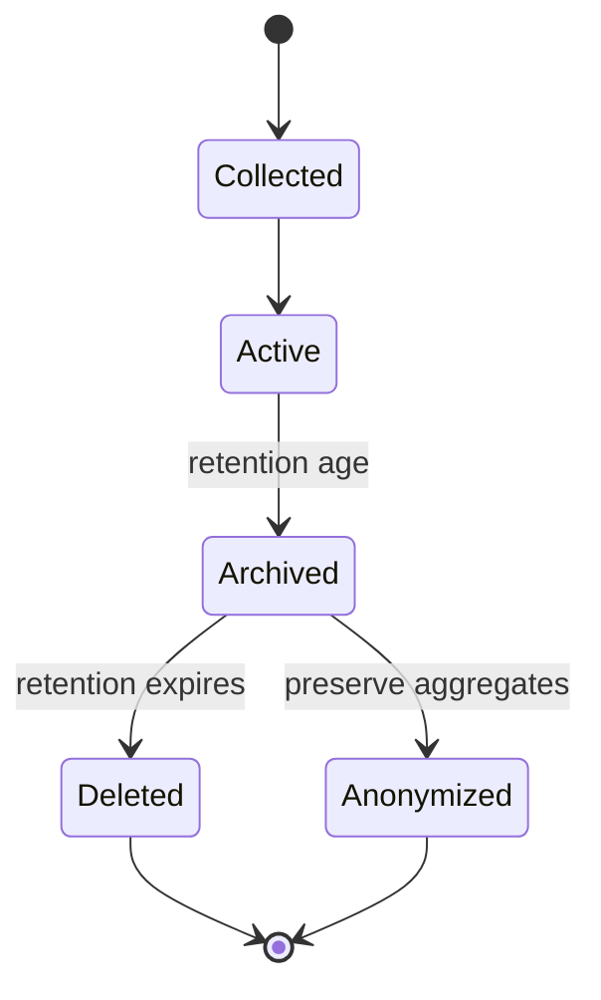
