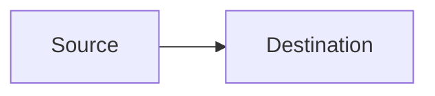

# GitHub Compatibility Policy

GitHub renders Mermaid embedded in fenced Markdown blocks, but its deployed Mermaid version can lag the newest upstream release. A successful render with a local latest-version CLI therefore does not guarantee GitHub compatibility.

## Required delivery form

For Markdown intended for GitHub, emit:

````markdown

````

Keep the Mermaid source in the Markdown even if a PNG or SVG preview is also generated.

## Compatibility tiers

### Tier A — preferred without special verification

Use conservative features of:
- flowchart / graph
- sequence diagram
- class diagram
- state diagram v2
- entity relationship diagram
- user journey
- Gantt
- pie
- Git graph
- mind map
- timeline
- quadrant chart

Avoid recently introduced directives inside these families unless needed.

### Tier B — verify target version or provide fallback

Treat the following as version-sensitive: Sankey, XY chart, block diagram, packet, Kanban, architecture, radar, swimlanes, ZenUML, event modeling, treemap, Venn, Ishikawa, Wardley, Cynefin, tree view, and any syntax marked beta/experimental by Mermaid.

If target support is unknown, represent the same idea with Tier A syntax. Example translations:
- swimlanes -> flowchart subgraphs by owner;
- architecture -> flowchart subgraphs by boundary/environment;
- Ishikawa -> left-to-right flowchart feeding a problem node;
- Wardley -> quadrant/flowchart approximation plus explanatory axes;
- tree view -> flowchart hierarchy;
- Kanban -> flowchart subgraphs by status.

## GitHub-safe design rules

- Use fenced `mermaid` blocks, not HTML script tags.
- Prefer plain text labels. Quote punctuation-heavy labels.
- Do not rely on click callbacks or arbitrary JavaScript.
- Avoid external assets or CSS required for comprehension.
- Avoid a theme-specific color as the only carrier of meaning.
- Keep labels concise so GitHub's responsive rendering remains readable.
- When repository rendering is a hard requirement, favor semantic portability over novelty.

## Verification

GitHub documents an `info` Mermaid diagram for checking the Mermaid version it currently uses. When the exact target repository/UI can be tested, use that information to decide whether Tier B syntax is acceptable. Otherwise stay conservative.
