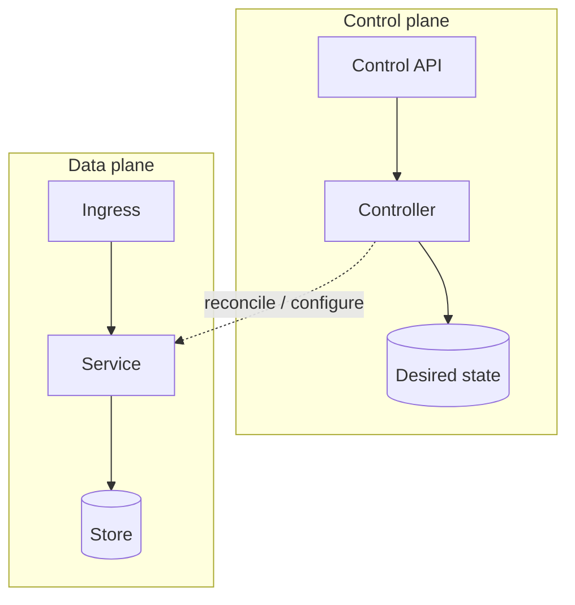

# Control plane vs data plane

## When to use

Separate **management / policy / reconciliation** from **request, event, or data path** traffic. Use when readers confuse “configures” with “serves,” or when plane boundaries explain reliability and blast radius.

## Dominant question

What configures and governs the system, versus what carries live traffic or data?

## Preferred Mermaid grammar

- **Primary:** `flowchart TB` (or `LR`) with two subgraphs: control plane and data plane
- **Alternate:** `sequenceDiagram` when a control action then affects a data-plane exchange
- **GitHub-safe:** flowchart + subgraphs; Architecture diagram only under a modern renderer profile

## Structure

1. Two subgraphs with distinct names: **Control plane** and **Data plane**.
2. Solid edges for the plane’s primary relationships; dashed or labeled edges for cross-plane influence (`configures`, `schedules`, `watches`).
3. Keep data-plane nodes as runtime path; keep control-plane nodes as controllers, APIs, catalogs, policy.
4. One cross-plane story tip: show *how* control affects data (push config, reconcile, admit)—not every API.

## What to cut

- Full mesh of every control API call and every data hop in one figure.
- Product logos, region maps, and org ownership unless they define the plane boundary.
- Treating “observability” as a third plane unless that is the point—otherwise attach as a side note or **split**.

## Minimal example

