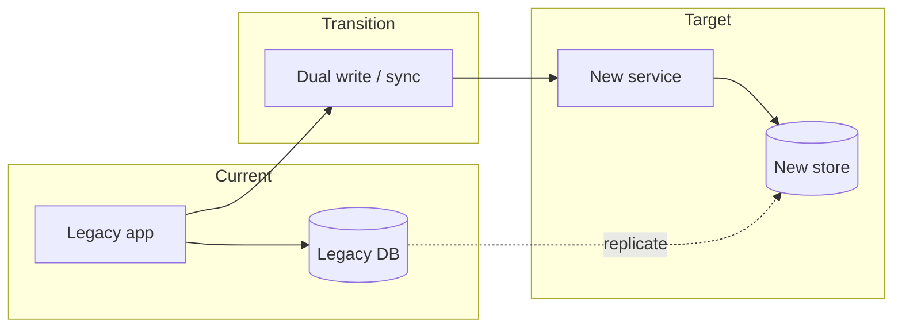

# Current → transition → target

## When to use

Communicate a **migration or transformation**: what exists today, what changes, and what the end state is. Prefer this over a single overloaded “everything at once” architecture picture.

## Dominant question

What moves from current to target, and what happens in between?

## Preferred Mermaid grammar

- **Primary:** `flowchart LR` with three stage subgraphs
- **Alternate:** `timeline` for milestone-heavy narratives; `stateDiagram-v2` when durable states dominate
- **GitHub-safe:** flowchart (and state/timeline when needed); do not rely on Architecture diagrams for GitHub preview

## Structure

1. Three clear stages: **Current**, **Transition**, **Target**.
2. Put only components that differ or move; shared unchanged infrastructure can be named once or omitted.
3. Transition edges should answer *what straddles* (dual-run, strangler, sync, cutover)—not every runtime call.
4. One reading direction left → right (or top → bottom for stage stacks).

## What to cut

- Full inventory of old and new systems in one figure.
- Operational runbooks, CI details, and org charts unless they are the migration mechanism.
- Mixing “how traffic flows today” with “who owns the cutover” unless both fit in budget—usually **split**: overview migration vs cutover sequence.

## Minimal example

