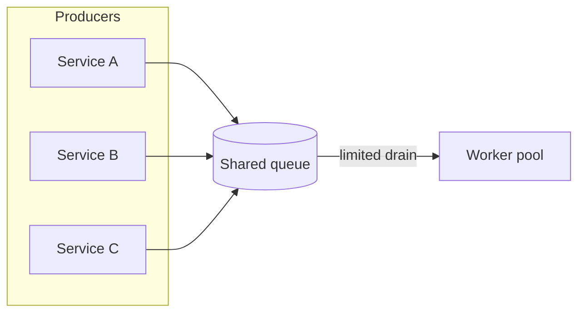

# Fan-in queue / bottleneck

## When to use

Show many sources converging on a **shared queue, lock, API, or worker pool**, and why throughput, latency, or contention concentrates there. Use when the bottleneck *is* the story.

## Dominant question

Where do many paths meet, and what limits flow at that meeting point?

## Preferred Mermaid grammar

- **Primary:** `flowchart LR` (or `TB`) with producers → choke point → consumers/drain
- **Alternate:** `sequenceDiagram` for ordered contention (lock acquire/release); `sankey-beta` only when volume split matters and the renderer supports it
- **GitHub-safe:** flowchart or sequence; treat Sankey as capability-gated

## Structure

1. Multiple similar producers on one side (group if they share a role).
2. A single, visually central **bottleneck** node (queue, lock, rate limiter, single writer).
3. Downstream drain or consumers on the other side.
4. Optional capacity/backpressure label on edges into the bottleneck—keep one metric idea, not a dashboard.

## What to cut

- Full topology of each producer’s internals.
- Retry/DLQ/observability overlays unless they explain the bottleneck.
- Mixing fan-in with control-plane design or authz detail—**split** if both need treatment.
- More than ~4–6 named producers; collapse extras into “N workers / N services.”

## Minimal example

