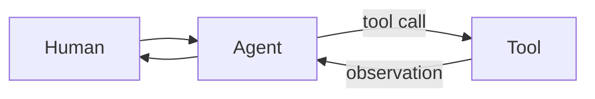

# Human → agent → tool

## When to use

Explain an **agentic interaction loop**: a human sets intent, an agent reasons or plans, and tools perform side effects or retrieval. Use when the boundary between probabilistic reasoning and deterministic action is the message. Prefer this over a generic “AI platform” map when the conversation is about one working loop.

## Dominant question

How do human intent, agent reasoning, and tool side effects connect?

## Preferred Mermaid grammar

- **Primary:** `flowchart LR` for the loop shape; `sequenceDiagram` when turn order and approvals matter
- **Alternate:** flowchart with an approval diamond when human-in-the-loop is required
- **GitHub-safe:** flowchart and sequence; avoid experimental agent diagram types

## Structure

1. **Human** → **Agent/model** → **Tool** → observation back to agent → optional reply to human.
2. Keep memory, retrieval, and policy as optional satellites—include only if material.
3. Separate side-effecting tools from read-only retrieval when that distinction matters.
4. One loop is enough; multi-agent supervisors belong in a dedicated diagram.

## What to cut

- Model provider logos, prompt text, and token metrics.
- Full tool catalogs; show one representative tool or a single “Tools” node.
- Mixing supervisor topology with the basic loop—**split**.
- Treating every retrieval hop as a separate agent.

## Minimal example

