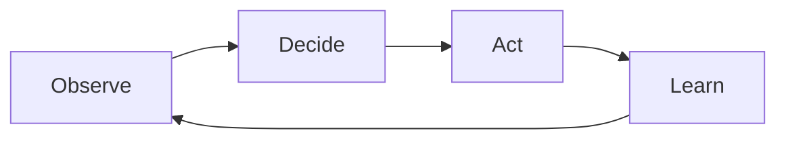

# Observe → decide → act → learn

## When to use

Show a **closed control or improvement loop**: sense the world, choose, intervene, then feed outcomes back. Fits operations, autoscaling, incident response, RL-style product loops, and continuous improvement—when the cycle itself is the point. Prefer this over a flat process list when learning/feedback closes the loop.

## Dominant question

What is sensed, what decides, what changes the world, and how do outcomes improve the next cycle?

## Preferred Mermaid grammar

- **Primary:** `flowchart LR` (or circular `TB` loop) with four named stages
- **Alternate:** `sequenceDiagram` for timed operational playbooks; `stateDiagram-v2` when loop stages are durable states
- **GitHub-safe:** flowchart, sequence, state; keep the loop to four primary nodes

## Structure

1. Four stages in order: **Observe** → **Decide** → **Act** → **Learn**, with Learn feeding Observe.
2. Name the artifacts at each stage (metrics, policy, change, updated model/runbook)—not every system involved.
3. One decision node; avoid nested decision trees inside the loop overview.
4. If org swimlanes matter, prefer a second diagram rather than crowding the loop.

## What to cut

- Full observability stacks and every dashboard.
- Parallel remediation playbooks (split detail).
- Mixing this with producer/broker topology or migration stages—**split**.
- Extra “AI” boxes that do not change observe/decide/act/learn roles.

## Minimal example

