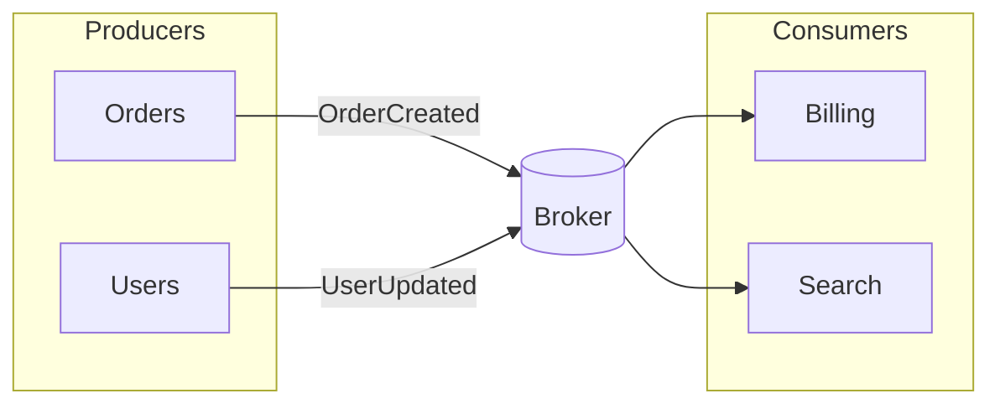

# Producer → broker → consumer

## When to use

Show **asynchronous decoupling** through a broker, bus, or topic. Use when the communication intent is “who publishes, what mediates, who reacts”—not the full distributed-systems encyclopedia.

## Dominant question

Who emits events, what mediates delivery, and who consumes them?

## Preferred Mermaid grammar

- **Primary:** `flowchart LR` with broker central
- **Alternate:** `sequenceDiagram` when publish/ack/consume timing or delivery semantics matter
- **GitHub-safe:** flowchart or sequence; keep node count small for preview readability

## Structure

1. Producers on one side, **broker/topics** in the center, consumers on the other.
2. Label edges with event or topic names when those names carry meaning.
3. Group producers/consumers by domain when there are more than a few.
4. Add retry/DLQ/idempotency only when operational behavior is the point.

## What to cut

- Schema registry, ACL matrices, and partition diagrams unless asked.
- Every consumer’s downstream side effects (split a detail diagram).
- Mixing saga compensation depth into the overview—happy-path broker picture first, compensations **split**.
- Duplicate arrows that restate the same publish/subscribe relationship.

## Minimal example

