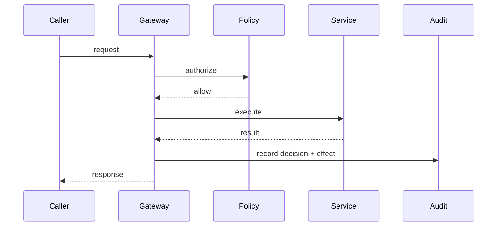

# Request → authorize → execute → audit

## When to use

Show a **governed request path**: something is asked for, checked, performed, then recorded. Use for API access, admin actions, agent side effects, and change windows where authorization and evidence matter.

## Dominant question

Who requests, what decides allow/deny, what runs, and what is recorded?

## Preferred Mermaid grammar

- **Primary:** `sequenceDiagram` when actors and ordered checks matter
- **Alternate:** `flowchart LR` for a compact control chain
- **GitHub-safe:** sequence and flowchart; keep actors ≤5 for sequence budgets

## Structure

1. Ordered stages: **Request** → **Authorize** → **Execute** → **Audit**.
2. Make the decision point explicit (PEP/PDP, role check, approval).
3. Show deny/reject only if the branch changes the lesson; otherwise note it in prose.
4. Audit should receive decision and/or effect—not a full SIEM architecture.

## What to cut

- Full identity-provider protocol detail (split an authn sequence).
- Every microservice hop between authorize and execute.
- Compliance frameworks and control catalogs as nodes.
- Combining this with paved-road topology and threat modeling in one figure—**split**.

## Minimal example

