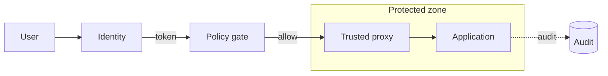

# Secure paved road

## When to use

Show the **trusted default path** users or workloads should take, with the controls that make that path safe. Use when the point is “how do we do this correctly,” not a full threat model or every alternate route.

## Dominant question

What is the approved path, and which controls make it trustworthy?

## Preferred Mermaid grammar

- **Primary:** `flowchart LR` (path + control checkpoints)
- **Alternate:** `sequenceDiagram` when order of identity, policy, and access matters more than topology
- **GitHub-safe:** flowchart and sequence; avoid Architecture / C4 for this pattern unless the renderer profile allows them

## Structure

1. Entry actor or workload on the left.
2. Ordered control steps on the paved road (identity → policy → gateway/proxy → protected resource).
3. One subgraph for the **trust / protected zone** if the boundary itself is the message.
4. Optional dashed edges for monitoring or audit only when they change the story.

Keep one primary reading direction. Labels should name the control, not the product brand.

## What to cut

- Parallel “shadow” paths, break-glass, and attacker stories (split diagrams).
- Full IAM matrix, every middleware hop, and decorative security icons.
- Color-only meaning for “secure.”
- Mixing this with control-plane topology or migration states in the same figure.

If paved road and threat model both need depth, **split diagrams**.

## Minimal example

