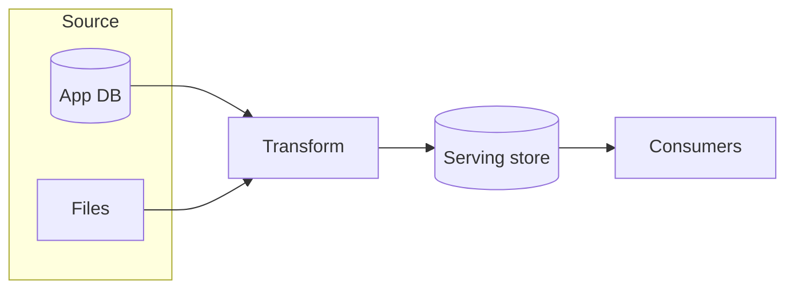

# Source → transform → serve

## When to use

Explain a **data or content pipeline** as staged movement: origins, processing, then consumption. Ideal for lakehouse spines, ETL/ELT, search indexing, and feature pipelines when lineage-of-stages matters more than every job.

## Dominant question

Where does data come from, how is it shaped, and how is it consumed?

## Preferred Mermaid grammar

- **Primary:** `flowchart LR` with stage subgraphs or a linear spine
- **Alternate:** `flowchart TB` for medallion / layered platforms
- **GitHub-safe:** flowchart; avoid packing catalog/quality/policy into the spine—show as cross-cutting dashed edges or a second diagram

## Structure

1. **Source** → **Transform** → **Serve** (optionally insert stage/store nodes between).
2. Group multiple sources or consumers only when they share a role.
3. Keep governance, catalog, and orchestration as side influences unless they are the main question.
4. Prefer stage names over tool names; add products only when the choice is the message.

## What to cut

- Every intermediate temporary table and cron.
- Full schema/ER detail (use a data-model diagram instead).
- Mixing this with control-vs-data-plane depth—**split** if both need full treatment.
- BI, ML, and agents as separate elaborate subgraphs when “consumers” as one group suffices.

## Minimal example

