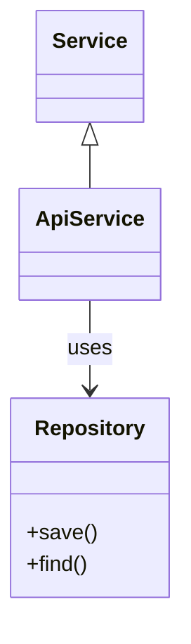

# Class

## Use when
Showing types, inheritance/composition, and key members—API models, domain objects, or module interfaces with relationships.

## Avoid when
You only need tables and FKs (use ER), runtime call order (use Sequence), or deployment/connectivity (use Flowchart).

## Preferred semantic intents
Domain modeling (types), structure/dependency among classes, interface contracts at a glance.

## GitHub compatibility
Tier A / GitHub-first. Prefer `classDiagram` with simple relationships (`<|--`, `*--`, `-->`). Avoid exotic stereotypes and huge member lists that overflow GitHub preview.

## Design rules
- Class names are nouns; members are short.
- Show only members that clarify the relationship story.
- Prefer composition/association clarity over exhaustive fields.
- One package or layer per diagram when possible.

## Complexity budget
Recommended ≤8 classes. Split near 12 by package or aggregate root.

## Minimal syntax
```text
classDiagram
  Animal <|-- Dog
  Dog : +bark()
```

## Common failure modes
Full DTO dumps; every utility class included; relationship direction ambiguity; treating Class as an ER with methods bolted on.

## Fallbacks
Persistent relational data → ER. Behavior over time → Sequence. Module boxes without members → Flowchart subgraphs. Wide type catalogs → table.

## Examples


