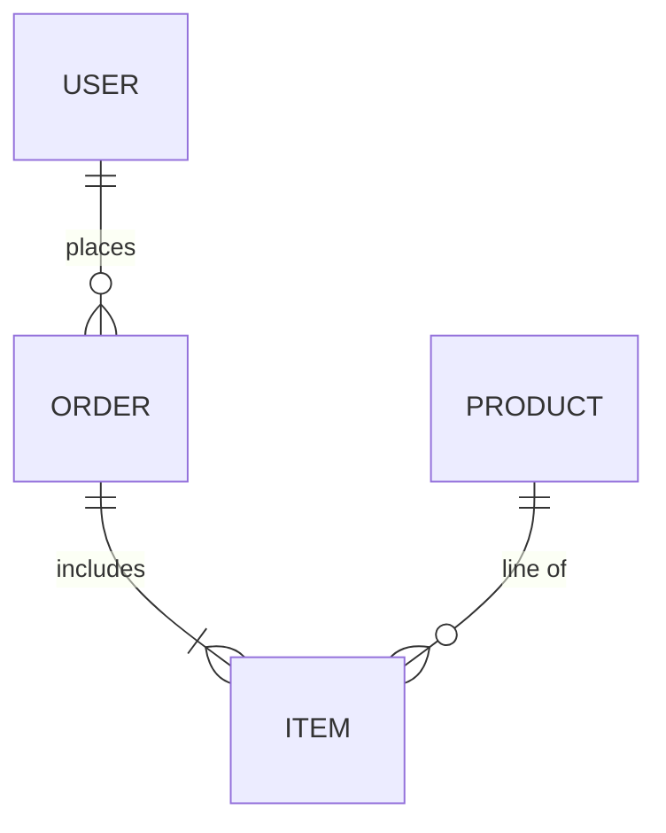

# ER

## Use when
Showing data entities and how they relate (cardinality, ownership)—schemas, domain models, or persistence boundaries.

## Avoid when
You need behavior, message flow, or class methods/inheritance emphasis (prefer Class or Sequence). Avoid packing every column into the diagram.

## Preferred semantic intents
Data model, structure of records, source-of-truth entity maps, bounded-context entity sketches.

## GitHub compatibility
Tier A / GitHub-first. Prefer `erDiagram` with entity names and relationship lines (`||--o{`, etc.). Keep attributes minimal; many renderers handle sparse ER better than wide attribute lists.

## Design rules
- Entity names are singular nouns.
- Show only key attributes (ids, foreign keys, 1–3 discriminators).
- Label relationships with short verbs when cardinality alone is ambiguous.
- One bounded context per diagram.

## Complexity budget
Recommended ≤8 entities. Split near 12 by subdomain or aggregate.

## Minimal syntax
```text
erDiagram
  CUSTOMER ||--o{ ORDER : places
  ORDER ||--|{ LINE_ITEM : contains
```

## Common failure modes
Dumping full table schemas; missing cardinality; mixing UI screens into entities; cross-context spaghetti on one canvas.

## Fallbacks
For OOP type hierarchies and methods, use Class. For runtime flows, use Sequence or Flowchart. For wide schemas, prefer a Markdown table of entities/keys.

## Examples


