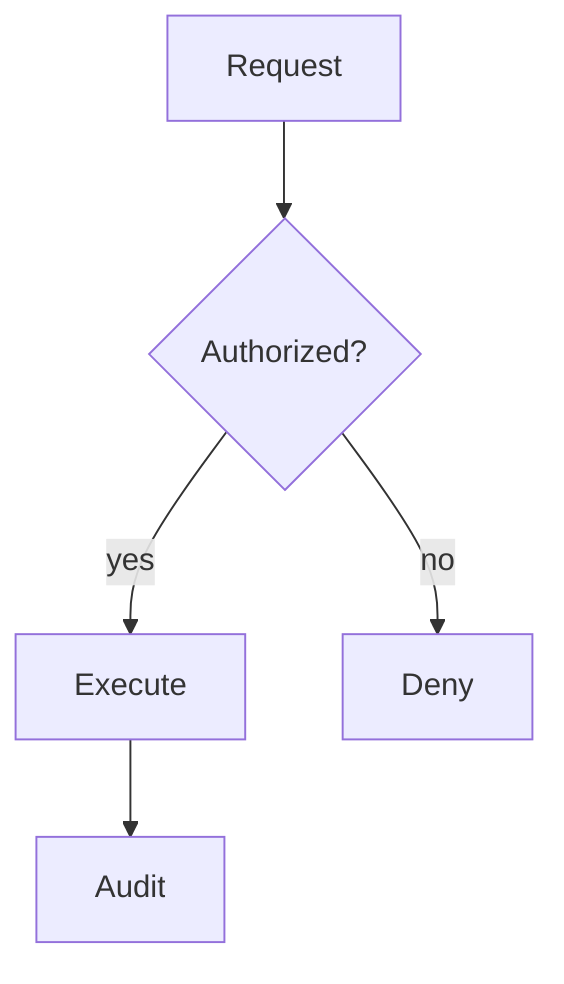

# Flowchart

## Use when
Showing process steps, branching decisions, or system connections where order or topology matters more than timing between actors.

## Avoid when
Message order between actors matters (use Sequence), lifecycle transitions dominate (use State), or a table/prose list answers the question more clearly.

## Preferred semantic intents
Process, system connectivity, responsibility via subgraphs (trust zones, stages), source → transform → serve, request → authorize → execute.

## GitHub compatibility
Tier A / GitHub-first. Prefer `flowchart TD` or `LR`. Avoid experimental shapes, `click` handlers, and external icon packs. Stick to basic node shapes and labeled edges.

## Design rules
- One dominant reading direction (`TD` or `LR`).
- Short noun phrases for nodes; short verbs for edges.
- Subgraphs only when they encode a real boundary (trust, deploy, stage).
- Do not encode critical meaning by color alone.

## Complexity budget
Recommended ≤12 nodes. Split near ~18 into overview + detail.

## Minimal syntax
```text
flowchart TD
  A[Start] --> B{Decision}
  B -->|yes| C[Action]
  B -->|no| D[End]
```

## Common failure modes
Sentence-length labels; equal-weight “box soup”; decorative subgraphs; too many edge styles; mixing swimlane intent without clear lane boundaries.

## Fallbacks
If layout becomes unreadable, split diagrams. For timed actor exchanges prefer Sequence. For pure containment prefer Mindmap. If comparison is tabular, use a Markdown table instead.

## Examples


