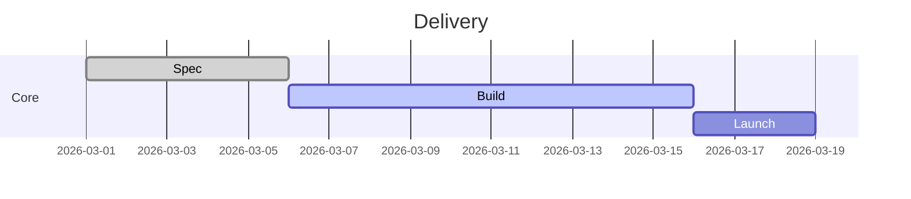

# Gantt

## Use when
Planning work over calendar time—phases, task durations, and rough sequencing for delivery plans.

## Avoid when
You need event storytelling without durations (use Timeline), dependency topology without dates (use Flowchart), or status boards (table/Kanban fallback).

## Preferred semantic intents
Planning, stage frameworks with dates, current → transition → target as phased work.

## GitHub compatibility
Tier A / GitHub-first. Prefer simple `gantt` with `dateFormat`, sections, and `task : status, id, date, duration`. Avoid exotic markers and dense milestone spam.

## Design rules
- Sections group real workstreams, not decoration.
- Task names are short noun phrases.
- Prefer durations over micro-day precision unless the audience needs it.
- One plan horizon per diagram.

## Complexity budget
Recommended ≤15 tasks. Split near 25 by workstream or time window.

## Minimal syntax
```text
gantt
  dateFormat YYYY-MM-DD
  section Build
  Design :a1, 2026-01-01, 7d
  Implement :a2, after a1, 14d
```

## Common failure modes
Project-plan dumps; overlapping unlabeled bars; mixing Kanban status into Gantt; date noise that hides the critical path story.

## Fallbacks
Milestone narrative without duration → Timeline. Dependency-only view → Flowchart. Status tracking → Markdown table. Too many tasks → overview Gantt + detail per section.

## Examples


