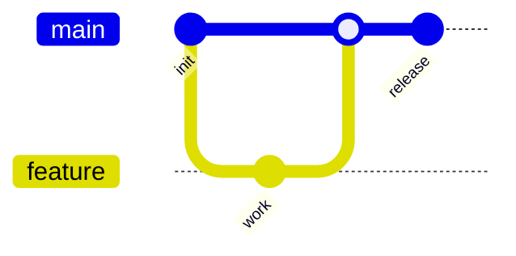

# GitGraph

## Use when
Explaining branch topology and integration flow—feature branching, release cuts, or hotfix merge stories for a Git audience.

## Avoid when
The story is general process (use Flowchart), deployment environments (Flowchart subgraphs), or timeline of releases without branch mechanics (use Timeline/Gantt).

## Preferred semantic intents
Branching strategy, merge/rebase teaching moments, release vs hotfix paths.

## GitHub compatibility
Tier A / GitHub-first. Prefer `gitGraph` with a small set of branches and clear `commit`/`branch`/`checkout`/`merge` sequences. Avoid elaborate commit messages and many parallel branches.

## Design rules
- Keep branch count small; name branches by role (`main`, `develop`, `feature`).
- Commits are short tags or omit messages when topology alone matters.
- Show one narrative: feature land, release, or hotfix—not all three at full fidelity.
- Order operations to match the teaching story.

## Complexity budget
Keep branch count small (about 2–4). Split competing strategies into separate diagrams.

## Minimal syntax
```text
gitGraph
  commit
  branch feature
  checkout feature
  commit
  checkout main
  merge feature
```

## Common failure modes
Too many branches; commit spam; mixing CI/CD environment topology into GitGraph; documenting every historical merge.

## Fallbacks
Environment/promotion flow → Flowchart. Release calendar → Timeline or Gantt. Policy prose (“we use trunk-based”) → short paragraph plus one minimal gitGraph.

## Examples


