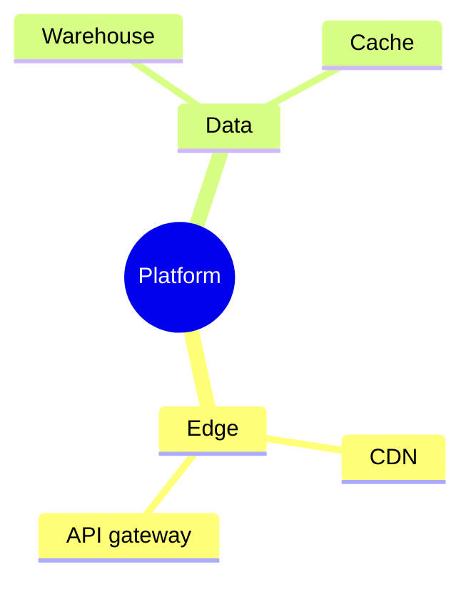

# Mindmap

## Use when
Showing hierarchy or containment from a single root—topic breakdowns, taxonomy, or “what belongs under what.”

## Avoid when
Edges carry distinct semantics (typed dependencies), cycles exist, or order/messages matter (use Flowchart, ER, or Sequence).

## Preferred semantic intents
Structure, containment, brainstorming outlines, TreeView-style hierarchies when Tier B TreeView is unavailable.

## GitHub compatibility
Tier A / GitHub-first. Prefer indentation-based `mindmap` with a single root. Avoid icons and deep styling; keep node text short for GitHub preview.

## Design rules
- One root, one organizing principle.
- Labels are short nouns or noun phrases.
- Prefer breadth control over depth races.
- Do not smuggle process arrows into a mindmap.

## Complexity budget
Recommended ≤4 levels. Split at 5 (root overview + child detail mindmaps).

## Minimal syntax
```text
mindmap
  root((Topic))
    Branch A
      Leaf
    Branch B
```

## Common failure modes
Deep trees that clip; sentence nodes; multiple roots; using mindmap for dependency graphs.

## Fallbacks
Typed relationships → Flowchart or ER. Ordered steps → Flowchart. Flat lists → Markdown bullets/table. Deeper trees → split by top-level branch.

## Examples


