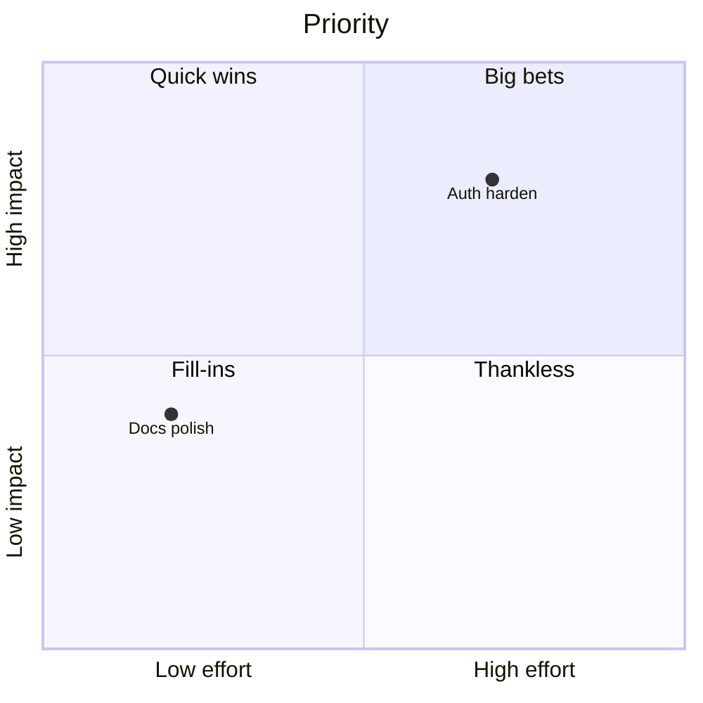

# Quadrant

## Use when
Positioning items on two meaningful axes for prioritization or strategy (impact/effort, value/risk, urgency/importance).

## Avoid when
Axes are vague, you need more than two dimensions, or ranking is purely numeric without spatial story (prefer a table).

## Preferred semantic intents
Strategy, where-to-act decisions, Cynefin-like placement when Tier C is unavailable, portfolio sorting.

## GitHub compatibility
Tier A / GitHub-first. Prefer `quadrantChart` with clear axis labels and short item names. Avoid overcrowding; GitHub layout is compact.

## Design rules
- Name axes with opposing, decision-relevant poles.
- Items are short nouns; positions must be intentional, not decorative.
- One decision question per chart.
- Prefer relative placement honesty over fake precision.

## Complexity budget
Recommended ≤12 items. Split near 20 by theme or audience.

## Minimal syntax
```text
quadrantChart
  x-axis Low --> High
  y-axis Low --> High
  quadrant-1 Do
  Item: [0.6, 0.7]
```

## Common failure modes
Untitled axes; too many items overlapping; using quadrant as a dump for unrelated tags; color as the only signal.

## Fallbacks
If axes are weak, use a prioritized Markdown table. Multi-factor scoring → table. Causal analysis → Flowchart/Ishikawa fallback path. Evolution maps needing more structure → prose + Flowchart.

## Examples


