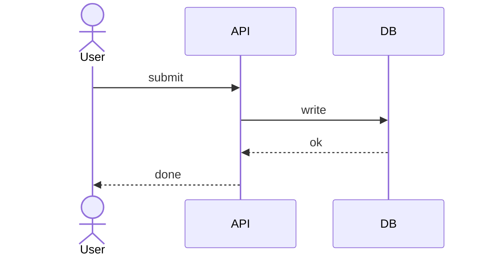

# Sequence

## Use when
Showing who talks to whom and in what order—request/response, handoffs, or protocol exchanges across a small set of actors.

## Avoid when
There is no meaningful message order, the story is a branching process (use Flowchart), or you need many parallel branches that obscure the timeline.

## Preferred semantic intents
Interaction, human → agent → tool, producer → broker → consumer, request → authorize → execute → audit.

## GitHub compatibility
Tier A / GitHub-first. Prefer plain `sequenceDiagram` with `participant`/`actor`, `->`/`-->>`, and optional `Note`. Avoid heavy `rect` nesting and unsupported extensions.

## Design rules
- Name actors as roles or systems, not long sentences.
- Keep messages short verbs or protocol names.
- Use `alt`/`opt`/`loop` sparingly—one control block type per diagram when possible.
- Left-to-right actor order should match the primary call path.

## Complexity budget
Recommended ≤5 actors. Split at 7 (overview participants vs detail call paths).

## Minimal syntax
```text
sequenceDiagram
  participant A
  participant B
  A->>B: request
  B-->>A: response
```

## Common failure modes
Too many actors; chatty micro-messages; nested alt/loop trees; treating Sequence as a flowchart with message labels.

## Fallbacks
If actor count grows, collapse internals into one participant or split by scenario. For process branching without dialogue, use Flowchart. For state machines, use State.

## Examples


