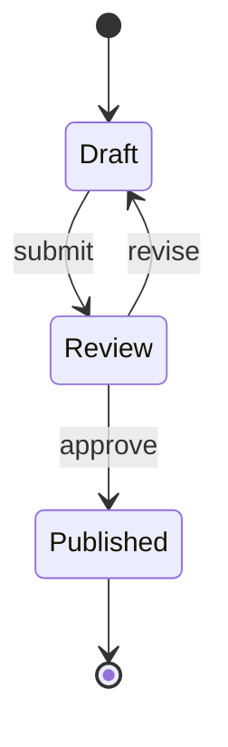

# State

## Use when
Modeling a lifecycle: discrete states and the transitions that move between them (tickets, sessions, deployments, entity status).

## Avoid when
You mainly need process steps without persistent state, actor messaging (use Sequence), or a hierarchical org/containment map (use Mindmap).

## Preferred semantic intents
Lifecycle, observe → decide → act (as transitions), approval/status machines, current → transition → target framed as states.

## GitHub compatibility
Tier A / GitHub-first. Use `stateDiagram-v2` only. Prefer simple states and `-->` transitions. Avoid deep nested composites unless essential and still within budget.

## Design rules
- State names are short nouns or past participles (`Draft`, `Published`).
- Transition labels are short events or guards.
- Include a clear start (`[*]`) and, when useful, an end.
- One machine per diagram; nest only for real sub-lifecycles.

## Complexity budget
Recommended ≤10 states. Split near 15 (overview machine + detail submachine).

## Minimal syntax
```text
stateDiagram-v2
  [*] --> Idle
  Idle --> Active: start
  Active --> [*]
```

## Common failure modes
Turning every process step into a state; unlabeled transitions that matter; deep nesting that GitHub layout flattens poorly; mixing Sequence-style actors into states.

## Fallbacks
If transitions are really messages between systems, use Sequence. If the flow is acyclic process steps, use Flowchart. If the “states” are just categories, prefer a table.

## Examples


