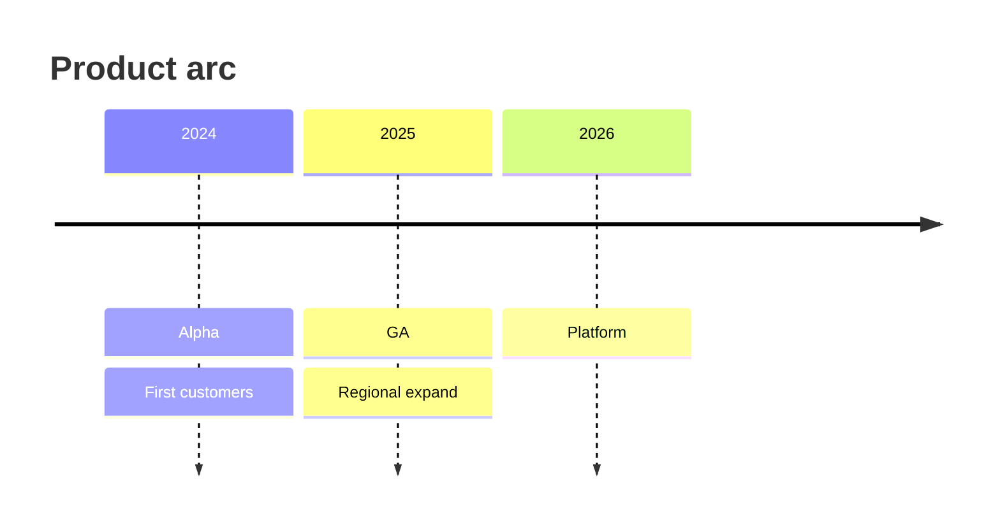

# Timeline

## Use when
Narrating ordered events or eras—history, incident chronology, product milestones—where sequence matters more than task duration.

## Avoid when
You need resource loading or task bars (use Gantt), causal process branches (use Flowchart), or actor dialogue (use Sequence).

## Preferred semantic intents
Planning-as-story, stage frameworks as eras, current → transition → target as dated beats.

## GitHub compatibility
Tier A / GitHub-first. Prefer `timeline` with titled eras and short event lines. Keep text terse; long paragraphs render poorly.

## Design rules
- One theme per timeline.
- Era labels are short period names; events are short phrases.
- Chronological order only—no side quests.
- Prefer fewer eras with clearer beats over many micro-events.

## Complexity budget
Recommended ≤12 events. Split near 18 by era or theme.

## Minimal syntax
```text
timeline
  title History
  2024 : Launch
  2025 : Scale
```

## Common failure modes
Essay-length event text; mixing durations (Gantt intent); unsorted events; multiple unrelated themes on one line.

## Fallbacks
Dated work with owners/duration → Gantt. Causal “why/how” → Flowchart or prose. Dense chronologies → Markdown table of date/event.

## Examples


