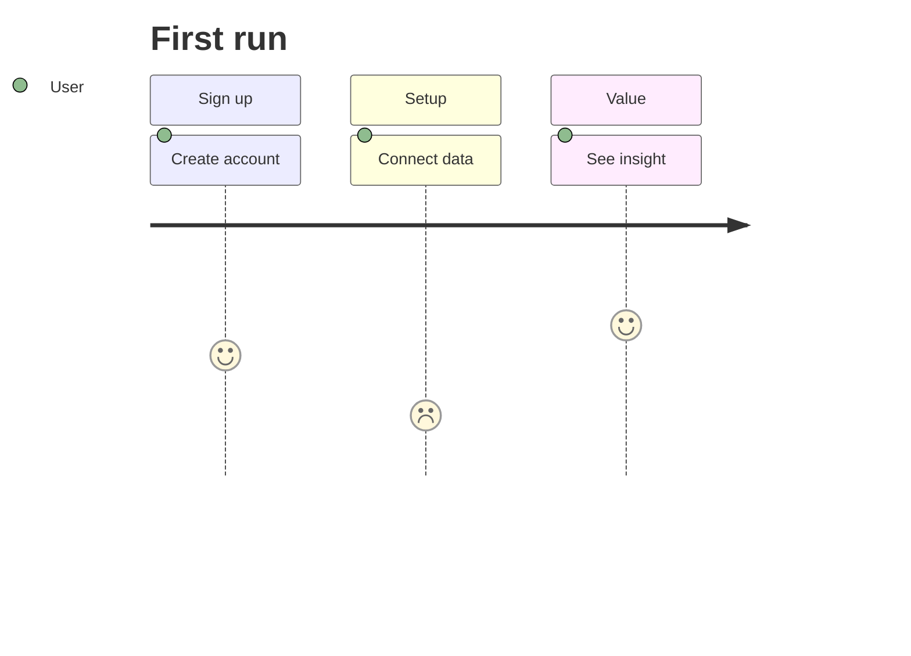

# User Journey

## Use when
Showing a persona’s path through stages with a simple satisfaction or effort score per step—onboarding, support, or product experience sketches.

## Avoid when
You need system internals, branching logic, or multi-actor protocols (use Flowchart or Sequence). Avoid journeys that are really project plans (use Gantt).

## Preferred semantic intents
Experience stages, human → agent → tool from the human’s view, observe → decide → act as felt steps.

## GitHub compatibility
Tier A / GitHub-first and GitHub-safe when kept minimal: few sections (stages), short tasks, scores 1–5. Avoid huge stage counts and long task names that break preview readability.

## Design rules
- Keep stages few and named for the user’s world.
- One persona (or clearly labeled dual comparison) per diagram.
- Task labels are short actions the user takes or feels.
- Scores must mean one consistent scale.

## Complexity budget
Keep stages few (about 3–6). Prefer splitting long journeys into early/late experience diagrams rather than one dense chart.

## Minimal syntax
```text
journey
  title Checkout
  section Browse
    Find item: 5: User
  section Buy
    Pay: 3: User
```

## Common failure modes
System swimlanes disguised as journey; too many sections; inconsistent score meaning; marketing copy in task names.

## Fallbacks
If branching dominates, use Flowchart. If multiple systems converse, use Sequence. If scores are the only signal, a Markdown table of stage/step/score is clearer.

## Examples


