# Enterprise Agent and Human Workflow Examples

## 1. Agent tool call with approval
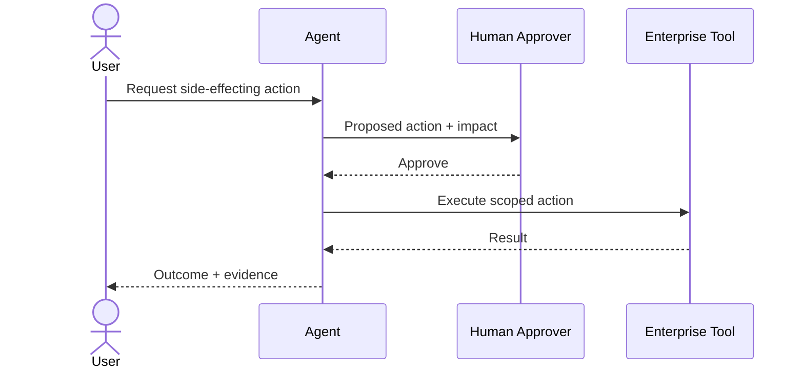

## 2. Agent tool call denied
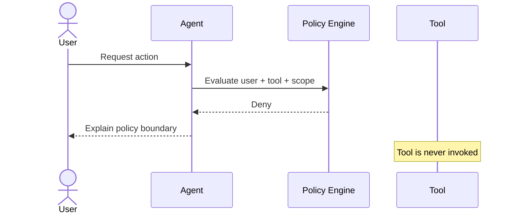

## 3. Agent memory write
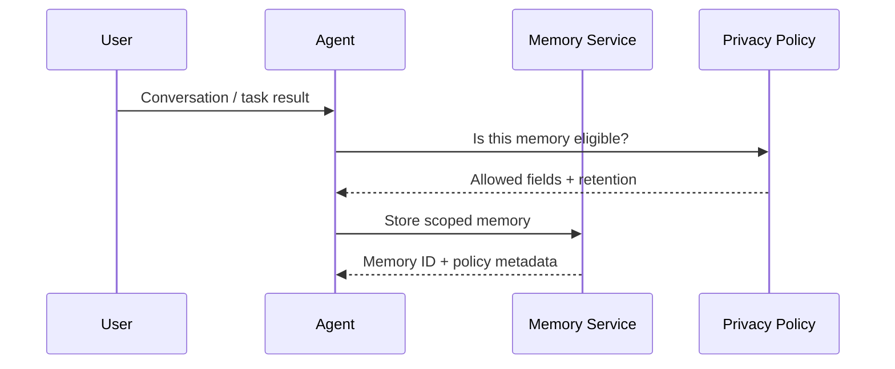

## 4. Agent memory retrieval
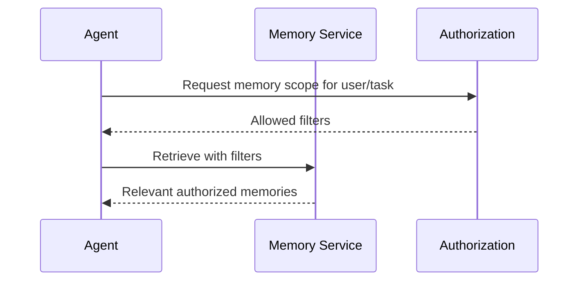

## 5. Multi-agent delegation
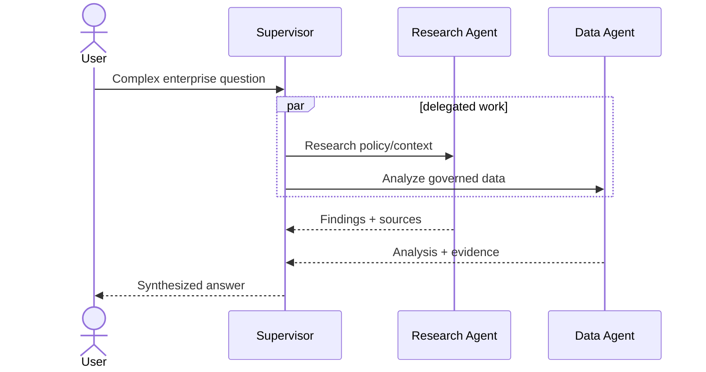

## 6. Agent escalation to human
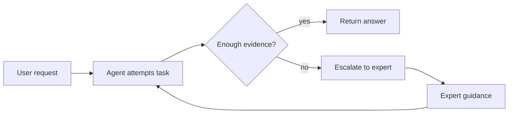

## 7. Agent-generated change request
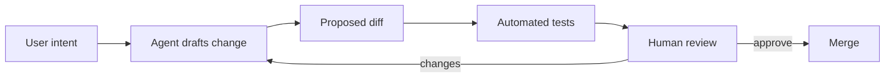

## 8. Agent production change gate
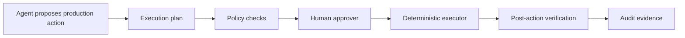

## 9. Agent analytics workflow
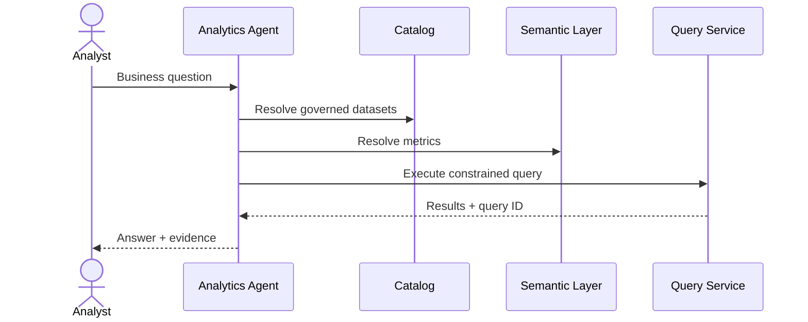

## 10. Agent retrieval with ACL filtering
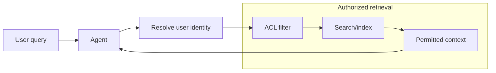

## 11. Agent evaluation loop
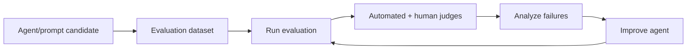

## 12. Agent incident assistant
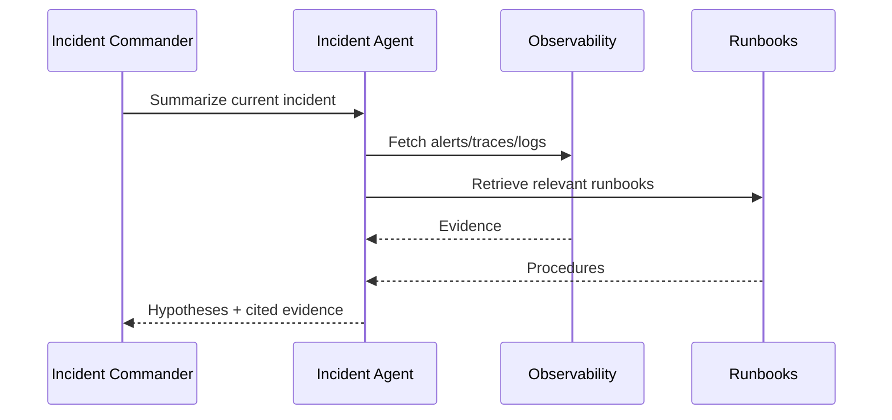

## 13. Agent customer-support handoff
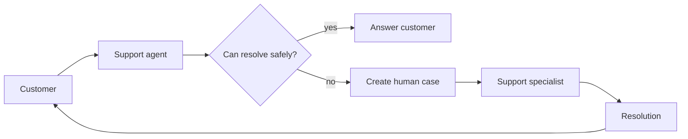

## 14. Agent procurement research
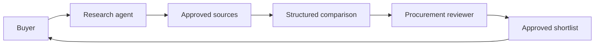

## 15. Agent security triage
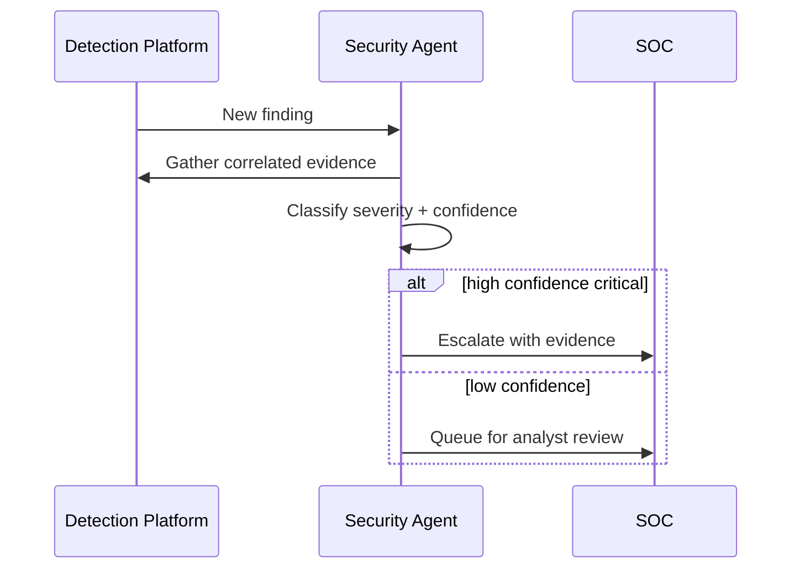

## 16. Agent-generated policy exception
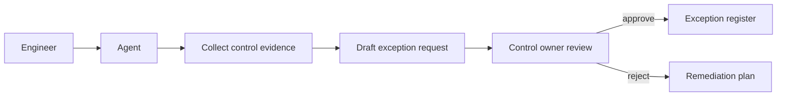

## 17. Tool timeout and recovery
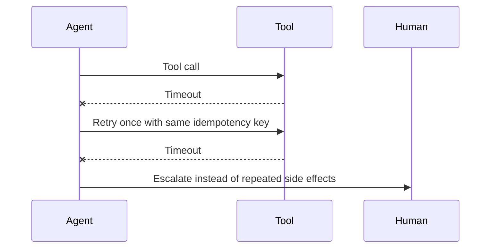

## 18. Agent session lifecycle
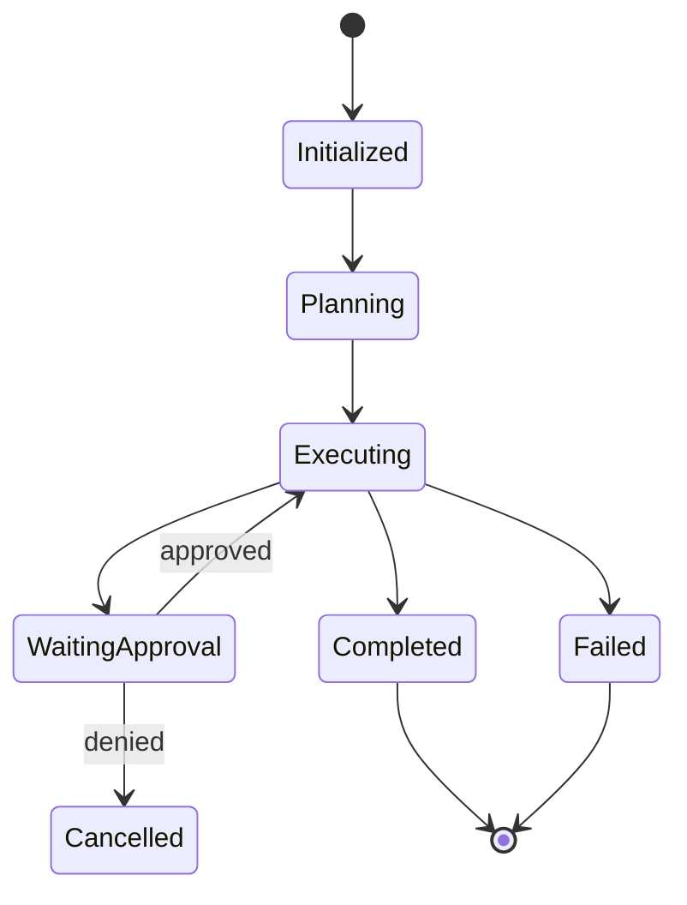

## 19. Agent audit trail
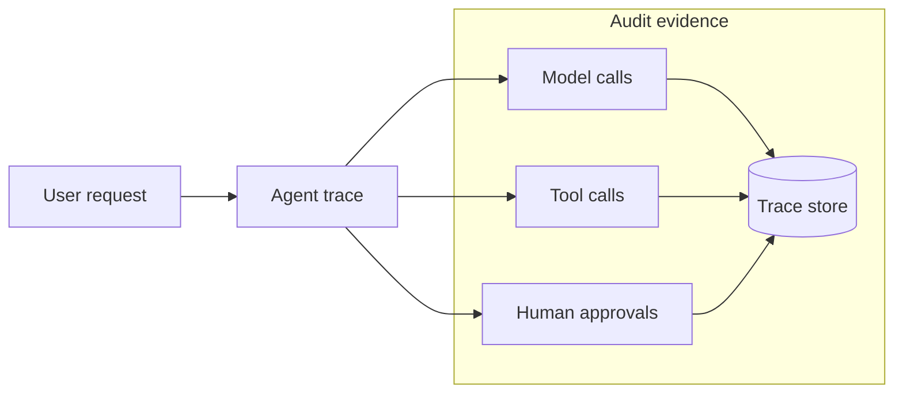

## 20. Agent rollback workflow
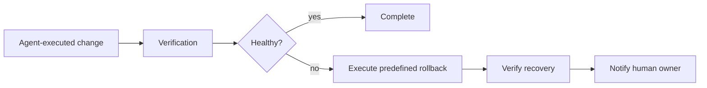