# Enterprise Approval and Governance Behavior Examples

## 1. Security exception approval
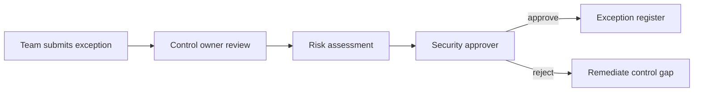

## 2. Data access approval
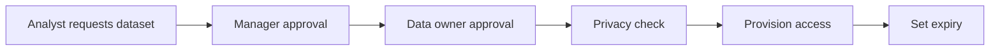

## 3. Production access approval
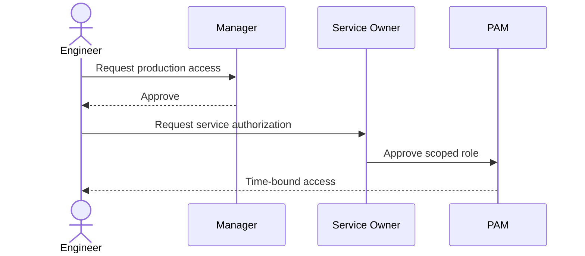

## 4. Vendor onboarding
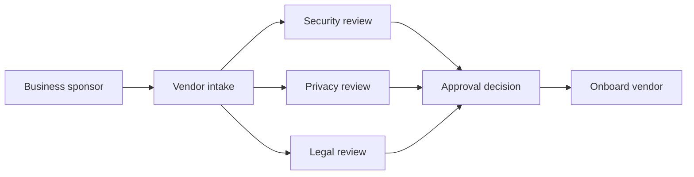

## 5. Architecture review
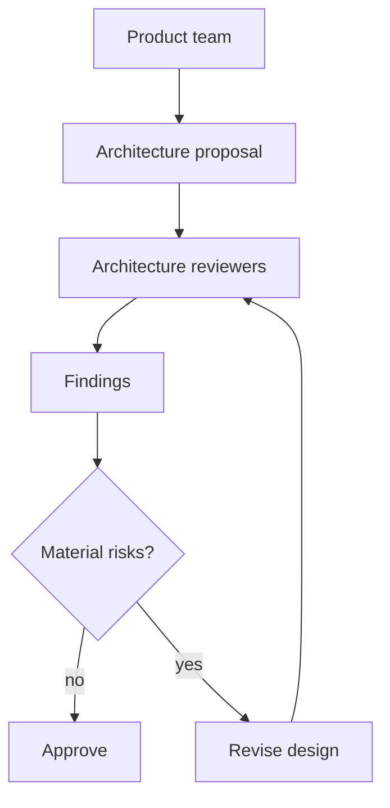

## 6. Privacy impact assessment
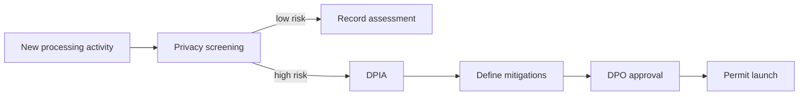

## 7. AI use-case approval
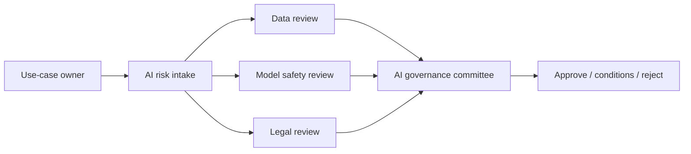

## 8. Open-source dependency exception
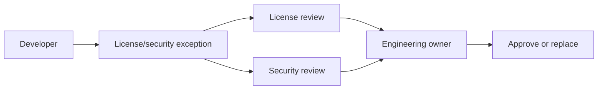

## 9. Change freeze exception
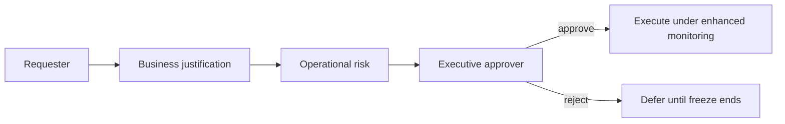

## 10. High-value payment approval
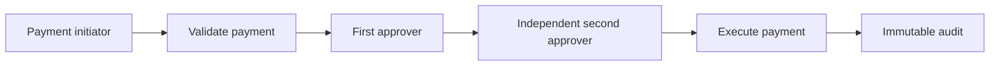

## 11. Customer data export approval
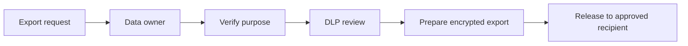

## 12. Policy change lifecycle
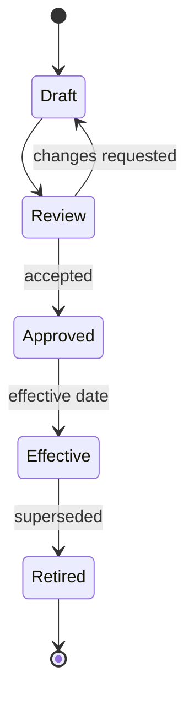

## 13. Risk acceptance lifecycle
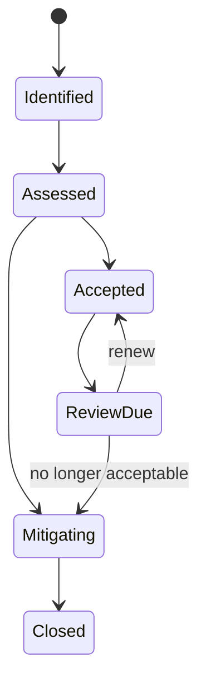

## 14. Records destruction approval
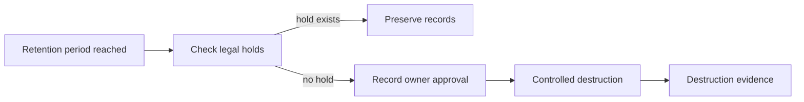

## 15. New cloud service approval
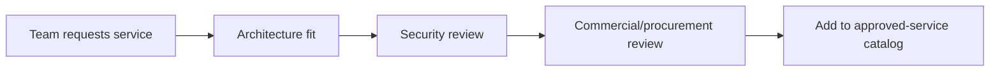

## 16. Data classification exception
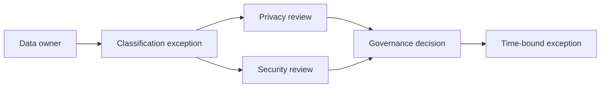

## 17. Regulatory evidence sign-off
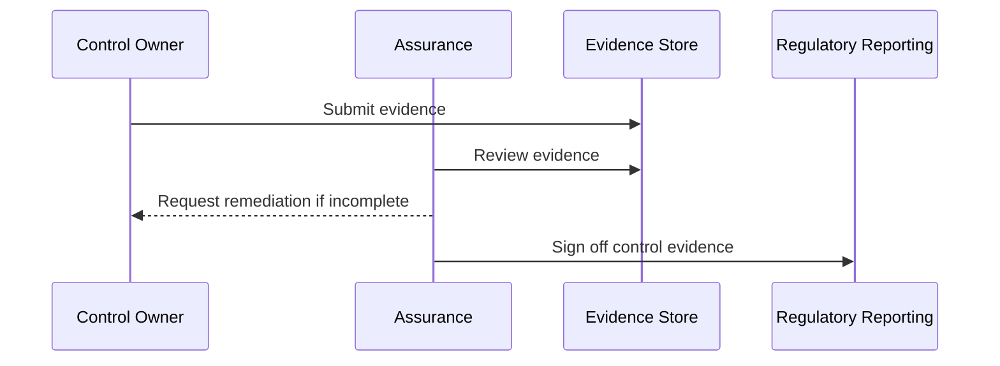

## 18. Segregation-of-duties conflict
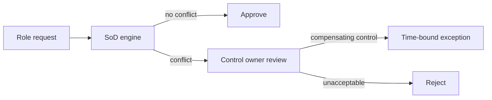

## 19. Contract approval
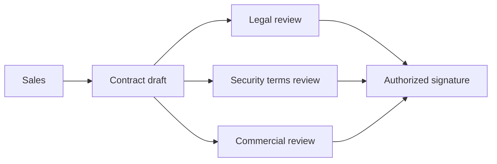

## 20. Governance committee decision state
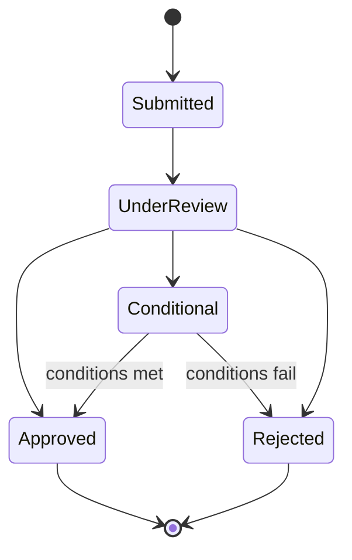