# Enterprise Async and Messaging Behavior Examples

## 1. Reliable webhook delivery
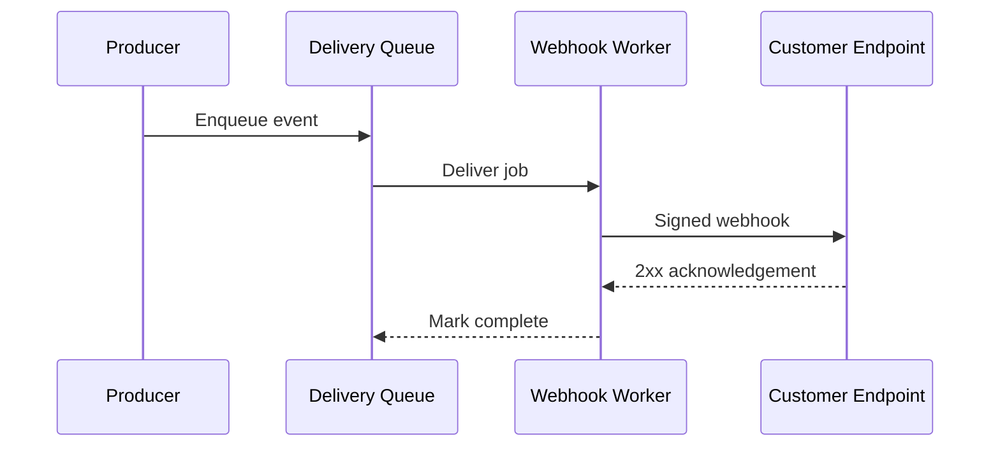

## 2. Webhook retry and DLQ
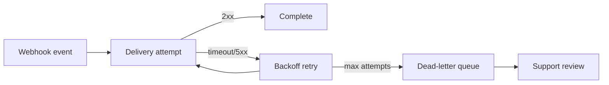

## 3. Async job submission
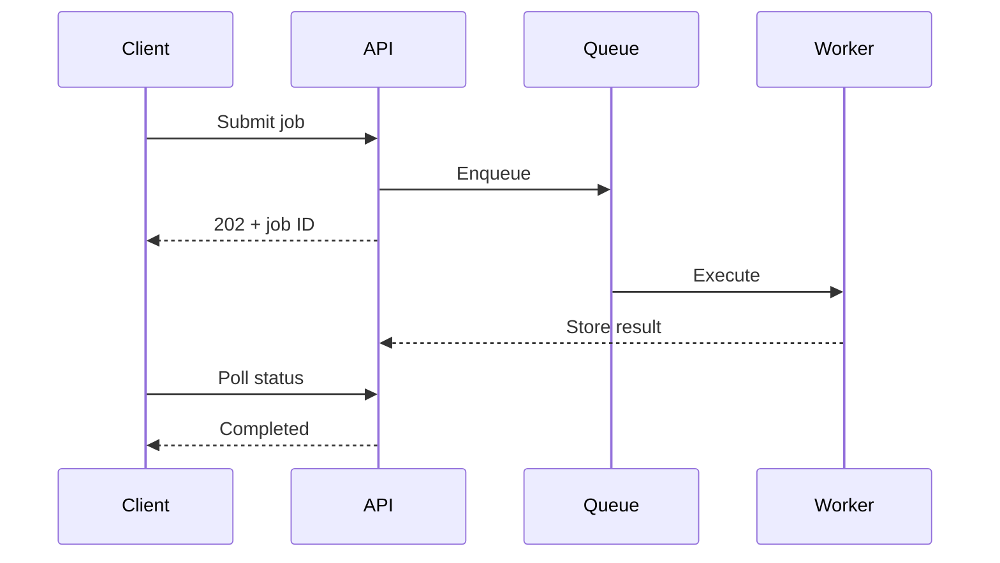

## 4. Idempotent message consumer
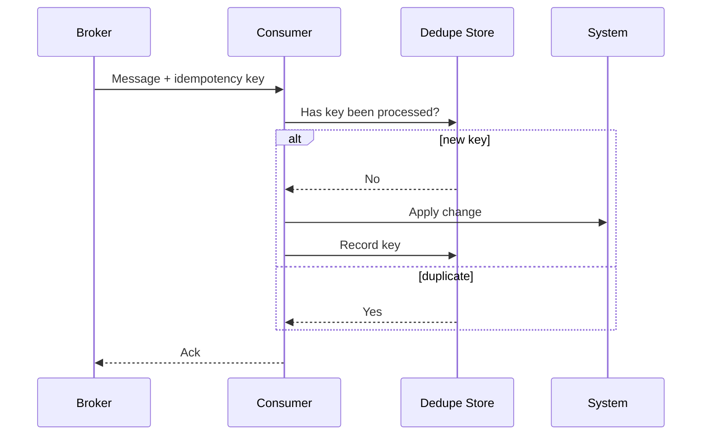

## 5. Transactional outbox behavior
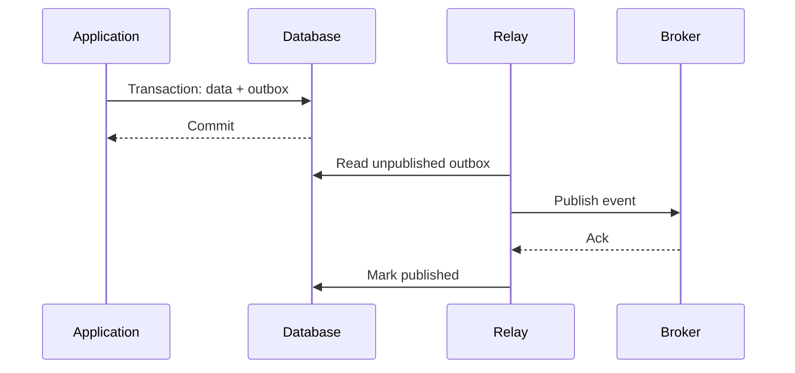

## 6. Saga orchestration success
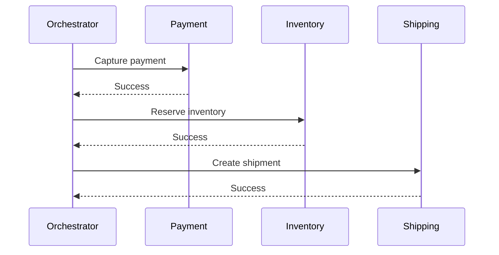

## 7. Saga compensation
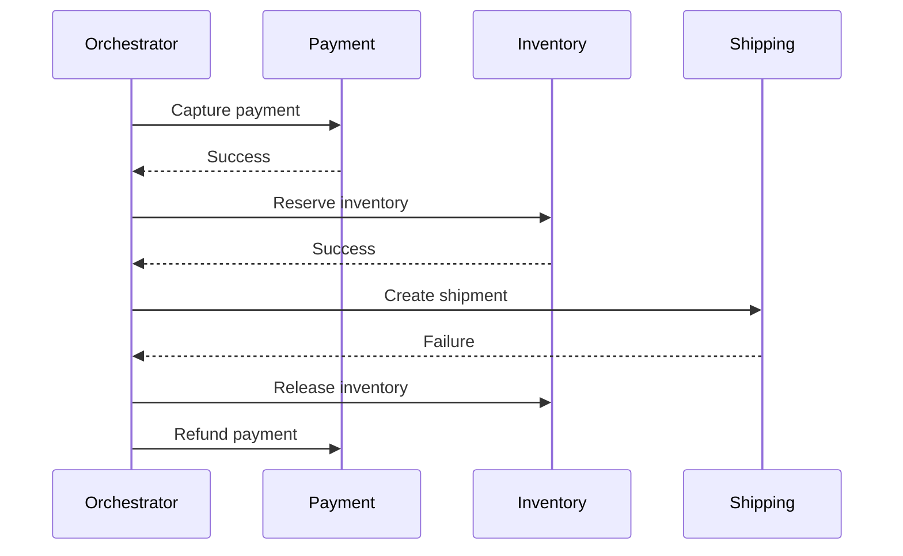

## 8. At-least-once delivery
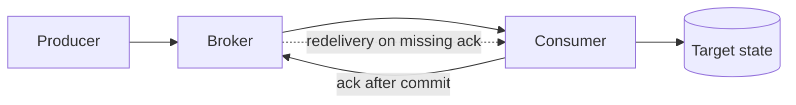

## 9. Queue backlog recovery
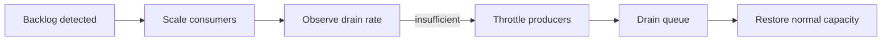

## 10. Request-reply correlation
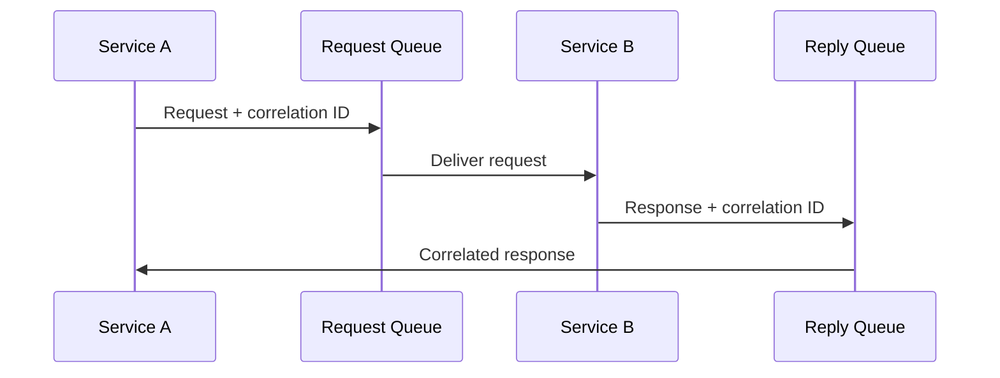

## 11. Event replay
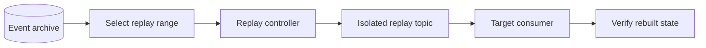

## 12. Delayed message scheduling
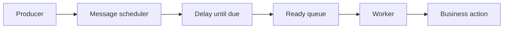

## 13. Poison message handling
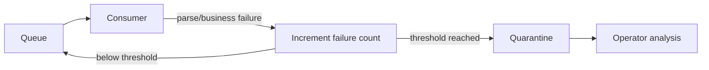

## 14. Fan-out processing
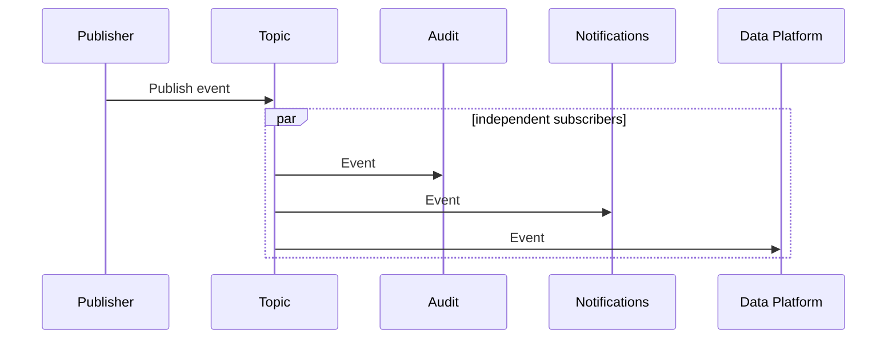

## 15. Ordered partition processing
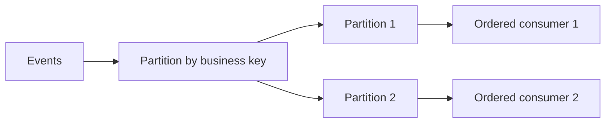

## 16. Consumer pause during downstream outage
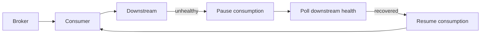

## 17. Long-running operation callback
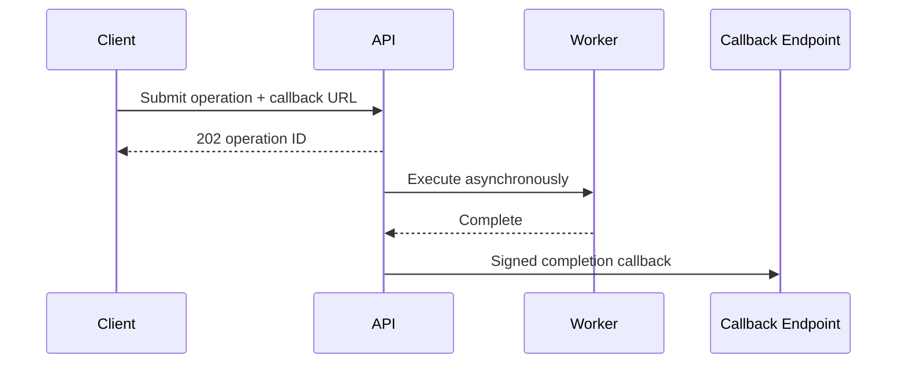

## 18. Event schema evolution
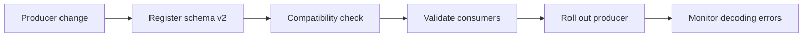

## 19. Async cancellation
```mermaid
sequenceDiagram
  participant C as Client
  participant A as API
  participant Q as Queue
  participant W as Worker
  C->>A: Submit job
  A->>Q: Enqueue
  C->>A: Cancel job
  A->>Q: Mark cancelled
  Q->>W: Deliver job
  W->>A: Check cancellation
  A-->>W: Cancelled; do not execute
```

## 20. Message-processing state machine
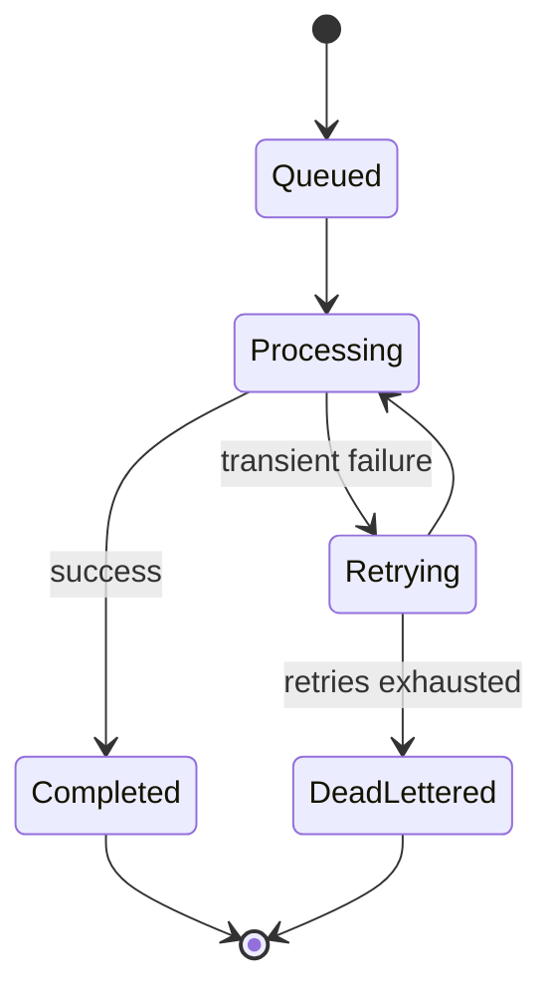