# Enterprise Business Workflow Examples

## 1. Enterprise customer onboarding
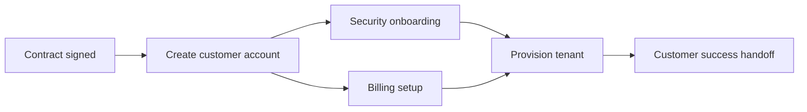

## 2. Purchase-to-pay
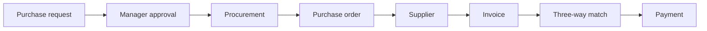

## 3. Quote-to-cash
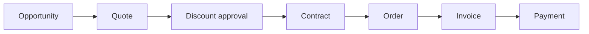

## 4. Order fulfillment
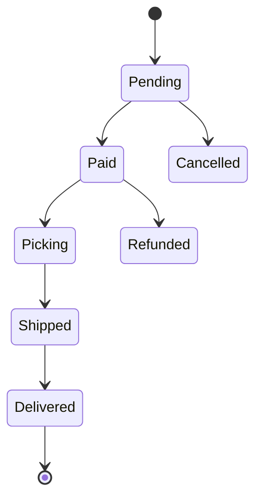

## 5. Support escalation
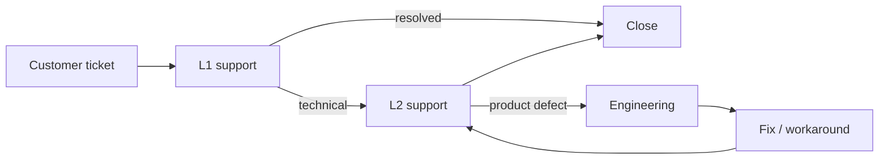

## 6. Customer complaint handling
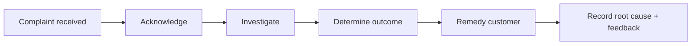

## 7. Employee onboarding
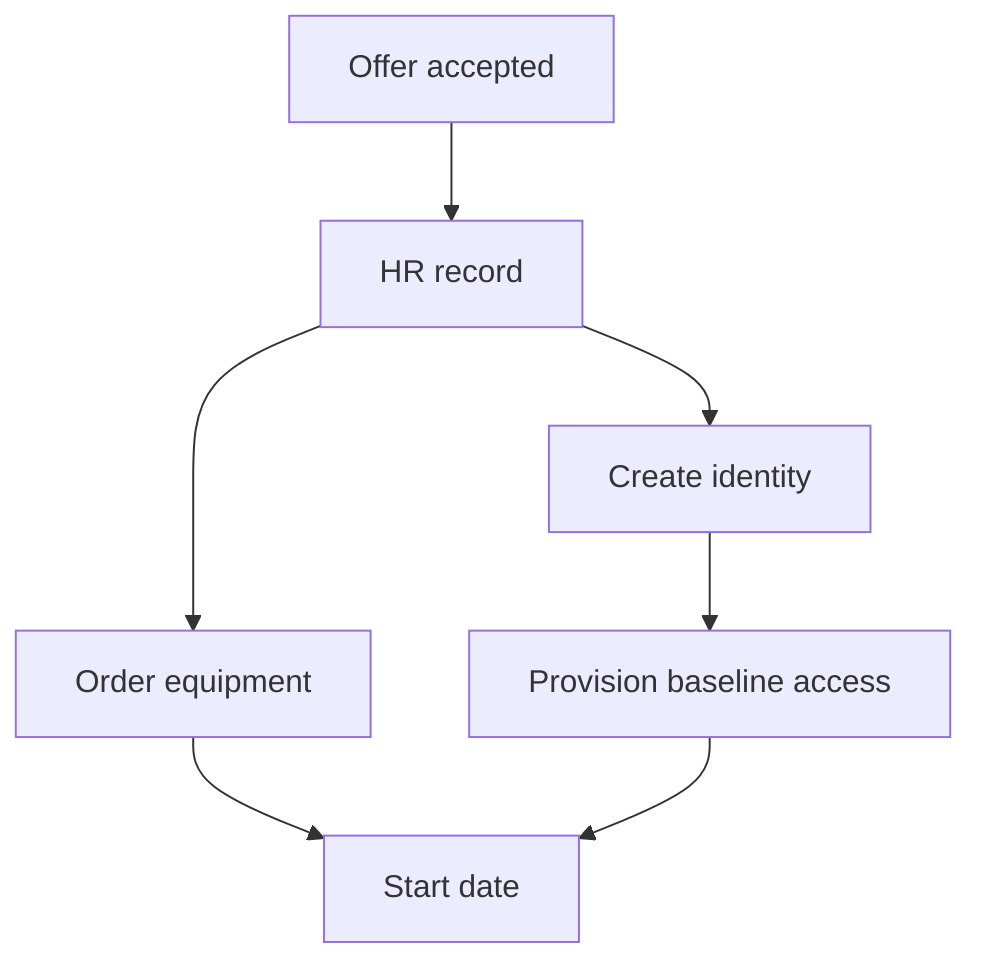

## 8. Employee transfer
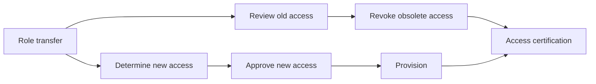

## 9. Expense reimbursement
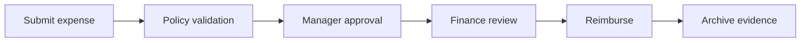

## 10. Contract renewal
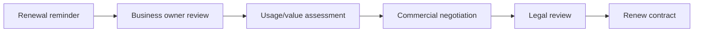

## 11. Vendor offboarding
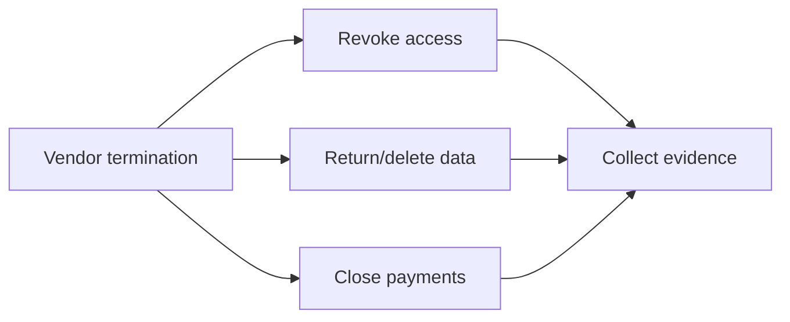

## 12. Lead qualification
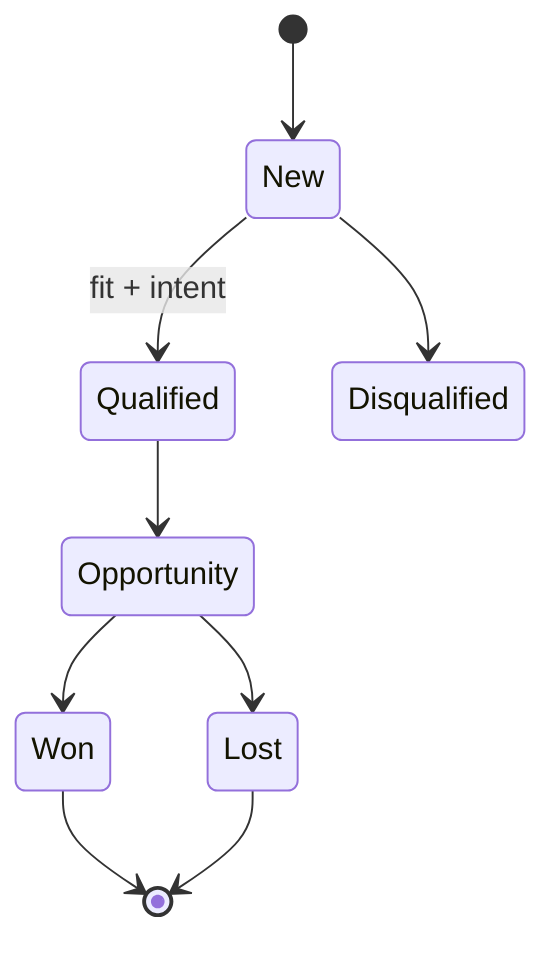

## 13. High-risk customer onboarding
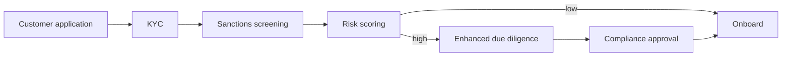

## 14. Refund approval
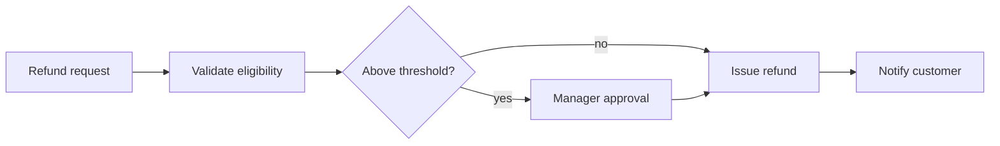

## 15. Enterprise trial conversion
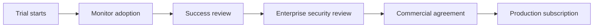

## 16. Account closure
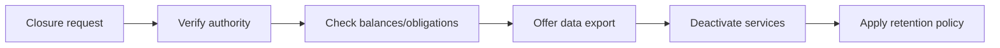

## 17. Procurement intake lanes
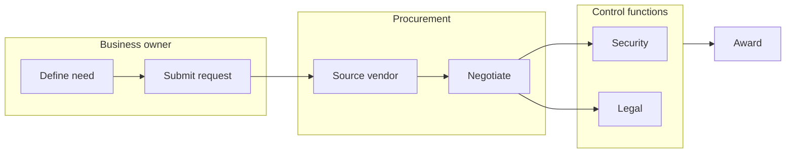

## 18. SLA breach handling
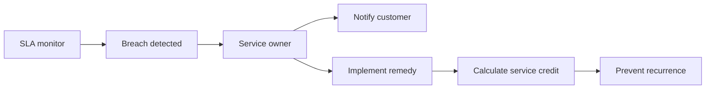

## 19. Business continuity invocation
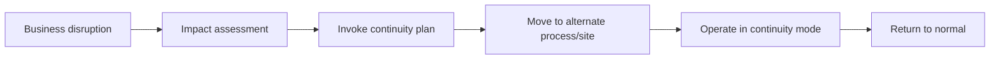

## 20. Customer lifecycle
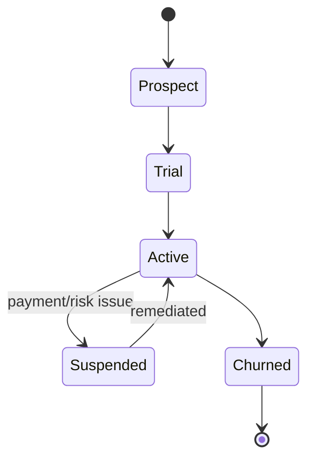