# Enterprise Change and Release Behavior Examples

## 1. Pull request to production
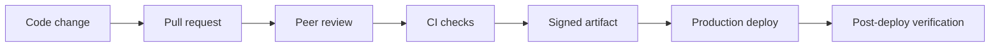

## 2. Change advisory approval
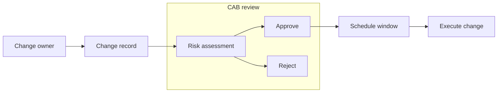

## 3. Canary rollout
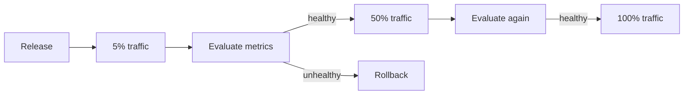

## 4. Blue-green switch
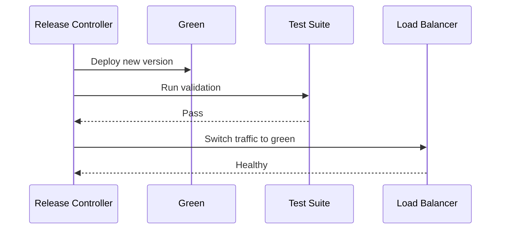

## 5. Emergency change
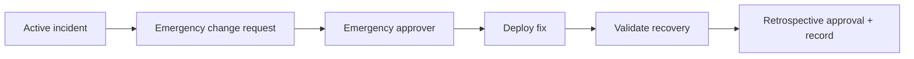

## 6. Feature flag release
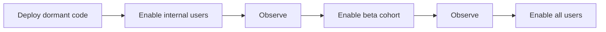

## 7. Database migration with expand-contract
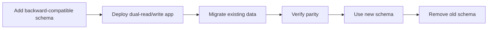

## 8. Infrastructure change pipeline
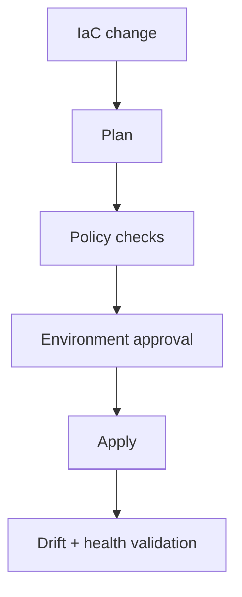

## 9. Production rollback decision
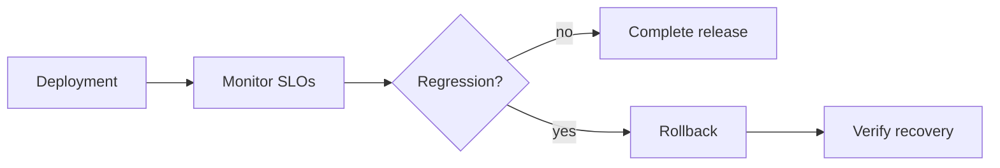

## 10. Release train
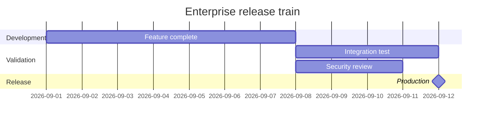

## 11. Dependency upgrade rollout
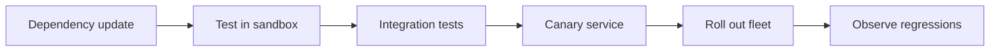

## 12. Mobile app release governance
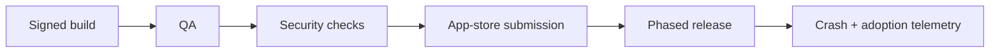

## 13. Configuration rollout
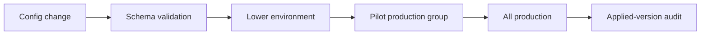

## 14. API breaking-change migration
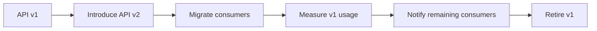

## 15. Model release gate
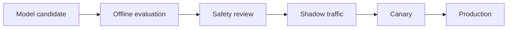

## 16. Release freeze exception
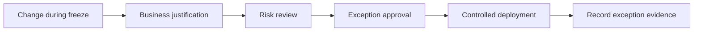

## 17. Package promotion
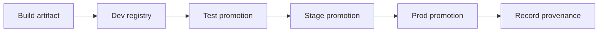

## 18. Rollout state machine
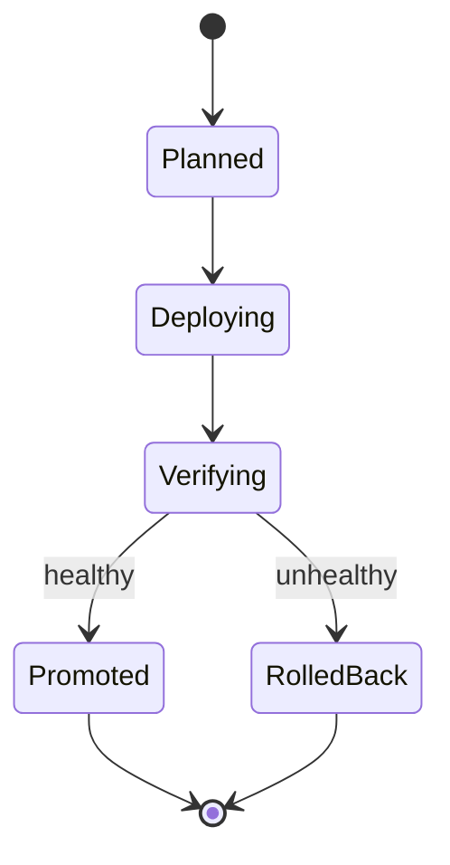

## 19. Change-window workflow
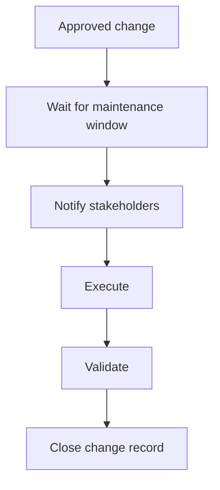

## 20. GitOps promotion
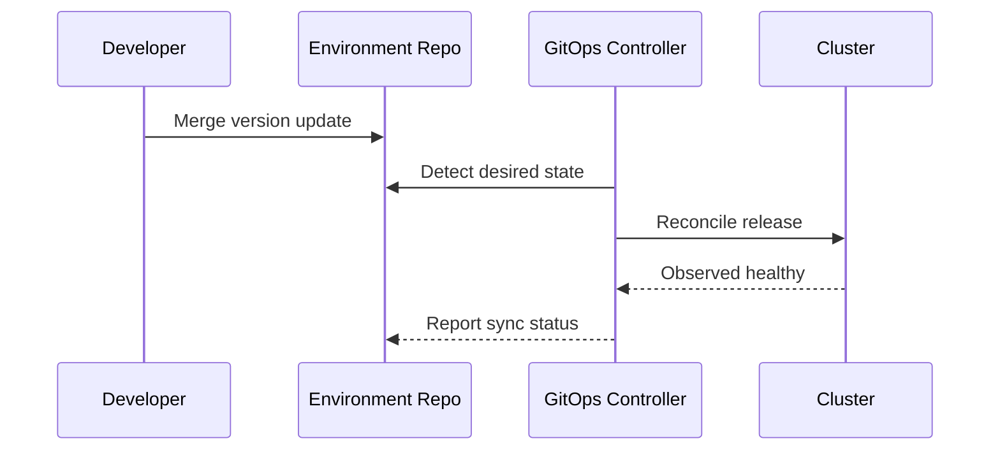