# Enterprise Data Workflow Behavior Examples

## 1. Batch ingestion
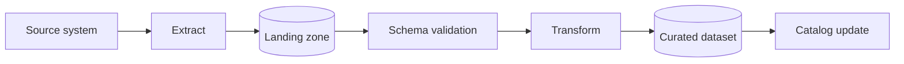

## 2. Data quality quarantine
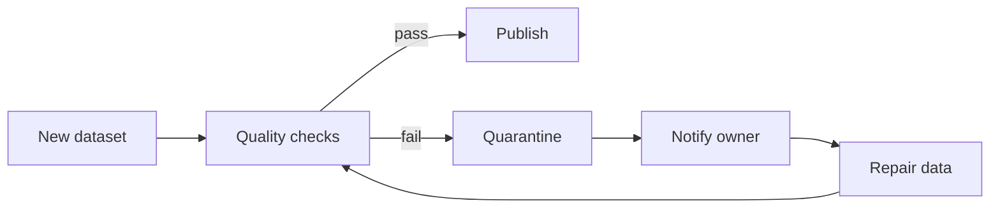

## 3. CDC propagation
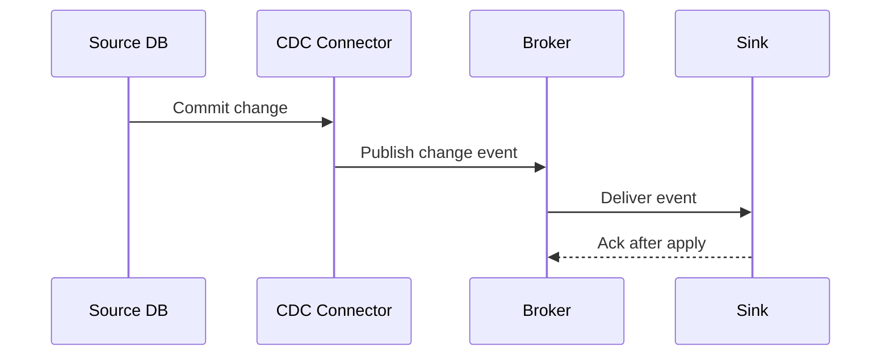

## 4. dbt-style model promotion
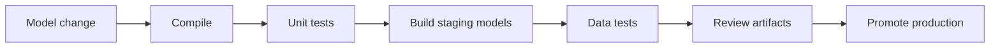

## 5. Data contract breaking change
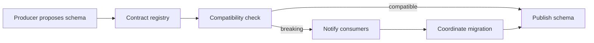

## 6. Backfill workflow
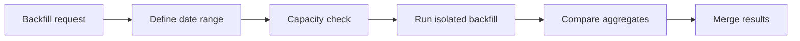

## 7. Dataset access request
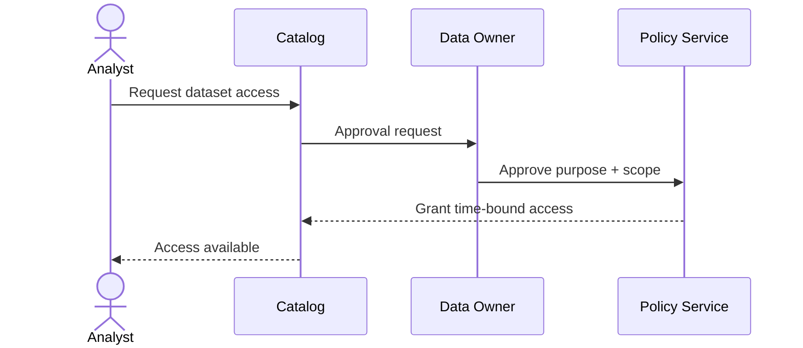

## 8. Sensitive-data tokenization
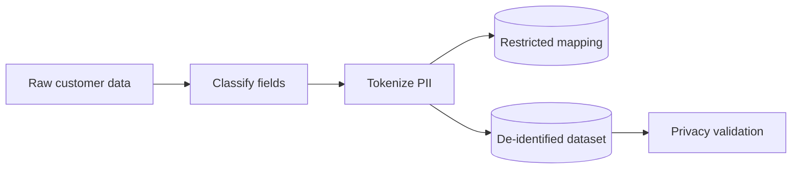

## 9. Data incident remediation
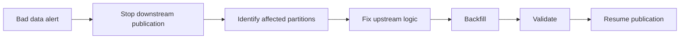

## 10. Data retention lifecycle
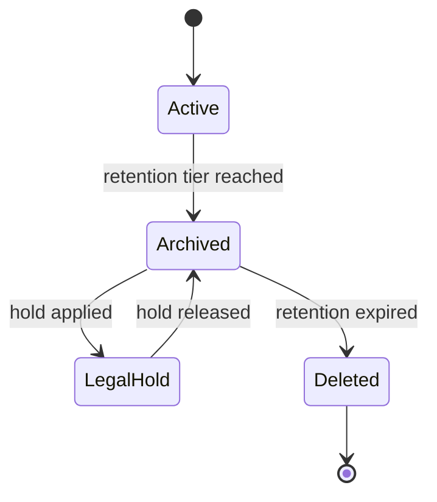

## 11. ML training pipeline
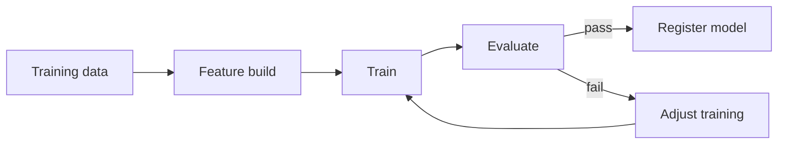

## 12. Model promotion
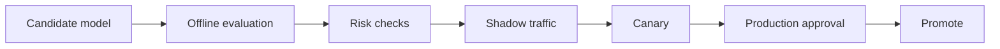

## 13. Feature computation freshness failure
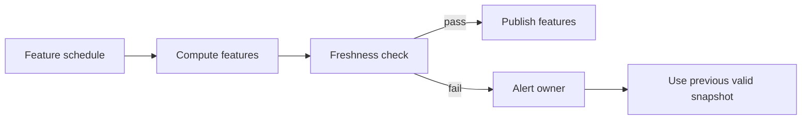

## 14. Metadata ingestion
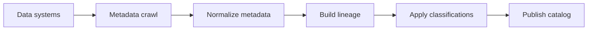

## 15. Lineage impact analysis
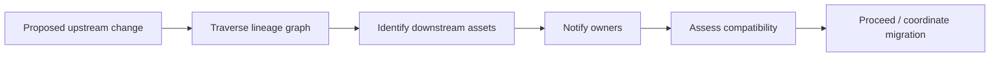

## 16. Metrics definition review
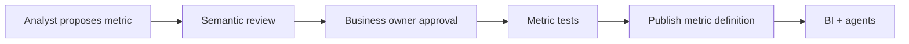

## 17. Data deletion request
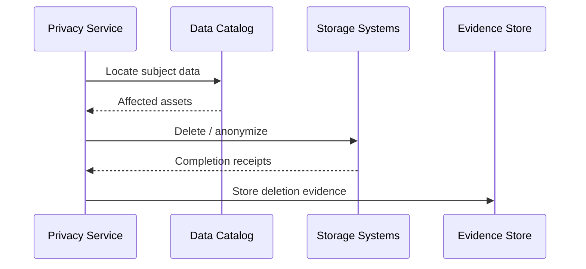

## 18. Analytics release validation
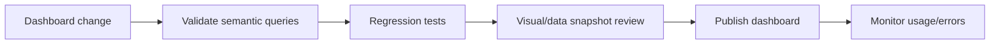

## 19. Streaming checkpoint recovery
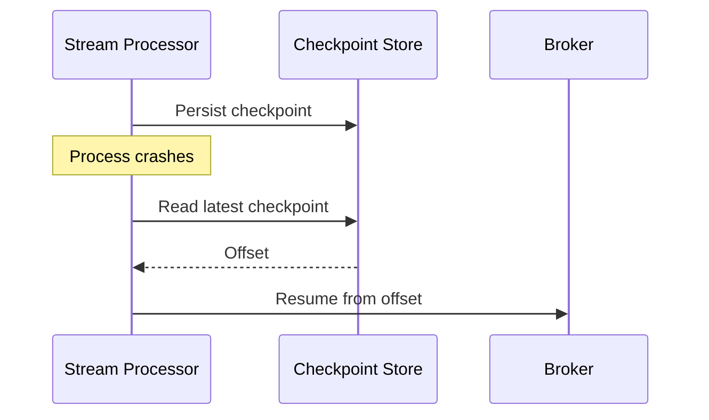

## 20. Dataset lifecycle
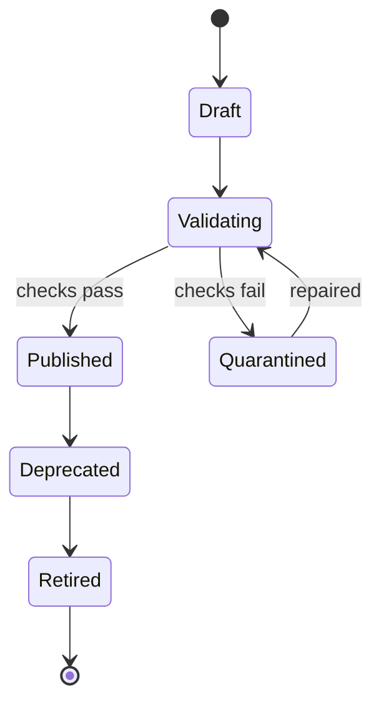